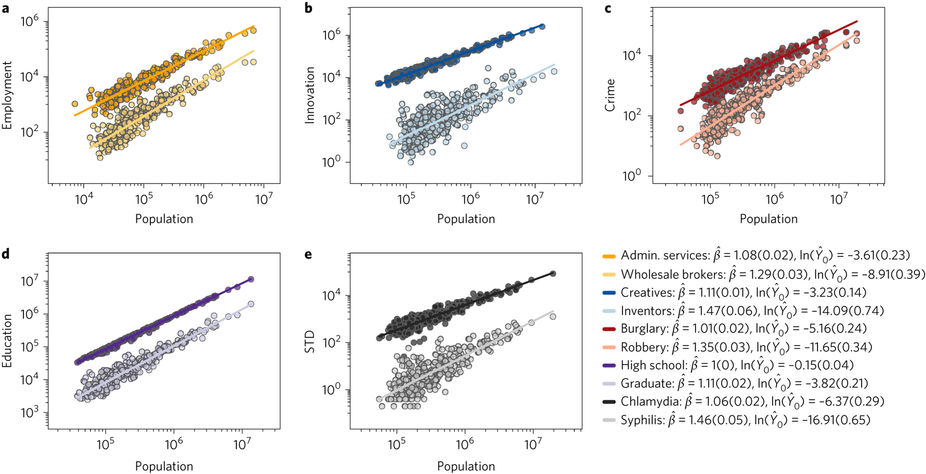

Via [Jason Potts](https://twitter.com/profjasonpotts), I [came across](https://twitter.com/CulturalEvolSoc/status/918153076212613120) an interesting [_Nature_ article](https://www.nature.com/articles/s41562-016-0012) \[1\] on the scaling of urban phenomena. In particular, the authors propose to explain the relationships in the graphic above.

Now the paper goes much further (explaining variance and the scaling exponents themselves) than I will, but I immediately noticed these relationships are all [information equilibrium relationships](https://informationtransfereconomics.blogspot.com/2016/09/basic-definitions-in-information.html) _Y_ ⇄ _N_ with information transfer indices _β_:

log _Y/Y₀_ = _β_ log _N/N₀_

The reasoning behind this relationship is that the information entropy of the state space (opportunity set) of each phenomena (_Y_) is in equilibrium with the information entropy of the population (_N_) state space. This falls under deriving the scaling from the relationship of surfaces to volumes mentioned in the paper (you can think of the information content of a state space as proportional to its volume if states are uniformly distributed, and the IT index measures the relative effective dimension of those two state spaces).

I wonder if adding shocks to the [dynamic equilibrium](https://informationtransfereconomics.blogspot.com/2017/01/dynamic-equilibrium-presentation.html) rate (_d/dt_ log _Y/N_) handles some of the deviations from the linear fit. For example, the slope of the upper left graph should actually relate to the employment population ratio — [but as we know there was a significant shock to that ratio in the 70s](https://informationtransfereconomics.blogspot.com/2017/01/dynamic-equilibrium-employment.html) (due to women entering the workforce). I can't seem to find employment population ratio data at the city level. [There is some coarse data](https://fred.stlouisfed.org/graph/?g=fnGb) where I can get employed in e.g. Seattle divided by King county population as a rough proxy. We can see at the link there's a significant effect due to shocks (e.g. the recessions and the tail end of women entering the workforce). The model the authors use would imply that this graph should have a constant slope. However, the dynamic equilibrium model says that it has constant slope interrupted by non-equilibrium shocks (which would result in data off of the linear fit).

**Footnotes:**

\[1\] The article itself is oddly written. I imagine it is due to the house styles of _Nature_ and Harvard, but being concise does not seem to be a primary concern. For example, this paragraph:

> _The central assumption of our framework is that any phenomenon depends on a number of complementary factors that must come together for it to occur. More complex phenomena are those that require, on average, more complementary factors to be simultaneously present. This assumption is the conceptual basis for the theory of economic complexity._

could easily be cut in half:

> _The central assumption of our framework is that phenomena depend on multiple simultaneous factors. This assumption is behind economic complexity theory._

Another example:

> _We observe scaling in the sense that the counts of people engaged in (or suffering from) each phenomenon scale as a power of population size. This relation takes the form E{Y|N} = Y₀ N^β, where E{⋅|N} is the expectation operator conditional on population size N, Y is the random variable representing the ‘output’ of a phenomenon in a city, Y₀ is a measure of general prevalence of the activity in the country and β is the scaling exponent, that is, the relative rate of change of Y with respect to N._

could also be cut in half:

> _The number of people experiencing each phenomenon is observed to scale as a function of population size E{Y|N} = Y₀ N^β, where E{⋅|N} is the expectation operator conditional on population size N, Y is the number of people experiencing a phenomenon in a city with scale parameter Y₀ and β, the scaling exponent._

I could even go a bit further:

> _The number of people experiencing each phenomenon is observed to scale as a function of population size Y ~ N^β, where N is the population size, Y is the number of people experiencing a phenomenon in a city, and β is the scaling exponent._
