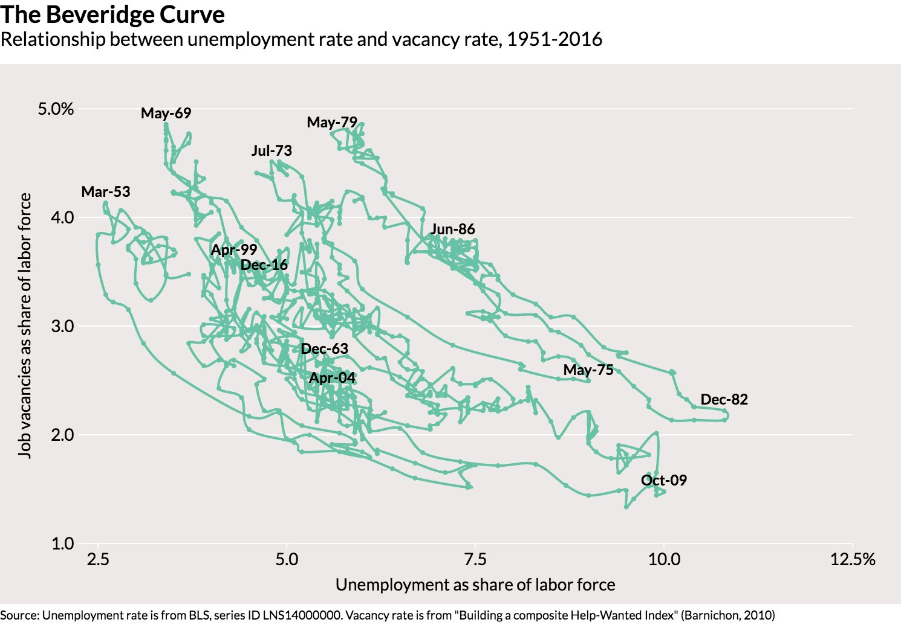

[Nick Bunker](https://twitter.com/nick_bunker/status/922567879421181954) charted some data for the Beveridge curve which made me realize I hadn't shown that the Beveridge curve is a consequence of [dynamic information equilibrium](https://informationtransfereconomics.blogspot.com/2017/01/dynamic-equilibrium-presentation.html). We can fit the dynamic equilibrium model to the JOLTS openings data (V for vacancies) and the unemployment rate data (U) — as done before on many occasions. Here's the result:

Now we can do a parametric plot of openings versus the unemployment rate. The result is here:

There's a lot to unpack in this graph. The data is blue, and the dynamic equilibrium model is red. The data starts at the black point in January 2001, and along the way I show where the shocks to openings (green) and the unemployment rate (purple) occur. These should usually be paired as a "recession" (labeled with years, with shocks to openings preceding shocks to unemployment as found [here](https://informationtransfereconomics.blogspot.com/2017/07/jolts-leading-indicators.html)). However there is the single positive shock to unemployment in 2014 (that may be associated with [Obamacare going into effect](https://informationtransfereconomics.blogspot.com/2015/06/perfect-storm-or-just-so-story.html)). The gray lines represent potential dynamic equilibria — any parallel hyperbola in U-V space can be realized. They are derived from the dynamic equilibrium growth rates (0.1/y and -0.1/y for openings and unemployment, respectively). If there were no shocks, the economy would simply climb one of these towards the top left. However, recessions intervene and send us towards the lower right. Depending on how well the shocks to openings and unemployment match ([which they don't in general](https://informationtransfereconomics.blogspot.com/2017/09/search-and-matching-ii-theory.html)), you can shift from one hyperbola to another. From 2001 to the present, we've shifted between three of them with the early-2000s recession, the Great Recession, and the 2014 mini-boom. I've projected out to January 2020, but that depends on whether another recession shock occurs between now and then.

From the unemployment rate dynamic equilibrium model alone (I don't have access to the data Bunker uses for the openings before 2001), we can see most of the previous shifts from equilibrium to equilibrium occurring during recessions. This implies that the shocks to the openings and the shocks to unemployment almost never match — they are possibly independent processes or at least effectively so given the limited data.

The main point here is that the dynamic information equilibrium model predicts these hyperbolic paths in U-V space.
