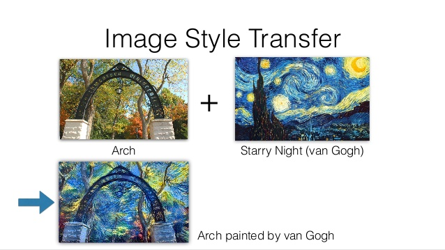

David Glasner [has a nice post](https://uneasymoney.com/2017/09/27/the-understanding-and-misunderstanding-imperfect-information/) on "imperfect information" in economics. In it, he discusses how the idea of painting Hayek and Stiglitz as "polar opposites" generally gets it wrong, and that Hayek didn't think markets had "perfect information". What was interesting to me is that a significant number of the arguments with commenters and on Twitter that resulted from [my Evonomics piece](https://evonomics.com/hayek-meets-information-theory-fails/) tried to make a similar point: that Hayek didn't say markets were always perfect. [As I mention in my response](https://informationtransfereconomics.blogspot.com/2017/05/more-on-hayek-and-information-theory.html), I never said that Hayek thought markets were perfect — quoting precisely a passage where Hayek says they're not perfect \[1\].

My contention is that not only aren't markets perfect, but even if they work they are not working in the way Hayek says they work when he looks at the case of functioning markets. I will also argue that the fact that **_neither_** a central planner nor a market can actually receive or transmit the information claimed to be flowing, making Hayek's argument against central planning _simultaneously an argument against markets_ — if they function the way Hayek claims they function. However, I will conclude with a discussion on how the price mechanism may actually function by **_destroying_** information. 

Let's start with Glasner quoting Timothy Taylor quoting Hayek:

> _\[The market is\] a system of the utilization of knowledge which nobody can possess as a whole, which ... leads people to aim at the needs of people whom they do not know, make use of facilities about which they have no direct \[knowledge\]; all this condensed in abstract signals ..._

Glasner responds to this (and the rest of the quoted section of Taylor's post):

> _Taylor, channeling Bowles, Kirman and Sethi, is here quoting from a passage in Hayek’s classic paper, “[The Use of Knowledge in Society](http://home.uchicago.edu/~vlima/courses/econ200/spring01/hayek.pdf)” in which he explained how markets accomplish automatically the task of transmitting and processing dispersed knowledge held by disparate agents who otherwise would have no way to communicate with each other to coordinate and reconcile their distinct plans into a coherent set of mutually consistent and interdependent actions, thereby achieving coincidentally a coherence and consistency that all decision-makers take for granted, but which none deliberately sought. The key point that Hayek was making is not so much that this “market order” is optimal in any static sense, but that if a central planner tried to replicate it, he would have to collect, process, and constantly update an impossibly huge quantity of \[knowledge\]._

There is an issue where in economics the words "information" and "knowledge" are synonymous (just like the colloquial English definitions \[2\]) that gets in the way of talking about this in terms of information theory. Therefore I traded "information" for "knowledge" in the quotes above (emphasizing with brackets). Knowledge is meaningful, whereas information represents a measure of the size of an available state space (weighted by probability of occupation) regardless of whether a state selected from it is meaningful. The phrases "The speed of light is a constant" and "Groop, I implore thee, my foonting" are drawn from a state space of approximately the same amount of information (the latter actually requires more), but the former is more meaningful and represents more knowledge.

This measure of information was designed to understand how to build systems that enable you to transmit either message. I'm not trying to say that Claude Shannon's definition is "better" than the economics definition or anything — there's simply a technical meaning given to it in information theory because of a distinction that hasn't been necessary in economics. In defining it, Shannon had to emphasize "information must not be confused with meaning".

However, this semantic issue allows us to get a handle on the mathematical issue with Hayek's mechanism. There is no way for this "impossibly huge quantity of knowledge" to be condensed into a price (a single number) because the amount of information (e.g. the thousands of — including "expected" — production numbers _\[x1, x2, x3, ... \]_, where the "knowledge" of them represents a specific set _\[42, 6, 9, ... \]_) is too great to be conveyed via that single number without an encoding scheme and drawing out the message over time. You could e.g. encode the numbers as Morse code and fluctuate the price over a few seconds, but the idea that there are messages like that in market prices is so laughable that we don't even need to discuss it. I'll continue use brackets to emphasize use of the technical distinction below.

Therefore one thing that market prices are not doing is "condensing" or "transmitting and processing" dispersed knowledge. Prices are incapable of carrying such an information load. The information is largely being _**destroyed**_ rather than processed or compressed.

When Stiglitz and others talk about imperfect \[knowledge\], they are actually talking about the fact that the information has been destroyed. A price of a used car isn't going to allow me to glean enough information about the state of that car — especially if you place the desires of the human used car salesperson to get a good price for it. Where an "honest" salesperson might price the car below Blue Book value because it has been flood damaged, the buyer's imperfect \[knowledge\] of the flood damage means the salesperson would rationally try to get Blue Book value. However, even a sub-Blue Book price cannot communicate the information state of the accident history, transmission, engine, etc in addition to that flood damage.

There's already an \[information\] asymmetry between the available states the car could be in and the available states the price could take. There is the additional \[knowledge\] asymmetry made famous by Akerlof's _[The Market for Lemons](https://en.wikipedia.org/wiki/The_Market_for_Lemons)_ on top of that.

But, you say, the price mechanism seems to function "as if" it is communicating information. I guess you could devise an effective theory where the state space information is actually really small (undifferentiated widgets that have some uniform production input). But that's basically just another way to describe the argument above: in order for the price to transmit dispersed knowledge, there mustn't be much knowledge to be transmitted. In a sense, this makes Hayek's argument against central planning a kind of straw man argument. Sure, a central planner can't collect and process all of this information, but the price mechanism can't do this either.

One of the reasons I belabor this particular point is because in trying to understand how information equilibrium relates to economics, I had to understand this myself. As I said in [my "about me" blog post](https://informationtransfereconomics.blogspot.com/2015/05/about-me.html):

> _... I stumbled upon [this paper](http://arxiv.org/abs/0905.0610) by Fielitz and Borchardt and tried to apply the information transfer framework to what is essentially Hayek's description of the price mechanism. That didn't exactly work, but it did work if you thought about the problem differently._

The part that "didn't exactly work" was precisely Hayek's description of information being compressed into the price. You had to think about the problem differently: the price was a detector of information flow, but unlike a thermometer or a pressure gauge (that have a tiny interface in order to not influence what it is measuring) the price is maximally connected to the system. The massive amount of information required to specify an economy was actually flowing between the agents in the economy itself (i.e. the economic state space information), with the price representing only a small amount of information.

But if this is true, then we might ask: _Since it frequently appears to work in practice, how could the price mechanism work when it does?_

I think the answer currently is that we don't know. However, I am under the impression that research into machine learning may yield some insights into this problem. What is interesting is that the price not as receiver but rather as detector is reminiscent of a particular kind of machine learning algorithm called Generative Adversarial Networks (GANs). GANs are used to train neural nets. They start with essentially randomly generated data (the generative bit) which is then compared to the real data you want the neural net to learn. A "discriminator" (or "critic" in some similar methods) checks how well the generator's guesses match the real data. 

Imagine art students trying to copy the style of van Gogh, and the art teacher simply saying you're doing well or not. It is amazing that this can actually work to train a neural net to copy the style of van Gogh (pictured above). A simpler but similar situation is a game of "warmer/cooler" where someone is looking for an object and the person who knows where it is tells them if they are getting warmer (closer) or cooler (farther). In this case, it is not as counterintuitive that this should work. Much like how it is not as problematic for Hayek's price mechanism to operate with generic widgets, what we have in the case of a game of "warmer/cooler" is very low dimensional state space so the sequence of "warmer/cooler" measurements from the "discriminator" is much closer in information content to the actual state space. In the case of van Gogh style transfer, we have a massive state space. There is no way the sequence of art teacher comments could possibly come close to the amount of information required to specify a van Gogh-esque image in state space.

However, information must be flowing from the actual van Gogh (real data) to the generator because otherwise we wouldn't be able to generate the van Gogh-esque image. The insight here is that information flows from the real data to the generator, and the quantity of information flowing will be indicated by the differences between the different discriminator scores. A constant score indicates no information flow. A really big improvement in the score indicates a lot of information has flowed.

Again, we don't know exactly how this works for high dimensional state spaces, [but a recent article in _Quanta_ magazine](https://www.quantamagazine.org/new-theory-cracks-open-the-black-box-of-deep-learning-20170921/) discusses a possible insight. It's called the "[information bottleneck](https://arxiv.org/abs/1503.02406)". In the information bottleneck, a bunch of information about the state space in the "real data" that doesn't generalize is destroyed (e.g. forgetting irrelevant correlations), leaving only "relevant" information about the state space.

To bring this back to economics, what might be happening is that the price mechanism is providing the bottleneck by destroying information. Once this information is destroyed, what is left is only relevant information about the the economic state space. My private information about a stock isn't aggregated via the price mechanism, but rather is almost entirely obliterated \[3\] when the market is functioning.

With most of this private information being obliterated in the bottleneck, measurements of the information content of trades should actually be almost zero if this view is correct. It is interesting that Christopher Sims has found that [only a few bits of information in interest rates](https://informationtransfereconomics.blogspot.com/2016/09/channel-capacity-and-rate-distortion-in.html) seems to be used by economic agents, and other research shows that [most traders seem to be "noise traders"](https://informationtransfereconomics.blogspot.com/2016/10/on-volume-and-informatoin.html). Is the information bottleneck destroying the remaining information?

This is speculation at this stage; I'm just thinking out loud with this post. However the information bottleneck is an intriguing way to understand how the price mechanism can work despite a massive amount of information falling on the floor.

...

**Footnotes:**

\[1\] Hayek from _The Use of Knowledge in Society_:

> _Of course, these \[price\] adjustments are probably never "perfect" in the sense in which the economist conceives of them in his equilibrium analysis. But I fear that our theoretical habits of approaching the problem with the assumption of more or less perfect knowledge on the part of almost everyone has made us somewhat blind to the true function of the price mechanism and led us to apply rather misleading standards in judging its efficiency. The marvel is that in a case like that of a scarcity of one raw material, without an order being issued, without more than perhaps a handful of people knowing the cause, tens of thousands of people whose identity could not be ascertained by months of investigation, are made to use the material or its products more sparingly; i.e., they move in the right direction. This is enough of a marvel even if, in a constantly changing world, not all will hit it off so perfectly that their profit rates will always be maintained at the same constant or "normal" level._

\[2\] The definitions that come up from Google searching "define knowledge" and "define information":

> _**knowledge**: facts, information, and skills acquired by a person through experience or education; the theoretical or practical understanding of a subject._

> _**information**: facts provided or learned about something or someone._

The difference between these definitions is basically the inclusion of "skills". What's also interesting is that the second definition for information gets better:

> _**information**: what is conveyed or represented by a particular arrangement or sequence of things._

Although the information theory definition of information entropy depends on the state space of possibilities that particular arrangement was selected from.

\[3\] In fact, the cases where my information isn't obliterated but rather amplified may well be the causes of market failures and recessions. Instead of my fear that a stock price is going to fall being averaged away among the optimistic and pessimistic traders, it becomes amplified in a stock market crash. The information transfer framework labels this as "[non-ideal information transfer](https://informationtransfereconomics.blogspot.com/2016/09/basic-definitions-in-information.html)" (a visualization using a demand curve as an example is [here](https://informationtransfereconomics.blogspot.com/2017/09/ideal-and-non-ideal-information.html)).
