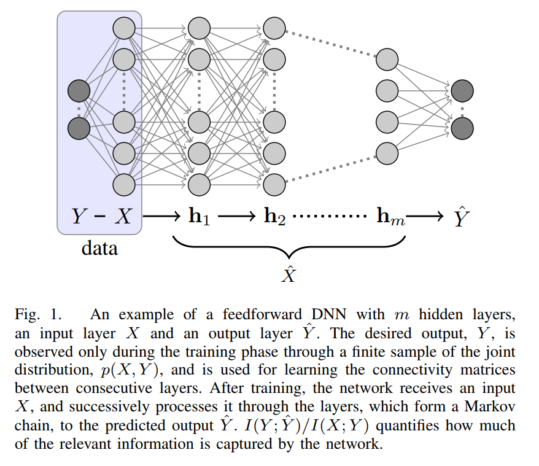

I've been reading and writing about the "information bottleneck" lately (e.g. [this paper](https://arxiv.org/abs/1703.00810), or e.g. [this post](https://informationtransfereconomics.blogspot.com/2017/10/the-price-mechanism-and-information.html)) focusing on how it might relate to the price mechanism. In the post, I argued that the price mechanism works by destroying information instead of aggregating or communicating it.

I thought this might be a neat example to try out _Mathematica_'s [**Classify**](http://reference.wolfram.com/language/ref/Classify.html) machine learning function. So I set up some training data on a simple system with three agents (1, 2, 3), a price that could take on three values (1, 2, 3) for an allocation of three units of one good. Of course, one one hand all the threes make this confusing — but on the other hand this website is free.

There are ten different possible allocations of three widgets across three agents which I designate by a list of three numbers: e.g. {1, 2, 0}, {0, 0, 3}, {1, 1, 1}, etc. Each allocation is then related to a price in the training data; here's a graphical representation of that (noisy) training data (that we'll later relate to the information bottleneck):

The prices are on the right, and the various possible allocations are on the left, with the arrows showing when a price was related to a particular allocation (sometimes multiple times, and sometimes an allocation was related to two different prices). Running **c = Classify\[trainingData\]**, we get a function **c\[.\]** that maps an allocation to a price _p_:

**c\[****\]**
**c\[****\]**

If we look at the various allocations related to each price (and weight them by their probabilities), we can get an idea of a "typical" allocation that yields each price:

Each price is represented by a different color. The horizontal line at 10% represents the probability of any particular allocation if we had a uniform distribution over the different allocations (since there are 10 of them). It's also the result when the machine learning algorithm fails, essentially choosing the least informative prior.

We can see when the price is _p_ = 1, then agent 1 ends up with more of the stock of widgets. When _p_ = 2, the distribution is more uniform (it was set up as the "equilibrium price" in the training data). Although each agent in this particular setup is a consumer, we can think of 1 as the "consumer" and 3 as the "producer". If the price is too high, agent 3 ends up with more of the goods on average (they don't sell); if the price is too low, agent 1 does (over-consumption).

we can look at the information entropy of these allocations, and it is indeed maximized for the equilibrium price _p_ = 2 (by construction):

We have an information bottleneck where these three price values (1.6 bits) are destroying the irrelevant information and capturing relevant information about the opportunity set (3.3 bits, for a loss of 1.7 bits — more than half the information content) \[1\].

I borrowed this information bottleneck diagram [from this pape](https://arxiv.org/abs/1503.02406)r:

In our case, $X$ is the allocation (state space), and $Y$ is the price. Our classify function c\[state\] represents $\hat{X}$ and $\hat{Y}$ is the output of that function. It was trained on the data (the diagram at the top of this post). Of course, Classify isn't really doing this with a Deep Neural Network (there's actually just one hidden layer with 8 nodes), but what I'm trying to illustrate here is the formal similarities between destroying information in the price mechanism and the information bottleneck.

We can envision the price mechanism as setting up a primitive neural network machine learning algorithm: the price functioning as an autoencoder of the state space information, destroying the irrelevant information in the information bottleneck, and then the flow of money reinforces the connection between neurons (i.e. exchages between agents).

We can add a second state space defining the demand for widgets (the state space above defines the supply). If these state spaces match up, then the supply and the demand will see the "equilibrium" price for the equilibrium allocation. Deviations on either side will will mean the market price will differ from the price derived from either the supply distribution or the demand distribution. Information will flow from supply to demand (or vice versa) via exchanges, and the price will change to represent the new state. This process will continue until the relevant information content of the supply distribution (captured via the bottleneck, with irrelevant information being destroyed) is equivalent to the information content of the demand distribution — i.e. [information equilibrium](https://informationtransfereconomics.blogspot.com/2017/04/a-tour-of-information-equilibrium.html).

If we take demand as constant (i.e. the real data we are trying to learn), this is identical to training a neural network with a Generative Adversarial Network (GAN) algorithm. Different supply distributions are created via exchanges and the price (the bottleneck) discriminates between them leading what should eventually be identical distributions on both sides when the price can no longer discriminate (i.e. is constant) between the supply distribution and the demand distribution.

Or at least that is how I am thinking about this at the moment. It is possible we need to look at the joint distribution of supply and demand as one big state space. More work to be done!

**Footnotes:**

\[1\] Additionally, I went through and did random trades among the agents (select two agents at random, and if one agent has more widgets than the other and the other has money at the price dictated by the future allocation — i.e. the allocation that would result from a trade — there's a trade). This eventually produces an equilibrium (an equilibrium price of 2 with a uniform allocation):

I want to eventually make the machine learning algorithm re-train on the new data that's produced from a transaction, which would likely reinforce some price probabilities and reduce others.
