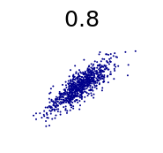

[Sandy Black](https://twitter.com/Econ_Sandy/status/922830782846160897)

> _Nice discussion of why, since the 1970s, hourly inflation-adjusted wages of the typical worker have grown only 0.2% per year._

The [linked article](https://hbr.org/2017/10/why-wages-arent-growing-in-america) does "discuss" stagnant wages, but doesn't really say why. Their description of what makes wages grow is in fact just a series of mathematical definitions written as prose:

> _For wages to grow on a sustained basis, workers’ productivity must rise, meaning they must steadily produce more per hour, often with the help of new technology or capital. Further, workers must receive a consistent share of those productivity gains, rather than seeing their share decline. Finally, for the typical worker to see a raise, it is important that workers’ gains are spread across the income distribution._

The first part is a description of the Solow growth model with constant returns to scale, and a fixed exponent. The last bit is just tautological: a typical worker sees gains if and only if those gains are shared across the income distribution. They might as well have said that for a typical worker to see a raise, it is important that the typical worker sees a raise.

But then  the article just whiffs on any substantive explanation, telling us what "decline is plausibly due to" an that "\[a\]ssigning relative responsibility to the policies and economic forces that underlie rising inequality or declining labor share is a challenge." It talks about "productivity" and "dynamism", which are more quantifying the issues we are seeing than explaining them. While it is generally useful to quantify things, one must avoid creating measures of phlogiston or attributing causality to quantities you defined \[2\].

Anyway, I looked at [hourly wages a couple months ago](https://informationtransfereconomics.blogspot.com/2017/08/dynamic-equilibrium-in-average-hourly.html) with the [dynamic equilibrium model](https://informationtransfereconomics.blogspot.com/2017/01/dynamic-equilibrium-presentation.html) and found that the dynamic equilibrium growth rate was about 2.3% — therefore with 2% inflation, the real growth rate would be about 0.3%:

In this picture, wages going forward will continue to be "stagnant" because that is their normal state. The high wages of the past were closely linked [with the demographic transition](https://informationtransfereconomics.blogspot.com/2017/09/was-phillips-curve-due-to-women.html).

But this got me interested in the different possible ways to frame the data. Because we [don't really have much equilibrium data](https://informationtransfereconomics.blogspot.com/2017/04/macroeconomics-has-no-equilibrium-data.html) (most of the post-war period is dominated by a major demographic shift), there's a bit of ambiguity. In particular, I decided to look at wages per employed person. I will deflate using the GDP deflator later (following [this post](https://informationtransfereconomics.blogspot.com/2017/10/real-growth.html), except with NGDP exchanged for W/L), but first look at these two possible dynamic information equilibria:

These show the data with a given dynamic equilibrium growth rate subtracted. One sees two transitions: women entering the workforce and baby boomers leaving it after the Great Recession (growth rate = 3.6%). The other sees just the single demographic transition (growth rate = 2.0%). These result in two different equilibria when deflated with the GDP deflator — dynamic equilibrium growth rates of 2.2% and 0.6%, respectively:

We can see that the 2.2% dynamic equilibrium is a better model:

The two models give us two different views of the future. In one, wages are at their equilibrium and will only grow slowly at about 0.6%/y in the future (unless e.g. another demographic shock hits). In the other (IMHO, better) model, wages growth will increase in the near future from about 1%/y to 2.2%/y. However both models point to the ending of the demographic transition (and the "[Phillips curve era](https://informationtransfereconomics.blogspot.com/2017/10/real-growth.html)") in the 90s as a key component of why today is different from the 1970s, therefore (along with the other model above) we can take that conclusion to be more robust.

As for future wage growth? There isn't enough data to paint a definitive picture. Maybe wage growth will have to rely on asset bubbles (the first model at the top of this post)? Maybe wage growth will continue to stagnate? Maybe wage growth will happen after we leave this period of Baby Boomer retirements?

My own intuition says a combination of 1 (because they do in both the hourly wage and W/L models \[1\]) and 3 (because it is the better overall model of W/L).

**Update**

Here's a zoom-in on the W/L model for tracking forecast performance:

**Footnotes:**

\[1\] In fact, you can see the asset bubbles affecting W/L on the lower edge of the graph shown above and again here — there are two bumps associated with the dot-com and housing bubbles:

\[2\] **Added in update**: I wanted to expound on this a bit more. The issue is that when you define things, you have a tendency to look for things that show an effect creating a kind of selection bias. "Dynamism" becomes important because you look at falling wages and look for other measures that are falling, and lump them under a new concept you call "dynamism". This is similar to an issue [I pointed out some time ago](https://informationtransfereconomics.blogspot.com/2016/05/a-review-of-cesar-hidalgos-why.html) that I'll call "_R²_ = 0.7 disease". If you were to design an index you wanted to call "dynamism" that combined various measures together, you might end up including or leaving out things that correlate with some observable (here: wages) depending on whether or not you thought they improved the correlation. Nearly all economic variables are correlated with the business cycle or are exponentially growing quantities so you usually start with some high _R²_, and this process seems to stop before your _R²_ gets too low. I seem to see a lot of graphs of indices out there with [correlations](https://en.wikipedia.org/wiki/Pearson_correlation_coefficient) on the order of 0.8 (resulting in an  _R²_ of about 0.6-0.7):

The issue with defining factors like productivity or dynamism is similar to the "_R²_ = 0.7 disease": since you defined it, it's probably going to have a strong correlation with whatever it is you're trying to explain.
