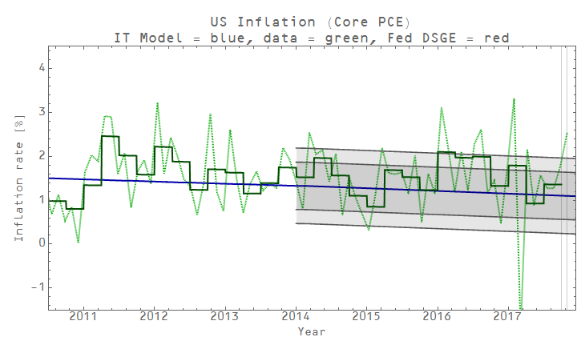
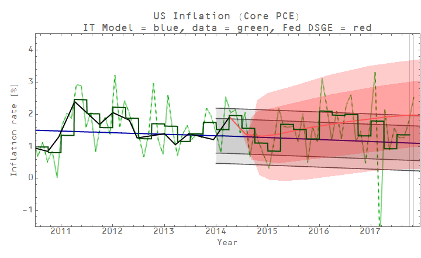
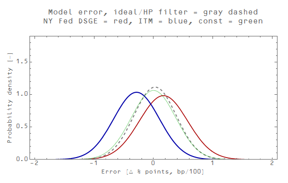
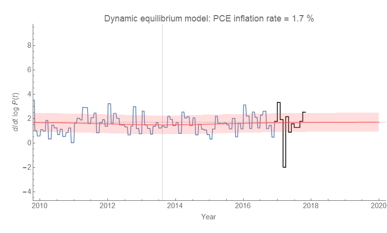
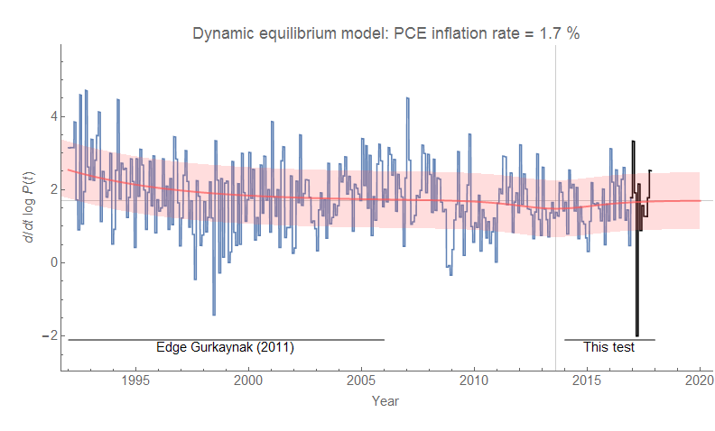

Actually, when you look at the monetary information equilibrium (IE) model I've been tracking since 2014 (almost four years now with only one quarter of data left) on its own it's not half-bad:

The performance is almost the same as the NY Fed's DSGE model (red):

A more detailed look at the residuals lets us see that both models have a bias (IE in blue, NY Fed in red):

The thing is that the monetary model looks even better if you consider the fact that it only has 2 parameters while the NY Fed DSGE model has 41 (!). But the real story here is in the gray dashed and green dotted curves in the graph above. They represent an "ideal" model (essentially a smoothed version of the data) and a constant inflation model — the statistics of their residuals match extremely well. That is to say that constant inflation captures about as much information as is available in the data. This is exactly the story of the [dynamic information equilibrium model](https://informationtransfereconomics.blogspot.com/2017/01/dynamic-equilibrium-presentation.html) (last updated [here](https://informationtransfereconomics.blogspot.com/2017/09/checking-in-on-inflation-forecast.html)) which says that PCE inflation should be constant \[1\]:

[Longtime readers may remember](https://informationtransfereconomics.blogspot.com/2016/10/forecasting-it-versus-all-comers.html) that I noted a year ago that a constant model didn't do so well in comparison to various models including DSGE models after being asked to add one to my reconstructions of the comparisons in Edge and Gurkaynak (2011). However there are two additional pieces of information: first, that was a constant 2% inflation model (the dynamic equilibrium rate is 1.7% \[2\]); second, the time period used in Edge and Gurkaynak (2011) contains the tail end of the 70s shock (beginning in the late 60s and persisting until the 90s) I've associated with [women entering the workforce](https://informationtransfereconomics.blogspot.com/2017/02/nairu-and-other-connections-between.html):

The period studied by Edge and Gurkaynak (2011) was practically aligned with a constant inflation period per the dynamic information equilibrium model \[3\]. We can also see the likely source of the low bias of the monetary IE model — in fitting the ansatz for 〈_k_〉 (see [here](https://informationtransfereconomics.blogspot.com/2017/10/forecast-head-to-head-performance-and.html)) we are actually fitting to a fading _non-equilibrium_ shock. That results in an over-estimate of the rate of the slow fall in 〈_k_〉 [we should expect in an ensemble model](https://informationtransfereconomics.blogspot.com/2017/07/presentation-macroeconomics-and.html), which in turn results in a monetary model exhibiting slowly decreasing inflation over the period of performance for this forecast instead of roughly constant inflation.

We can learn a lot from these comparisons of models to data. For example, if you have long term processes (e.g. women entering the workforce), the time periods you use to compare models is going to matter a lot.  Another example: constant inflation is actually hard to beat for inflation in the 21st century — which means the information content of the inflation time series is actually pretty low (meaning complex models are probably flat-out **_wrong_**). A corollary of that is that it's not entirely clear monetary policy does anything. Yet another example is that if 〈_k_〉 is falling for inflation in the IE model, it is a much slower process than we can see in the data.

Part of the reason I started my blog and tried to apply some models to empirical data myself was that I started to feel like macroeconomic theory — especially when it came to inflation — seemed unable to "add value" beyond what you could do with some simple curve fitting. I've only become more convinced of that over time. Even if the information equilibrium approach turns out to be wrong, the capacity of the resulting functional forms to capture the variation in the data with only a few parameters severely constrains the [relevant complexity](http://informationtransfereconomics.blogspot.com/2017/01/curve-fitting-and-relevant-complexity.html) \[4\] of macroeconomic models.

**Footnotes:**

\[1\] See also [here](https://informationtransfereconomics.blogspot.com/2017/08/forecast-updates-and-more-ie-versus-fed.html) and [here](https://informationtransfereconomics.blogspot.com/2017/10/forecast-head-to-head-performance-and.html) for some additional discussion and where I made the point about the dynamic equilibrium model as constant inflation mode before.

\[2\] See also [this on "2% inflation"](https://informationtransfereconomics.blogspot.com/2017/10/miracles.html).

\[3\] You may notice the small shock in 2013. It was added based on information (i.e. a corresponding shock) in nominal output in [the "quantity theory of labor" model](https://informationtransfereconomics.blogspot.com/2017/03/the-quantity-theory-of-labor-and.html). It is so small it is largely irrelevant to the model and the discussion.

\[4\] This idea of relevant complexity is related to relevant information in the [information bottleneck](https://informationtransfereconomics.blogspot.com/2017/10/the-price-mechanism-and-information.html) as well as effective information in Erik Hoel's discussion of emergence that I talk about [here](https://informationtransfereconomics.blogspot.com/2017/06/emergence-and-over-selling-information.html). By related, I mean I think it is actually the same thing but I am just too lazy and or dumb to show it formally. The underlying idea is that functions with a few parameters that describe a set of data well enough is the same process in the information bottleneck (a few neuron states capture the relevant information of the input data) as well as Hoel's emergence (where you encode the data in the most efficient way — the fewest symbols).
