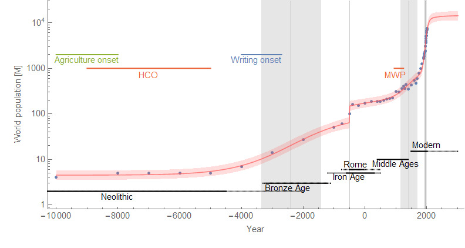
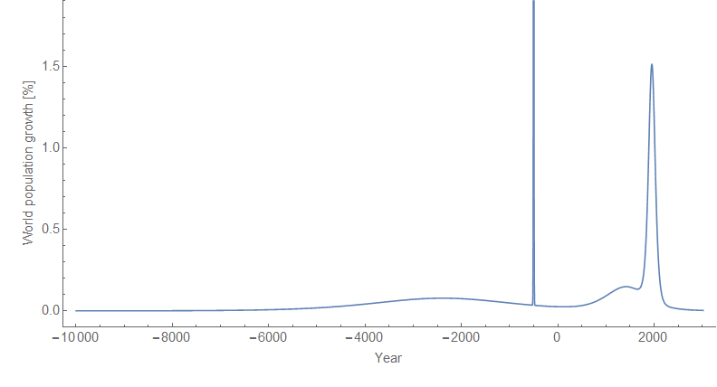

Apropos of nothing (well, Matthew Yglesias's new newsletter where he referenced [this book from Kyle Harper on Ancient Rome](https://www.amazon.com/dp/B071SLPWVL/ref=as_li_ss_tl?_encoding=UTF8&btkr=1&linkCode=ll1&tag=arandomphysic-20&linkId=4d65890b2ab483605c1d69823d5a354e)), I decided to try the [dynamic information equilibrium model](https://informationtransfereconomics.blogspot.com/2017/01/dynamic-equilibrium-presentation.html) on world population data. I assumed the equilibrium growth rate was zero, and fit the model to data. The prediction is about 12.5 billion humans in 2100 (putting it at the somewhat middle-higher end of [these projections](https://commons.wikimedia.org/wiki/File:UN_DESA_continent_population_1950_to_2100.svg)) with an equilibrium population at about 13.4 billion.

There were four significant transitions in the data centered at 2390 BCE, 500 BCE, 1424, and 1954. The widths (transition durations) were ~ 1000 years, between 0 and 100 years (highly uncertain, but small), ~ 300 years, and ~ 50 years, respectively. Historically, we can associate the first with the neolithic revolution following the Holocene Climate Optimum (HCO). The second appears right around the dawn of the Roman Republic. The third follows the Medieval Warm Period (MWP) and is possibly another agricultural revolution that is ending, while the final one is our modern world and is likely associated with public health and medical advances (it began near the turn of the century in 1900). Here's what a graph looks like:

I included some random items from (mostly) Western history to give readers some points of reference. The interesting thing is that "exponential growth" with a positive growth rate of 1% to 2% is really only a local approximation. Over history, the population growth rate is typically zero:

Some major technology developments seem to happen on the leading edge of these transitions (writing, money, horse collar/heavy plow, computers). Maybe a more systematic study of technology might yield some pattern — my hypothesis (i.e. random guess) is that there are bursts of tech development associated with these transitions as people try to handle the changes in society during the population surges. There are also likely social organization changes as well — the third transition roughly coincides with the rise of nation-states, and the fourth with modern urbanization.
