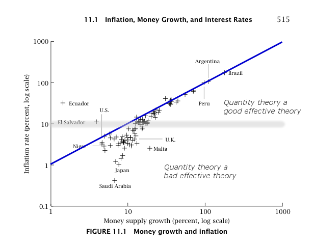

I put up my [macro and ensembles slides as a "Twitter talk"](https://informationtransfereconomics.blogspot.com/2017/07/presentation-macroeconomics-and.html) (Twalk™?) yesterday and it reminded me of something that has always bothered me since the early days of this blog: Why does the "quantity theory of money" follow from the [information equilibrium relationship](https://informationtransfereconomics.blogspot.com/2016/09/basic-definitions-in-information.html) _N_ ⇄ _M_ for information transfer index _k_ = 2?

From the information equilibrium relationship, we can show log _N_ ~ _k_ log _M_ and therefore log _P_ ~ (_k_ − 1) log _M_. This means that for _k_ = 2 

log _P_ ~ log _M_

That is to say the rate of inflation is equal to the rate of money growth for _k_ \= 2. Of course, this is only empirically true for high rates of inflation:

**But why _k_ \= 2?** It seems completely arbitrary. In fact, it is so arbitrary that we shouldn't really expect the high inflation limit to obey it. The information equilibrium model allows all positive values of _k_. Why does it choose _k_ \= 2? What is making it happen?

I do not have a really good reason. However, I do have some intuition.

One of the concepts in physics that the information equilibrium approach is related to is diffusion. In that case, most values of _k_ represent "anomalous diffusion". But ordinary diffusion with a Wiener process (a random walk based on a normal distribution) results in diffusion where the distance traveled goes as the square root of the time step _σ_ ~ √_t_. That square root arises from the normal distribution, which is in fact a universal distribution (there's a central limit theorem for distributions that converge to it). Another way: 

2 log _σ_ ~ log _t_

is an information equilibrium relationship _t_ ⇄ _σ_ with _k_ \= 2.

If we think of output as a diffusion process (distance is money, time is output), we can say that in the limit of a large number of steps, we obtain

2 log _M_ ~ log _N_

as a diffusion process, which implies log _P_ ~ log _M_.

Of course, there are some issues with this besides it being hand-waving. For one, output is the independent variable corresponding to time. This does not reproduce the usual intuition that money should be causing the inflation, but rather the reverse (the spread of molecules in diffusion is not causing time to go forward \[1\]). But then applying the intuition from a physical process to an economic one via an analogy is not always useful.

I tried to see if it came out of some assumptions about money _M_ mediating between nominal output _N_ and aggregate supply _S_, i.e. the relationship

_N_ ⇄ _M_ ⇄ _S_

But aside from figuring out that if the IT index _k_ in the first half is _k_ \= 2 (per above), then the IT index _k'_ for _M_ ⇄ _S_ would have to be 1 + φ or 2 − φ where φ is the golden ratio in order for the equations to be consistent. The latter value _k'_ = 2 − φ ≈ 0.38 implies that the IT index for N ⇄ S is _k k'_ ≈ 0.76, while the former implies _k k'_ ≈ 5.24. But that's not important right now. It doesn't tell us **_why_** _k_ \= 2.

Another place to look would be [the symmetry properties](https://informationtransfereconomics.blogspot.com/2016/10/invariance-under-inversion.html) of the information equilibrium relationship, but _k_ \= 2 doesn't seem to be anything special there.

I thought I'd blog about this because it gives you a bit of insight as to how physicists (or at least this particular physicist) tend to think about problems — as well as point out flaws (i.e. _ad hoc_ nature) in the information equilibrium approach to the quantity theory of money/AD-AS model in the aforementioned slides. I'd also welcome any ideas in comments.

...

**Footnotes:**

\[1\] Added in update. You could make a case for the "[thermodynamic arrow of time](https://en.wikipedia.org/wiki/Entropy_\(arrow_of_time\))", in which case the increase in entropy is actually equivalent to "time going forward".
