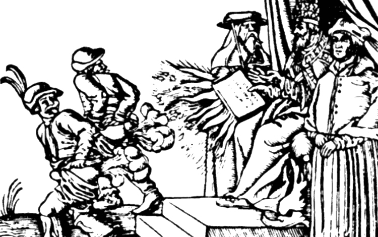

The other day, Rethinking Economics and the New Weather Institute published "33 theses" and metaphorically nailed them to the doors of the London School of Economics \[1\]. They're re-published [here](https://www.opendemocracy.net/neweconomics/33-theses-economics-reformation/). I think the "Protestant Reformation" metaphor they're going for is definitely appropriate: they're aiming to replace "neoclassical economics" — the Roman Catholic dogma in this metaphor — with a a pluralistic set of different dogmas — the various dogmas of the Protestant denominations (Lutheran, Anabaptist, Calvinist, Presbyterian, etc). For example, Thesis 2 says:

> _2\. The distribution of wealth and income are fundamental to economic reality and should be so in economic theory._

This may well be true, but a _scientific_ approach does not assert this and instead collects empirical evidence that we find to be in favor of hypotheses about observables that are affected by the distribution of wealth. A _dogmatic_ approach just assumes this. It is just as dogmatic as neoclassical economics assuming the market distribution is efficient.

In fact, several of the theses are dogmatic assertions of things that either have tenuous empirical evidence in their favor or are simply untested hypotheses. These theses are not things you dogmatically assert, but rather should show with evidence:

> _11\. ... Economics needs a deeper understanding of how markets behave, and could learn from the science of complex systems ..._

> _21\. ... Our understanding of GDP growth may be improved if we see innovation as occurring within a constantly-evolving, disequilibrium ecosystem ..._

> _23\. Private debt also profoundly influences the rate at which the economy grows\[,\] and yet is excluded from economic theory. The creation of debt adds credit-financed demand, and affects both goods and asset markets. ..._

> _25\. The way in which money is created affects the distribution of wealth within society. ..._

> _27\. Economics needs a better understanding of how instability and crises can be created internally within markets, rather than treating them as ‘shocks’ that affect markets from the outside._

There were two more theses that are also dogmatic assertions but can in fact be shown to be false in one relatively empirically accurate approach:

> _4\. Policy does not ‘level’ the playing field, but tilts it in a direction._

> _12\. Institutions shape markets, and influence the behaviour of all economic actors. ..._

To first order in the information equilibrium approach, it seems empirically that economic policy does not affect a lot of things from GDP to unemployment over the bulk of the time series, and many institutions (e.g. the business news, central banks) serve as nuclei of coordination (groupthink) that cause problems (e.g. financial crises) for the sparse shocks in the time series. I'm not asserting this approach is correct, but rather that these theses exclude information equilibrium from the purportedly pluralistic set of approaches.

As with the other theses above, this is primarily because they represent hypotheses that need to be tested that are not true in many theories and may not be true in reality. I've [written](https://informationtransfereconomics.blogspot.com/2014/08/against-human-centric-macroeconomics.html) that focusing on human decision-making may be a longstanding bias ([unchallenged assumption](https://informationtransfereconomics.blogspot.com/2017/08/the-unchallenged-assumption-of-human.html)) in economic theory that has held it back. But I would not write up a manifesto where one thesis is that human decisions don't matter. Leave it to research to figure out \[2\].

A few theses seem like the authors regret choosing economics and wish they'd chosen a different field like ecology, psychology, or physics:

> _6\. ... \[The economy\] depends upon a continual through-flow of energy and matter, and operates within a delicately balanced biosphere._

> _11\. ... Economics needs a deeper understanding of how markets behave, and could learn from the science of complex systems, as used in physics, biology, and computing._

> _15\. ... Mainstream economics therefore needs a broader understanding of human behaviour, and can learn from sociology, psychology, philosophy, and other schools of thought._

The first entry in the last section on teaching economics almost had me spitting out my coffee:

> _29\. \[Economics education should\] also \[include\] a wide range of current perspectives – such as institutional, Austrian, Marxian, post-Keynesian, feminist, ecological, and complexity._

Austrian economics is basically garbage, and I'm not sure [what they mean by complexity](http://informationtransfereconomics.blogspot.com/2017/01/complex-systems-versus-complicated.html). Usually teaching (at least at the undergraduate level) is reserved for approaches that have withstood the test of time and are generally agreed as useful \[3\]. The speculative or alternative methodologies are more appropriate to graduate school (they require more critical thinking skills). You write a thesis on post-Keynesian economics, but you take a test on supply and demand.

This thesis was weird given that in the third rationale in the preamble said that economics wasn't being scientific:

> _31\. Economics should not be taught as a value-neutral study of models and individuals. ..._

It's true that sometimes science isn't "value neutral", but the key here is admitting and documenting your values and biases — not saying that you should go ahead and include your value system in a scientific approach to your subject.

**\*  \*  \***

Overall, these 33 theses represent a lot of unfounded assumptions and hypotheses presented as facts that feels to me to be almost more dogmatic than "mainstream" (or neoclassical) economics. A neoclassical synthesis education has produced a range of voices from Brad DeLong to John Cochrane (and even Steve Keen who has a Phd in economics). I agree that economics should be taught with eyes wide open to where the approach gets things wrong, but it seems that a traditional economics education is just as likely to generate a person that can question the mainstream (both DeLong and Cochrane do so extensively!) as any other field that teaches critical thinking —dare I say physics?

In the end, this effort is not terribly dissimilar to a reviewer asking why you didn't cite his or her paper in your manuscript, or an attendee at a conference asking a question about how the presenter's approach relates to the attendee's research. _Why don't college economics classes teach [my research](https://informationtransfereconomics.blogspot.com/2017/04/a-tour-of-information-equilibrium.html)?_ I ask that as a tongue-in-cheek rhetorical question about my own approach (of course they shouldn't teach information equilibrium in economics textbooks yet \[4\]), but I think Steve Keen actually intends to get his approaches \[1\] in their current form into introductory economics textbooks.

Again, the way to be scientific is not to make assertions about how inequality affects growth. _In fact, I would question the results in a paper on that subject from anyone signing on to these theses._ These economists have admitted a bias in favor finding a negative effect of increased inequality on an economy. When their paper comes out and says that inequality causes lower growth, my first reaction is going to be "of course you found that", not "I want to read this paper". It is no different from the way I look at papers from Tyler Cowen or John Cochrane that say lower taxes or less regulation improve growth. In a document that says economics has fallen short of the standard of science, explicitly claiming bias on major research topics seems like an odd choice.

...

PS Some of the writing is just funny:

> _5\. The nature of the economy is that it is a subset of nature ..._

...

**Footnotes:**

\[1\] Steve Keen [was one of the people](https://twitter.com/rethinkecon/status/940684818853126144) "nailing" the document to the doors. Part of the document says that economics is "developing more as a faith than as a science" which I find terribly ironic. If I had to choose an approach that was **_less_** scientific than mainstream economics, I'd probably choose Keen's (see [here](https://informationtransfereconomics.blogspot.com/2016/02/attainable-definitions-of-equilibrium.html), [here](https://informationtransfereconomics.blogspot.com/2017/08/economics-criticism-as-art-criticism.html), [here](https://informationtransfereconomics.blogspot.com/2017/09/the-long-trend-in-energy-consumption.html), [here](https://informationtransfereconomics.blogspot.com/2016/10/keen-chaos-and-equilibrium.html), or [here](https://informationtransfereconomics.blogspot.com/2017/02/qualitative-economics-done-right-part-2.html)). Kate Raworth [was also in the pictures](https://twitter.com/Suitpossum/status/940888233348665349) and I have issues with [her dogmatic approach as well](https://informationtransfereconomics.blogspot.com/2017/04/good-ideas-do-not-need-lots-of-invalid.html).

\[2\] This is basically a problem that I've found many times in economics: what should be a research question is instead asserted as a definition or dogmatic position. I documented several of these with regard to [what recessions are](https://informationtransfereconomics.blogspot.com/2015/11/frameworks.html). If these 33 theses are supposed to form the basis of an economic theory framework, then it shouldn't make major assumptions about the objects of study in that framework. Economic theory is supposed to study the effects of inequality and recessions, not assert their properties.

\[3\] What's funny about this is that the 33 theses starts out with a statement that "neoclassical economics made a contribution historically and is still useful", which would mean that the consensus framework among the various pluralistic approaches that should be taught in undergraduate curriculum is in fact **neoclassical economics**.

\[4\] But that doesn't stop me from dreaming ... \[see [here](https://informationtransfereconomics.blogspot.com/2017/09/my-introductory-chapter-on-economics.html) and [here](https://informationtransfereconomics.blogspot.com/2016/03/if-i-was-to-teach-econ-101.html)\]
