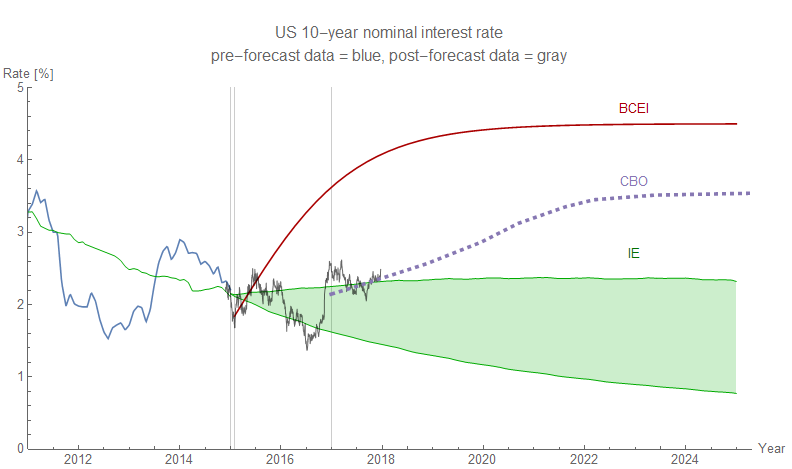

Since _Mathematica_ [seems to have stopped supporting S&P 500 data](https://informationtransfereconomics.blogspot.com/2017/12/comparing-s-500-forecast-to-data-update.html), I've finally recovered the original forecast using some cobbled-together data sources with a bit of re-sampling:

Most of the rise since the beginning of 2017 has been pretty much on trend; the most recent data is a bit above (probably due to the increased likelihood of stock buybacks in the wake of the tax bill passing) — but still within the expected error.

The same events are likely influencing the bond market with yields up recently, but again the path is consistent with [the forecast I made in 2015](https://informationtransfereconomics.blogspot.com/2015/08/comparison-of-interest-rate-predictions.html):

**\*  \*  \***

Bitcoin went through a bit of crash recently, which has helped reduce the uncertainty in the expected path (per the model I've been following [here](https://informationtransfereconomics.blogspot.com/2017/10/bitcoin-model-fails-usefulness-criterion.html)):

As the previous link states, I've given up on this as a useful forecasting tool (bitcoin is too volatile, and it also seems estimates of shock amplitudes are initially too small then too large). Instead it's more of a _post hoc_ description of the data that is consistent with [dynamic equilibrium](https://informationtransfereconomics.blogspot.com/2017/01/dynamic-equilibrium-presentation.html). The only thing I'd take seriously from this graph is the slope of the future path (i.e. down due to the −2.6/y dynamic information equilibrium rate). Another shock could hit in 2018 (or the current shock could continue with the recent fall being a temporary fluctuation), but in the absence of future shocks and taking the model's estimate that the current shock is mostly over as genuine the graph above is what I'd expect \[1\]. Note that the best fit suggests a rebound from the current losses, but new data could easily revise that estimate (which is why I consider the model useless for forecasting, but not necessarily describing data after the fact).

...

**Footnotes:**

\[1\] One thing that I find interesting is that in other cases the exchange rates between two currencies represent (effectively) a ratio of the GDPs of the two countries. Is this bitcoin exchange rate a ratio of the "bitcoin economy GDP" to the US GDP? There seems to be a financial industry swarming around bitcoin (with e.g. futures markets just recently) which some people seem to be making money off of (regardless of its long term sustainability). I'd say there are far more questions than answers here.
