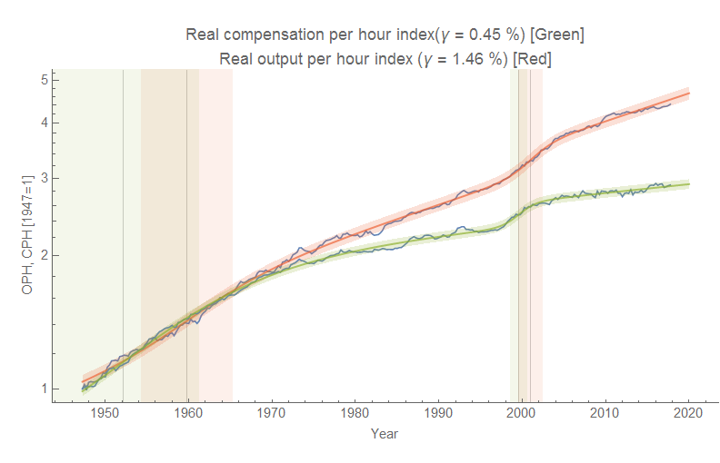

[Noah Smith has an article at Bloomberg View](https://www.bloomberg.com/view/articles/2017-12-04/workers-get-nothing-when-they-produce-more-wrong?utm_content=view&utm_campaign=socialflow-organic&utm_source=twitter&utm_medium=social&cmpid%3D=socialflow-twitter-view) asking why compensation hasn't risen in lockstep with productivity. Recent research seems to say it at least rises a little when output rises in the short run, but not one-for-one:

> _This story gets some empirical support from a new study by economists Anna Stansbury and Larry Summers, presented at a recent conference at the Peterson Institute for International Economics. Instead of simply looking at the long-term trend, Stansbury and Summers focus on more short-term changes. They find that there’s a correlation between productivity and wages — when productivity rises, wages also tend to rise. Jared Bernstein, senior fellow at the Center on Budget and Policy Priorities, checked the results, and found basically the same thing._

I thought the long run data would be a good candidate for the [dynamic information equilibrium model](https://informationtransfereconomics.blogspot.com/2017/01/dynamic-equilibrium-presentation.html), but came out with some surprising results. It's true that the models appear correlated. Real output per hour (OPH) seems to rise faster at 1.46%/y while real compensation per hour (CPH) rises at about 0.45%/y. This has held up throughout the data that isn't being subject to a non-equilibrium shock (roughly the "Great Moderation" and the post-global financial crisis period).

But the interesting part of this particular framing of the data is the timing of the shocks — shocks to real compensation per hour **_precede_** shocks to real output per hour:

The shocks to CPH (_t_ = 1952.1 and _t_ = 1999.6) precede the shocks to OPH (_t_ = 1959.8 and _t_ = 2001.0). Real compensation increases **before** real output increases. It's not that compensation captures some part of rising output; it's that giving people raises **_increases_** productivity.

Now it is entirely possible this framing of the data isn't correct (there is a less statistically significant version of the dynamic equilibrium that sees the periods of the shocks as the equilibrium and the 80s and 90s, as well as the post-crisis period as the shocks). However there is some additional circumstantial evidence that the productivity shocks correspond to real world events. The late 90s shock seems associated with the introduction of the internet to a wider audience than defense and education, while the 40s and 50s shock is likely associated with a post-war increase in production efficiency in the US. It is possible increased compensation is due to increased skills required to use new technologies and methods — with those raises and increased starting salaries needing to happen before firms can implement these technology upgrades \[it costs more to get labor with the latest skills\]. Those could well be just-so stories (economists like stories, right?), but I believe the most interesting aspect is simply the plausible existence of this entirely different (but mathematically consistent) way to look at the data along with the entirely different policy implications (i.e. needing to find ways to directly raise wages instead of looking for ways to increase growth or productivity).

...

**Update:** I added a bit of clarifying text — e.g. "upgrades" and bracketed parenthetical — in the last paragraph that was ambiguous. Also the reference to "post-crisis period" replaces "2010s" because the latter could be confused with the actual shock to output in 2008/9 whereas I am actually referring to the the period after the shock that we are still in.
