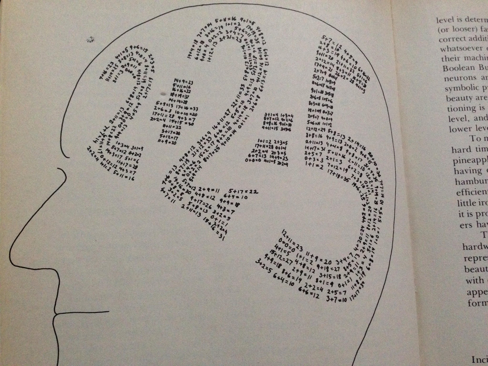
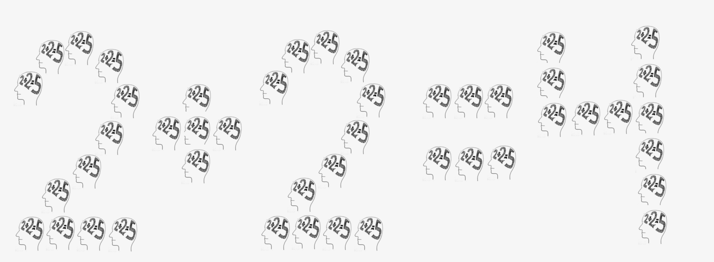

> _\[Gary\] Becker acknowledged that ... he was pushing the envelope. In his Nobel address he discusses this explicitly (Becker 1993). “I have intentionally chosen certain topics for my research—such as addiction—to probe the boundaries of rational choice theory. … My work may have sometimes assumed too much rationality, but I believe it has been an antidote to the extensive research that does not credit people with enough rationality”._ 

> _Becker’s last sentence suggests an alternative definition of behavioral economics: crediting people with just the right amount of rationality and human foibles. The trick is in figuring out what is just the right amount. The approach taken by most behavioral economists has been to focus on a few important ways in which \[Homo sapiens, HS\] diverge from Homo economicus \[HE\]._

That is from a [recent article by Richard Thaler in JPE](http://www.journals.uchicago.edu/doi/full/10.1086/694640). Thaler's characterization suggests a particular interpretation of economic theory where real humans are perturbations from a rational _Homo economicus_:

(1) _HS = HE + dB_

Now this "behavior perturbation theory" formulation is entirely plausible. It represents the typical approach to quantum field theory where the electrons we observe are "ideal" electrons plus quantum interactions (_dI_):

_Electron = Ideal electron + dI_

However, this formulation is incorrect for thermodynamics. We do not say \[1\] that diffusion is an atom plus some diffusion perturbation (_dD_):

(✕) _Diffusing atom = Atom + dD_

but rather it is an [entropic force](https://en.wikipedia.org/wiki/Entropic_force) that does not exist for a single atom and requires there to be an collection of a large number of atoms \[7\]:

_Diffusion = d(Σ Atoms)_

Diffusion is a pseudo-force that exists due to the possible configurations of a collection of atoms, but not for any single atom. This sets up a different paradigm from (1). Economic forces might well arise from collections of humans

(2) _Economic forces = d(__Σ_ _HS)_

That is to say that economic forces (macro or micro) are gradients in the state space accessible by real humans. In this paradigm, you might be able to observe many behavioral effects (dB) relative to _Homo economicus_ that don't show up in economic forces as a simple aggregate if at all. This might explain [Thaler's lament](http://www.nytimes.com/2015/05/10/upshot/unless-you-are-spock-irrelevant-things-matter-in-economic-behavior.html):

> _The field of behavioral economics has been around for more than three decades, but the application of its findings to societal problems has only recently been catching on._

Could this be because:

_d(__Σ_ _HS) ≈ d(__Σ_ _HE)_

(i.e. on average the idiosyncratic human behaviors _dB_ 'cancel' such that _Σ_ _dB ≈ 0_)? Or what about:

_d(__Σ_ _HS) ≈ HE?_

This approximation is something I [speculated about awhile ago](https://informationtransfereconomics.blogspot.com/2015/09/the-emergent-representative-agent-1.html) (that a rational representative agent might be emergent from irrational humans). My own particular view is that macroeconomics can be understood using (2) with the addition of perturbations due to collective behavior (_CB_):

(3) _Economic forces = d(__Σ_ _HS) + dCB_

These "collective perturbations" \[6\] are things like so-called groupthink or the panics that accompany financial crises that lead to correlations among _Homo sapiens_. This would also include information cascades (where the "conventional wisdom" undergoes a "phase transition" from thinking e.g. fundamentals justify asset prices to "this is a bubble"). Notice that you can't really have "groupthink" or "information cascades" without a collection of _Homo sapiens_ or other agents.

Overall, there are several possible paradigms for understanding economic forces and each of these paradigms indicate which effects are important. But there's another way to organize these paradigms in terms of scales, emergence, and information theory. Erik Hoel wrote an interesting paper (or rather series of papers) [that I discuss here](https://informationtransfereconomics.blogspot.com/2017/06/emergence-and-over-selling-information.html) where he uses information theory to describe how theories explain observations and data. You can think of a theory as a way to decode empirical evidence. The codes can be more or less efficient depending on how much information is lost (and whether lost information is relevant information). But it is unlikely a single code (theory) is efficient across all messages (phenomena), so you end up with specific codes that work well for collections of phenomena. The collections of phenomena are split up by what we can call scales, and so in economics we might have a macro scale (economic forces) and a micro scale (humans). There is no reason that a particular code (theory) at one scale has to have anything to do with a code at a different scale, and it also does not necessarily make sense to cross over from one scale to another because each scale has its own agents (degrees of freedom).

That may seem like a tangent, but I think it is critical to understanding the economic theory paradigms above. A behavioral theory may well describe _Homo sapiens_ at the individual human scale, but may not apply (or have any direct analog) at the economic/macro scale \[2\]. Paradigm (3) keeps everything at the collective scale (collective forces with collective perturbations \[3\]) while paradigm (1) tells us that behavior crosses scales from individuals to economic forces among societies. Of course, either paradigm could be the most efficient way to understand economic theory, but I think there is a bit of an over-simplification in Thaler's '_Homo economicus_ plus behavioral perturbations' view \[4\]. However since economic forces at the macro scale aren't very well understood, I don't think we should limit ourselves to any specific paradigm \[5\] — but we should keep in mind that the connection between theories at different scales may be tenuous (or simply not informative).

At the top of this post, I have a picture of an illustration from one of my favorite books: _Godel Escher Bach_ by Douglas Hofstadter. Hofstadter is trying to illustrate how rationality (illustrated by math facts) at one level (computer code or neuron behavior) can in fact result in irrationality (illustrated by 2+2=5) at another level (an artificial intelligence or human behavior). The connection between 10+6=16 and 2+2=5 is more than just tenuous, but complete logical disconnect. But this picture illustrates my point about how the "perturbations to rationality" view is limiting: in what sense is the irrationality of 2+2=5 a perturbation to the rationality of 10+6=16?

This disconnect could also occur when transitioning from the human scale to the economic scale in my modification of Hofstadter's illustration:

The irrationally behaving humans (made up of rationally behaving machine-like neurons) can themselves be collected into a rational macroeconomic system. With this post, I am only emphasizing that this is a theoretical possibility given the present state of understanding economic forces — something to keep in mind.

**Footnotes:**

\[1\] It is possible to set up an effective theory that works like this, but it would be far more limited in scope than the correct approach. Actually, I think that is a good way to think about behavioral economic formulated as perturbation theory: it functions for limited scope.

\[2\] This could also apply to agent based modelling. I'm not saying it is definitely true or anything like that, only that assuming agent-based modelling is the only way to answer questions is potentially flawed (more on that [here](https://informationtransfereconomics.blogspot.com/2016/03/the-irony-of-microfoundations.html)).

\[3\] This is not to say that collective perturbations are not reducible to individual behavior, but rather I am thinking in terms of "weak emergence" where the the theory individual behavior that yields the collective behavior is not as informative or useful as just understanding the collective behavior at its own scale.

\[4\] Thaler may well be adopting this view for the purpose of persuasion: "economic theory is fine with some behavioral tweaks" rather than "burn it down".

\[5\] Individuals can limit themselves to study one paradigm if they want.

\[6\] These perturbations fall under the heading of "[non-ideal information transfer](http://informationtransfereconomics.blogspot.com/2016/09/basic-definitions-in-information.html)".

\[7\] This "schematic" equation related directly to the gradient ("_d_") of entropy ("_Σ Atoms_") in the actual definition of entropic force.
