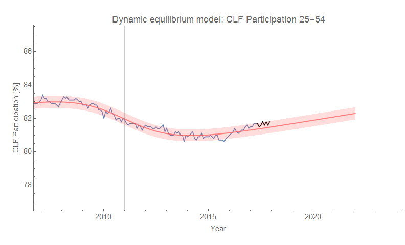
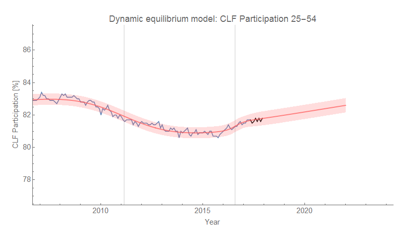

I've added some recent points to the prime age Civilian Labor Force (CLF) participation rate forecast (both [the original](https://informationtransfereconomics.blogspot.com/2017/09/date-update-civilian-labor-force.html) as well as the ["tiny 2016 shock" version](https://informationtransfereconomics.blogspot.com/2017/11/a-new-beveridge-curve-or-science-is.html)):

Note: there appears to be a slight difference in the solution found for the original shock. It is possible I altered the initial guess for the optimization, or maybe my newly updated _Mathematica_ 11 from a couple weeks ago chose a different optimization method with the "Automatic" setting. It is not  huge difference (the post-2015 period appears shifted down by about 0.1 percentage points relative to the previous solution), but I'll try and find the reason and recover the previous result.
