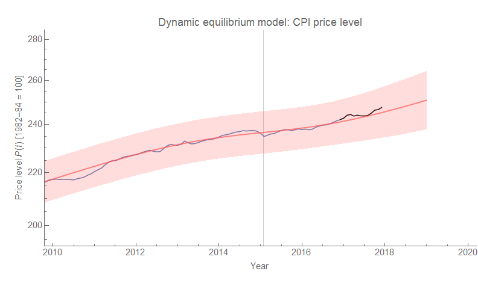
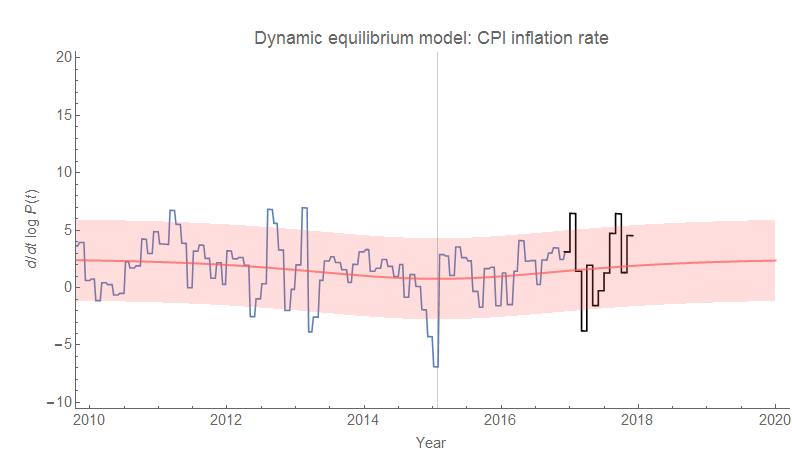
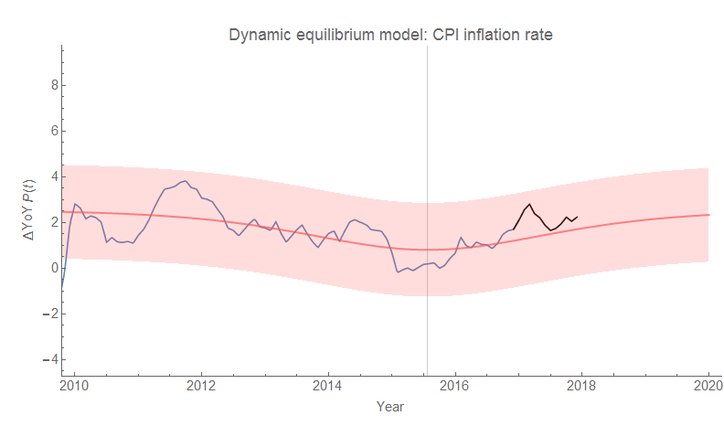

Let's update the [dynamic information equilibrium](https://informationtransfereconomics.blogspot.com/2017/01/dynamic-equilibrium-presentation.html) CPI (all items) forecast graph with the latest data (previous update [here](https://informationtransfereconomics.blogspot.com/2017/07/dynamic-equilibrium-model-cpi-all-items.html)):

