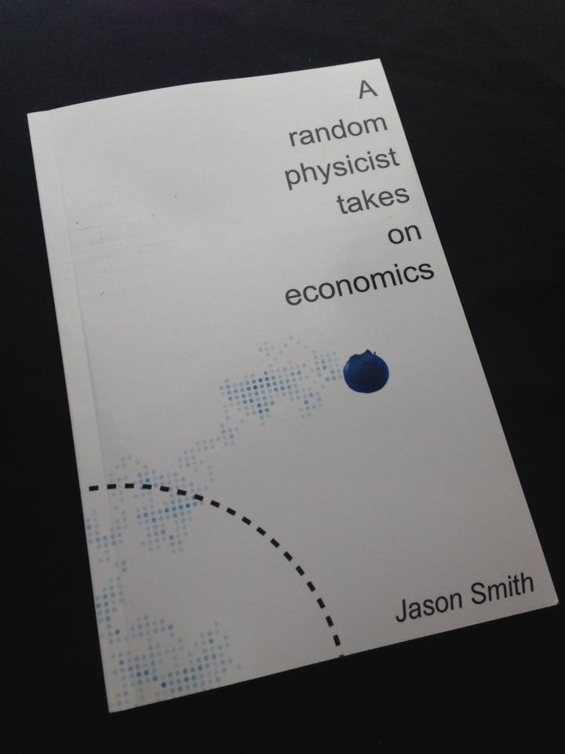
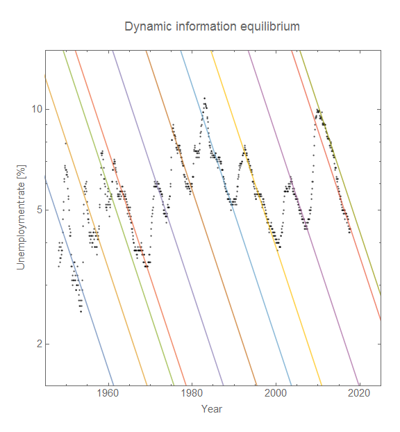
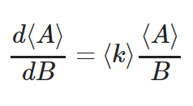

With 2017 coming to a close, I wanted to put together a list of highlights like I did [last year](https://informationtransfereconomics.blogspot.com/2016/12/information-transfer-economics-year-in.html). This year was the year of dynamic information equilibrium as well as presentations. It was also the year I took some bigger steps in bringing my criticisms of economics and alternative approaches to the mainstream, [having an article at](http://evonomics.com/hayek-meets-information-theory-fails/) _[Evonomics](http://evonomics.com/hayek-meets-information-theory-fails/)_ and [publishing a book](https://www.amazon.com/dp/B0754X3PYF/ref=as_li_ss_tl?ie=UTF8&linkCode=ll1&tag=arandomphysic-20&linkId=5c99f745bc44ab78f67c0f97d9b88d63).

I'd like to thank everyone who reads, follows and shares on [Feedly](https://feedly.com/i/discover/sources/search/https%3A%2F%2Finformationtransfereconomics.blogspot.com%2F) and [Twitter](https://twitter.com/infotranecon), or who bought [my book](https://www.amazon.com/dp/B0754X3PYF/ref=as_li_ss_tl?ie=UTF8&linkCode=ll1&tag=arandomphysic-20&linkId=5c99f745bc44ab78f67c0f97d9b88d63). It is really only through readers, word of mouth, and maybe your own blog posts on information equilibrium (like at _[Run Money Run](http://runmoneyrun.blogspot.com/2017/09/elongated-interest-rates-vs-ngdpmb.html)_) that there is any chance the ideas presented here might be heard or investigated by mainstream economists.

I'd also like to thank [Cameron Murray for a great review of my book](http://www.fresheconomicthinking.com/2017/08/a-random-physicist-takes-on-economics.html), Brennan Peterson for helping me edit my book, as well as [Steve Roth at](http://evonomics.com/about/) _[Evonomics](http://evonomics.com/about/)_ (and _[Asymtosis](http://www.asymptosis.com/)_) for being an advocate and editor of my article there.

**Dynamic information equilibrium**

The biggest thing to happen was the development of the dynamic information equilibrium approach to information equilibrium. The seeds were planted in the summer of 2014 in [a discussion of search and matching theory](https://informationtransfereconomics.blogspot.com/2014/07/remarkable-recovery-regularity-and.html) where I noted that the rate of unemployment recovery was roughly constant — I called it a "remarkable recovery regularity". Another piece was looking at how the information equilibrium condition [simplifies given an exponential ansatz](https://informationtransfereconomics.blogspot.com/2016/03/information-equilibrium-and-time-series.html). But the _**Aha!**_ moment came when I saw [this article at VoxEU.org](http://voxeu.org/article/new-models-macroeconomic-policy) that plotted the log of JOLTS data. I [worked out the short "derivation"](https://informationtransfereconomics.blogspot.com/2017/01/a-dynamic-equilibrium-in-jolts-data.html), and applied it to [the unemployment rate the next day](https://informationtransfereconomics.blogspot.com/2017/01/dynamic-equilibrium-unemployment-rate.html).

Since that time, I have been [tracking forecasts](https://informationtransfereconomics.blogspot.com/2017/11/checking-my-forecast-performance.html) of the unemployment rate (and other measures) using the dynamic equilibrium model. I even put together what I called a ["dynamic equilibrium history" of the US](https://informationtransfereconomics.blogspot.com/2017/07/a-dynamic-equilibrium-history-of-united.html) contra Friedman's monetary history. As opposed to other economic factors and theories, the post-war economic history of the US is almost completely described by the social transformation of women entering the workforce. Everything from high inflation in the 70s to the [fading Phillips curve](https://informationtransfereconomics.blogspot.com/2017/09/was-phillips-curve-due-to-women.html) can be seen as a consequence of this demographic change.

**Dotting the _i_'s and crossing the _t_'s**

Instead of haphazardly putting links to my Google Drive, I finally created [Github repositories](https://informationtransfereconomics.blogspot.com/2017/02/information-equilibrium-code.html) for the Mathematica (in February) and eventually Python (in July) code. But the most important thing I did theoretically was [rigorously derive the information equilibrium conditions](https://informationtransfereconomics.blogspot.com/2017/07/dynamic-equilibrium-and-ensembles-and.html) for ensembles of markets which turned out to be formally similar equations to individual markets. This was a remarkable result (in my opinion) because it means that information equilibrium could apply to markets for multiple goods — and therefore macroeconomic systems. In a sense it makes rigorous the idea that the AD-AS model is formally similar to a supply and demand diagram (and under what scope it applies). The only difference is that we should also see slowly varying information transfer indices which would manifest by e.g. slowing growth as economic systems become large.

**Connections to machine learning?**

These are nascent intuitions, but there are strong formal similarities between information equilibrium and [Generative Adversarial Networks (GANs)](https://informationtransfereconomics.blogspot.com/2017/06/wasserstein-gan-and-information.html) as well as a [theoretical connection](https://informationtransfereconomics.blogspot.com/2017/10/the-price-mechanism-and-information.html) to what is called the "information bottleneck" in neural networks. I started [looking into it this year](https://informationtransfereconomics.blogspot.com/2017/10/the-price-mechanism-as-information.html), and I hope to explore these ideas further in the coming year!

**Getting the word out**

Over the past year or so, I think I finally reached a point where I sufficiently understood the ideas worked through on this blog that I could begin outreach in earnest. In May [I published an article at](http://evonomics.com/hayek-meets-information-theory-fails/) _[Evonomics](http://evonomics.com/hayek-meets-information-theory-fails/)_ on Hayek and the price mechanism that works through a the information equilibrium approach and connection to Generative Adversarial Networks (GANs). In August, I (finally) [published my book](https://www.amazon.com/dp/B0754X3PYF/ref=as_li_ss_tl?ie=UTF8&linkCode=ll1&tag=arandomphysic-20&linkId=5c99f745bc44ab78f67c0f97d9b88d63) on how I ended up researching economics, on my philosophy to approaching economic theory, as well as some of the insights I've learned over four years of work.

I also put together four presentations throughout year (on [dynamic equilibrium](https://informationtransfereconomics.blogspot.com/2017/01/dynamic-equilibrium-presentation.html), a [global overview](https://informationtransfereconomics.blogspot.com/2017/04/a-tour-of-information-equilibrium.html), on [macro and ensembles](https://informationtransfereconomics.blogspot.com/2017/07/presentation-macroeconomics-and.html), and on [forecasting](http://informationtransfereconomics.blogspot.com/2017/11/presentation-forecasting-with.html)). Several of my presentations and papers are collected at [the link here](http://informationtransfereconomics.blogspot.com/2017/05/explore-more-about-information.html). In November, I started doing "Twitter Talks" (threaded tweets with one slide and a bit of exposition per tweet) which were aided by the increase from 140 to 280 characters — in the middle of the first talk! They were on [forecasting](https://twitter.com/infotranecon/status/928028648115810305), [macro and ensembles](https://twitter.com/infotranecon/status/928717075291320320), as well as [a version of my _Evonomics_ article](https://twitter.com/infotranecon/status/930541889446490112).

**\*  \*  \***

Thanks for reading everyone! This blog is a labor of love, written in my free time away from my regular job in signal processing research and development.
