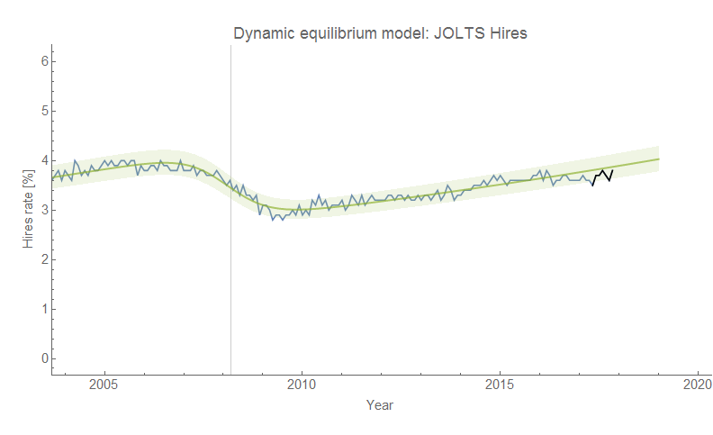
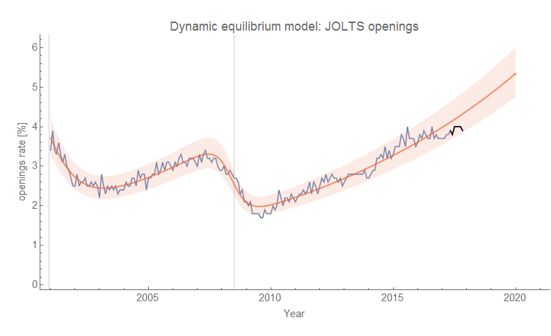
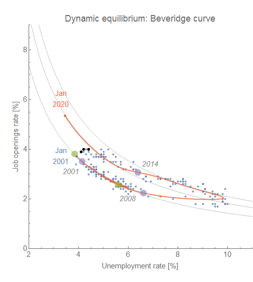

The latest data from the Job Openings and Labor Turnover Survey [is out today on FRED](https://fred.stlouisfed.org/release?rid=192) and we're here [with another update](https://informationtransfereconomics.blogspot.com/2017/11/jolts-data-out-today.html) of the forecast performance/recession indicator. Here are the hires and openings data:

Here's the update of the hires shock counterfactual evolution (a fall in hires [might be a leading indicator](https://informationtransfereconomics.blogspot.com/2017/07/jolts-leading-indicators.html)):

Here's the updated Beveridge curve as well:

