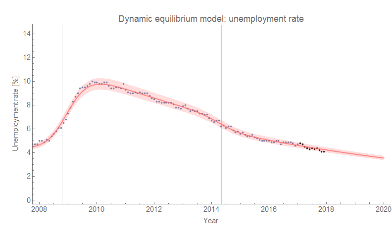
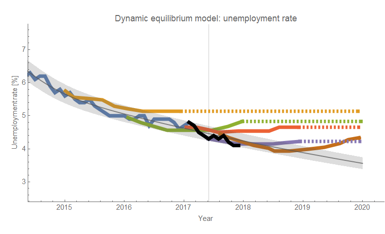
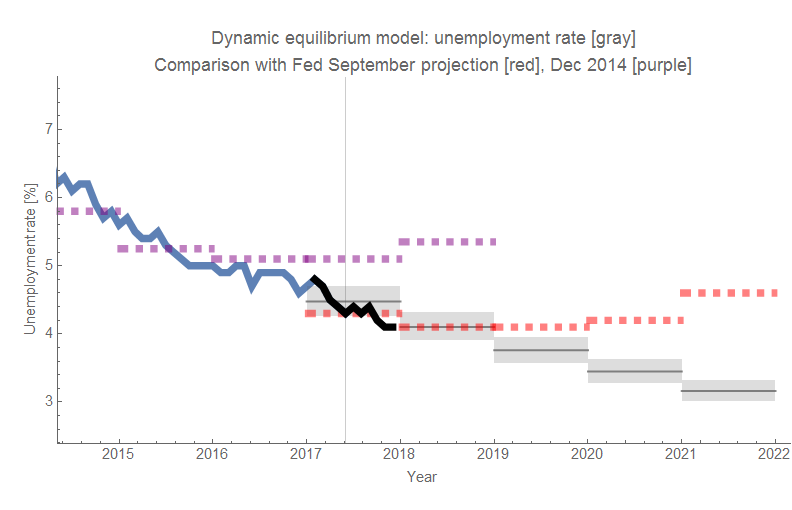

The latest [monthly unemployment numbers for the US](https://fred.stlouisfed.org/series/UNRATE) came out on Friday (unchanged at 4.1% from last month) and so I've yet again put the new data points on my old model forecast graphs to see how they're performing (just great, by the way — more details are below). There were several mentions of the old "structural unemployment" argument (against fiscal or monetary stimulus) given in the wake of the financial crisis saying that the arguments hadn't held up well as unemployment has fallen to the lowest levels in years. In particular, [Paul Krugman noted](https://twitter.com/paulkrugman/status/939250572418535424):

> _Remember when all the Very Serious People knew that high unemployment was structural, due to a massive skills gap, and could never be expected to return to pre-crisis levels?_

He linked back [to an old blog post](https://krugman.blogs.nytimes.com/2013/08/03/structural-humbug/) of his where he showed an analysis from Goldman Sachs about state unemployment rates and then looked at unemployment rates and the subsequent recovery by occupation. The data showed that occupations (and states) that had been hit harder (unemployment increased more) had recovered faster (unemployment had declined more). Krugman said this indicated unemployment was cyclical, not structural:

> _So the states that took the biggest hit have recovered faster than the rest of the country, which is what you’d expect if it was all cycle, not structural change. ... the occupations that took the biggest hit have had the strongest recoveries. In short, the data strongly point toward a cyclical, not a structural story ..._

What was interesting to me was that the data Krugman showed was actually just a result of the [dynamic information equilibrium model](https://informationtransfereconomics.blogspot.com/2017/01/dynamic-equilibrium-presentation.html) — the larger the shock, the faster the fall since the dynamic information equilibrium is a constant slope of _(d/dt)_ log _u(t)_. In fact, the data Krugman shows match up pretty well with the result you'd expect from the dynamic equilibrium model:

This tells us that the dynamic equilibrium is the same across different occupations (much like how the [dynamic equilibrium is the same for different races](https://informationtransfereconomics.blogspot.com/2017/07/racial-disparities-in-unemployment-rate.html), or for [different measures of the unemployment rate](https://informationtransfereconomics.blogspot.com/2017/09/different-unemployment-rates-do-not.html)). All of this tells us that unemployment recoveries \[1\] are closer to a force of nature (or "deep structural parameters" in discussions of the Lucas critique). But on another level, this is also just additional confirmation of the usefulness of the dynamic equilibrium model for unemployment.

**\*  \*  \***

As I mentioned above, I also wanted to show how the forecasts were doing. The first graph is the model forecast alone. The second graph shows comparisons with the (frequently revised) forecasts from the FRB SF. The third graph shows a comparison with the (also revised) forecast from the FOMC.

...

**Footnotes:**

\[1\] The shocks to unemployment are non-equilibrium processes in this model. It remains an open question whether these shocks can be affected by policy, or whether they too are a force of nature.
