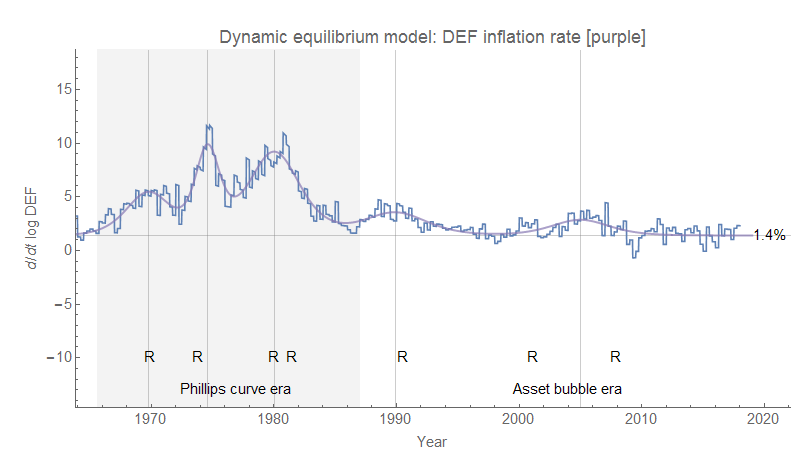
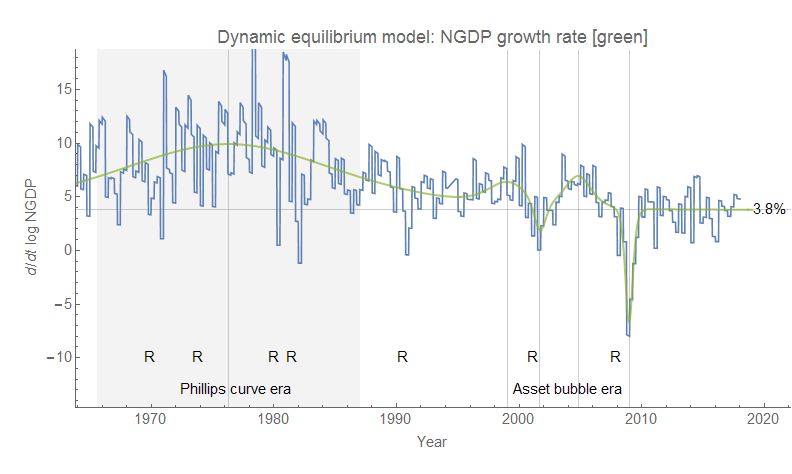
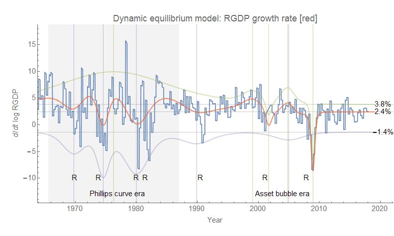
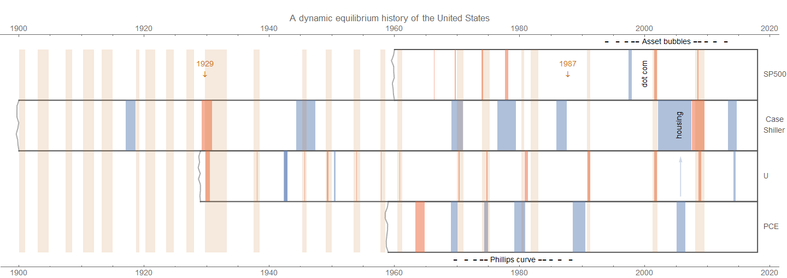
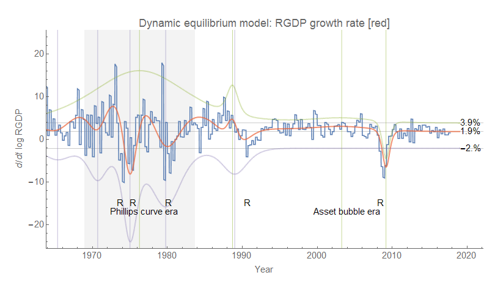

As part of the work going into my next book that will attempt to re-write the narrative of the past 50 years of economic growth \[1\], I've been working on the dynamic information equilibrium model of nominal and real GDP (NGDP and RGDP). The key element connecting those two measures is the GDP deflator (DEF), so let's look at it first:

The deflator is best modeled as having a dynamic equilibrium of 1.4%/y with several shocks from 1960-1990 where inflation falls after recessions (indicated with R's). I am calling this the "Phillips curve era" where shocks to employment result in shocks to inflation and the era is associated with the [demographic shift of women entering the workforce](https://informationtransfereconomics.blogspot.com/2017/09/was-phillips-curve-due-to-women.html). I have speculated that these factors are all connected.

There is another shock in the 2000s that lines up with an NGDP shock (below) that is much further away from either the recession preceding or following it. It is because of these unique properties (and because of the description of NGDP below) that I consider this a different "era" that I'll call the "asset bubble era" \[2\]. Take a look at NGDP:

Most of the NGDP data is dominated by a long duration shock that lines up with the demographic transition of women entering the workforce. After that shock subsides, we have two smaller, shorter positive shocks followed by crashes. Looking at their timing, we can pretty unambiguously associate these with the so-called "dot-com" boom and the housing boom. The latter boom coincides with the aforementioned inflation shock. It is possible the inflation signal is stronger than the dot-com boom because the housing boom involved building actual housing (and therefore employing a lot of labor) as well as assets that a larger fraction of the population own (housing). It is also possible that the reason is far simpler: housing is included in measures of inflation while stocks aren't. But regardless of the reason, the second boom-bust cycle was accompanied by moderate inflation.

The DEF shocks are the purple vertical lines, while the NGDP shocks are the green vertical lines. The DEF inflation rate is shown as negative since it is subtracted from NGDP growth to obtain RGDP growth (RGDP = NGDP/DEF). The a-periodic oscillations of mean RGDP are what give rise to the sensation (illusion?) of a "business cycle", however the "Phillips curve era" oscillations are more strongly connected to DEF shocks while the "asset bubble era" osciallations are more strongly connected to NGDP shocks (collapses of asset prices). We can see that there hasn't been a strong signal of a new asset price bubble (the S&P 500, while seemingly on a recent winning streak, is [consistent with fluctuations around its historical growth rate](https://informationtransfereconomics.blogspot.com/2017/12/checking-some-long-term-market.html)). However this doesn't mean there won't be another recession shock; I'm using the "asset price bubble" label as just a label \[2\].

In addition to trying to set up a framework to understand these phenomena for the future book, I also saw [a tweet from Stephanie Kelton](https://twitter.com/StephanieKelton/status/957727840136556545) talking about the downward revisions of [potential RGDP](https://fred.stlouisfed.org/series/GDPPOT) and [potential NGDP](https://fred.stlouisfed.org/series/NGDPPOT) both in level and [growth rate](https://fred.stlouisfed.org/graph/?g=hXX6) \[3\]. She thinks that 2% growth going forward is too pessimistic -- saying we can get 3% growth. Now the model above says that the dynamic equilibrium is 2.4% (so I'd agree that 2% growth is a shade pessimistic, see \[3\]).

But there is never a period in the history where the US has achieved a sustainable RGDP growth above the 2.4% dynamic equilibrium rate where we have decent data. The 60s and 70s involved a major change in the civilian labor force (increasing the relative fraction of women in the labor force) that gave us 20 or more years of RGDP growth periodically above 2.4% coupled with bouts of sub-2.4% growth. The only other times of above-2.4% growth were during the dot-com and housing bubbles.

I'm not saying it isn't possible, but it would require something that hasn't been tried in post-war US history \[4\]. I would also add that the RGDP growth rate does not strongly impact the rate of fall of the unemployment rate [which has been roughly constant over the same post-war period](https://informationtransfereconomics.blogspot.com/2017/01/dynamic-equilibrium-presentation.html), so higher or lower RGDP growth is more about the level of income than employment rates. Overall, unless there is another asset bubble of some kind (or a negative shock due to reduced immigration \[4\]), I think it's 2.4% growth for the foreseeable future.

...

**Update 19 February 2018**

Here is [an "economic seismograph" view](https://informationtransfereconomics.blogspot.com/2018/02/economic-seismographs-labor-and.html) of this data (and more including unemployment, the S&P 500, and the Case-Shiller housing price index). It uses PCE inflation instead of the deflator, but the general form is the same.

...

**Update 31 January 2018**

The same general story appears to be true for the UK, except there is no separate "dot-com" boom, but what is rather a general financial boom beginning in the late 90s and continuing until the 2008 financial crisis:

There is also an interesting mini-boom in the late 1980s (the center is 1988.7) that is known as the "[Lawson boom](https://en.wikipedia.org/wiki/Lawson_Boom)" in reference to Chancellor of the Exchequer at the time Nigel Lawson. This "boom" has the properties of the housing boom in the US (an inflation shock at the same time as a nominal output shock, with the recession associated with it coming a bit later than the "Phillips curve" cycles).

**Footnotes:**

\[1\] This is best read as a kind of self-deprecating hubris.

\[2\] I'm not really making any kind of normative or even theoretical claim here, just that in the popular culture the housing bubble and dot-com bubble are useful labels for a collection of events. I wanted to tentatively call it the Minsky era because the investment boom/bust cycle is very close to that [described by Minksy](https://en.wikipedia.org/wiki/Minsky_moment). However the period following the 2008 financial crisis appears to be relatively calm suggesting it might be some time before another "Minsky cycle" gets started. The dot-com "cycle" was followed immediately by the housing "cycle", but this may not be the typical case going forward. We might observe long stretches of flat growth (like the present period) before another cycle booms and busts.

\[3\] The most recent potential GDP seems to show a 3.8% NGDP growth rate going forward (matching the dynamic equilibrium above), but only shows 1.8% for RGDP growth which is probably due to the assumption of 2% DEF inflation (the dynamic equilibrium is 1.4%).

\[4\] May I suggest [allowing a lot more immigration](https://informationtransfereconomics.blogspot.com/2018/01/immigration-is-major-source-of-growth.html)?
