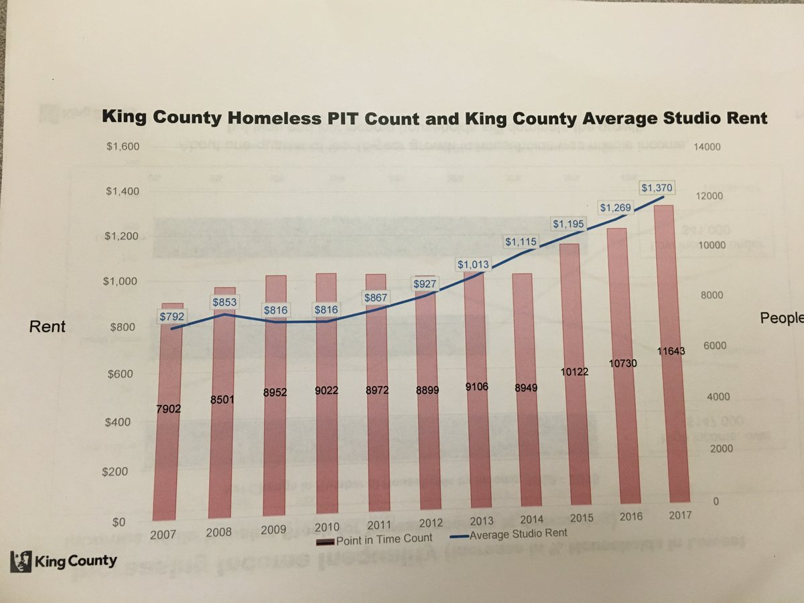
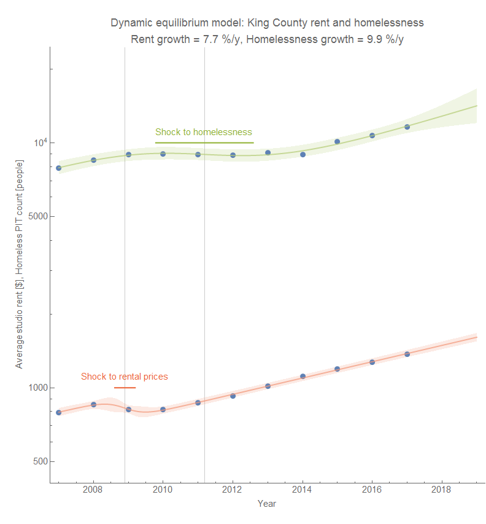

I saw this data in a [Tweet from Erica Barnett](https://twitter.com/ericacbarnett/status/955510081289777152) (above) about the relationship between Seattle (King County) homelessness and rental prices. This data fits pretty well with a dynamic information equilibrium \[1\] (i.e. "matching" model [per my recent paper](https://papers.ssrn.com/sol3/papers.cfm?abstract_id=3094757)):

There was a shock that reduced rental prices during the Great Recession (centered at 2008.9, lasting about 6 months). This temporarily halted the growth in rental prices, which was followed by a temporary halt to homelessness growth (a shock centered at 2011.2, lasting about 2 years). Since those shocks, rental prices and homelessness have returned to their previous trajectories. Absent some kind of intervention, it is forecast to continue.

**Footnotes:**

\[1\] Although I call this an equilibrium, it doesn't mean this equilibrium is "good" for social welfare. The fact that rental prices and homelessness are directly connected is more a failure of the market provision of housing than an endorsement.
