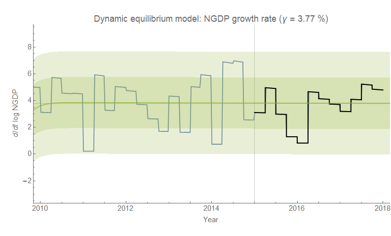

I get to close out another forecast [collected at the aggregated prediction link](https://informationtransfereconomics.blogspot.com/2015/09/prediction-aggregation-redux.html) with a smiley face: NGDP ([last updated here](https://informationtransfereconomics.blogspot.com/2017/04/update-to-predicted-path-of-ngdp.html)). The latest NGDP data [has been released](https://fred.stlouisfed.org/series/GDP). In the graphs below, orange indicates the data available at the time of the forecast, the vertical line indicates the beginning of the forecast (January 2015), and the yellow indicates the data as well as a linear fit to the growth rate data. The gray dashed lines indicate the "old normal" which used the growth rate average from before the Great Recession, while the solid gray line indicates "the new normal" which used the growth rate average from 2010-2015 (about 3.8%/y).

The "old normal" (gray dashed lines) is pretty decisively rejected at this point, and the data remains consistent with the information transfer model (ITM) and the "new normal". But what is also great news for the information equilibrium approach in general is that this data also validates the dynamic equilibrium model (see e.g. [here](https://informationtransfereconomics.blogspot.com/2018/01/immigration-is-major-source-of-growth.html)) because it also says growth should average 3.8%/y (i.e. the "new normal"). The dynamic equilibrium/"new normal" version (gray solid line in the first graph) almost perfectly matches the linear fit to the NGDP growth data (yellow dashed line in the first graph).

...

**Update 30 January 2018**

Here is the dynamic information equilibrium model version of this graph (bands are 1-sigma and 2-sigma error bands):

