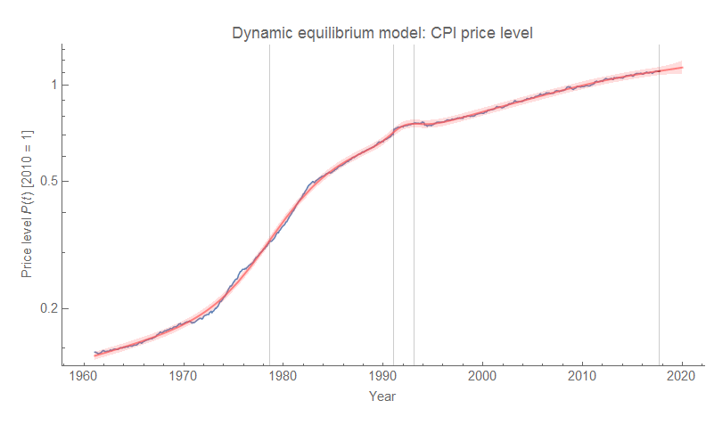
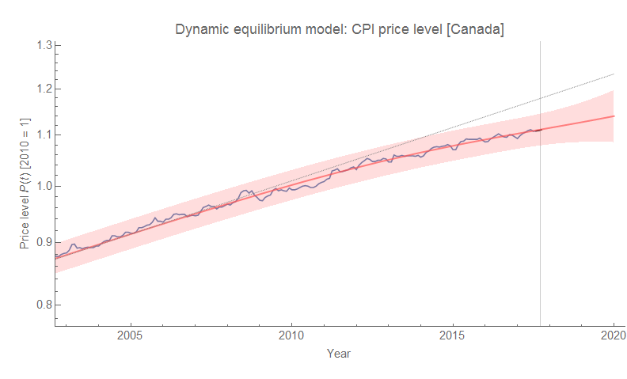
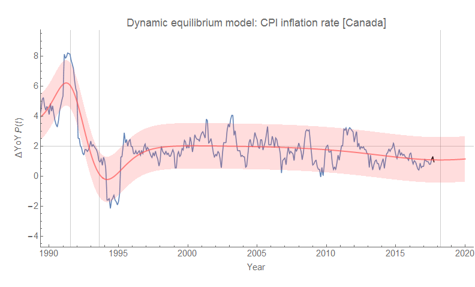

Some years ago I had predicted that Canada would begin to undershoot its 2% inflation target, and then [touted the success of the information transfer monetary model](https://informationtransfereconomics.blogspot.com/2017/02/worthwhile-canadian-prediction-comes.html) when that prediction came true. However I mostly see the monetary model as at best a local approximation with the dynamic information equilibrium model being better empirically ([discussion in terms of US inflation at this linked post](https://informationtransfereconomics.blogspot.com/2017/11/comparing-my-inflation-forecasts-to-data.html)).

To that end, I thought I'd put together how you'd look at Canada's below-target inflation in terms of the [dynamic information equilibrium model](https://informationtransfereconomics.blogspot.com/2017/01/dynamic-equilibrium-presentation.html) (of all items CPI). In this case, the dynamic equilibrium is approximately 2%, and the undershooting is due to a long-duration shock possibly triggered by the global financial crisis/Great Recession.

The first graph is the full CPI level dataset from FRED. The second shows a more recent CPI level data. The third shows year-over-year inflation. The main shocks are the demographic shock centered at 1978.65 ± 0.04 (width \[1\] = 3.0 y) and the post-crisis shock is centered at 2017.7 ± 4.9, with a width of 3.3 years. There are two additional shocks in 1991 and 1993 to deal with the bump in the CPI.

**Footnotes**

\[1\] I've been a bit sloppy on this blog about what I mean by the "width" of a transition, although I nearly always use the "width" or "inverse steepness" parameter $b_{0}$ of the logistic function

Since the derivative is nearly a Gaussian function, we can think of the 1-standard deviation width $\sigma$, which is approximately

based on matching the leading order of the Taylor series. The other possible measure is the full width at half maximum ($FWHM$) which is

Therefore if $b_{0} \simeq 3.0\;\text{y}$ means $\sigma \simeq 4.8\;\text{y}$, and $FWHM \simeq 10.6 \;\text{y}$. Using the $\sigma$ measure, 95% of the shock occurs within $4 \sigma$ distances (i.e. $2 \sigma$ on either side) or 19.1 years.
