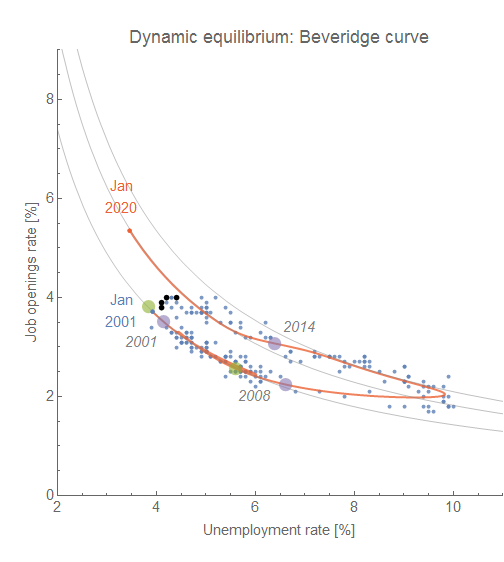

The week after the latest unemployment rate data is released, we have the Job Openings and Labor Turnover Survey (JOLTS) [data at FRED](https://fred.stlouisfed.org/categories/32241). I've been tracking these as [potential leading indicators](https://informationtransfereconomics.blogspot.com/2017/07/jolts-leading-indicators.html) of recessions since last summer. There isn't much change in the results, however I do want to start posting the job openings counterfactual shock estimate alongside the hires. In the leading indicators post, I noted that hires seems to experience its shock earlier than other indicators. However I also noted that I have exactly one recession to work with \[1\], so that should be taken with a grain of salt. With the latest data, the indicator that came second \[2\] (i.e. openings) seems to be showing a possible shock as well (but the series is much noisier and therefore uncertain).

Here are the two measures with the latest shock counterfactual (in gray):

And here are animations of the evolution of the shocks counterfactuals:

And finally, here are the latest points on [the Beveridge curve](https://informationtransfereconomics.blogspot.com/2017/10/the-beveridge-curve.html) (also hinting at a shock which would take it back along the path between the 2001 and 2008 labels on the graph):

Note that [my most recent paper available at SSRN](https://papers.ssrn.com/sol3/papers.cfm?abstract_id=3094757) talks about these models and theory behind them.

**Foonotes:**

\[1\] The JOLTS data series on FRED begins in December of 2000, effectively at the start of the 2001 recession, so only one complete recession exists in the data.

\[2\] The center and width of the shocks to various JOLTS measures: hires, openings, quits, and the unemployment rate:

