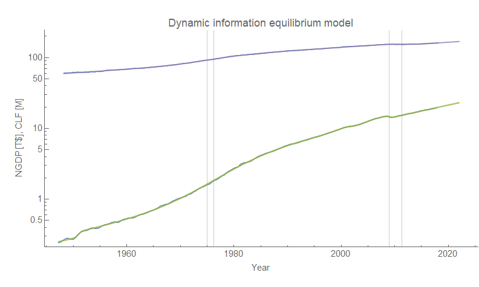
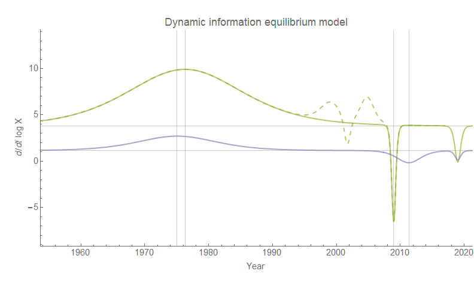
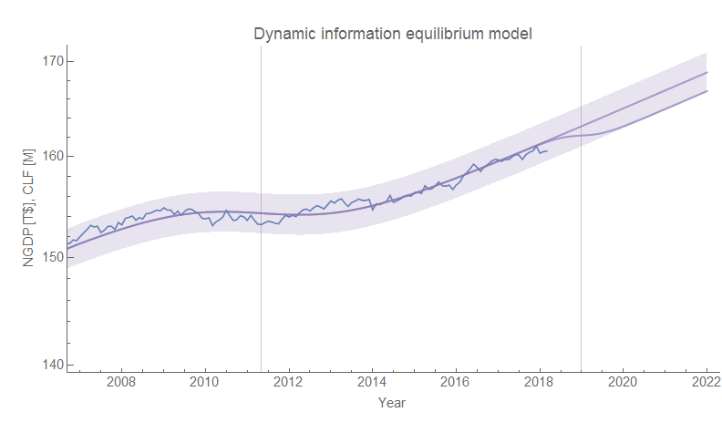
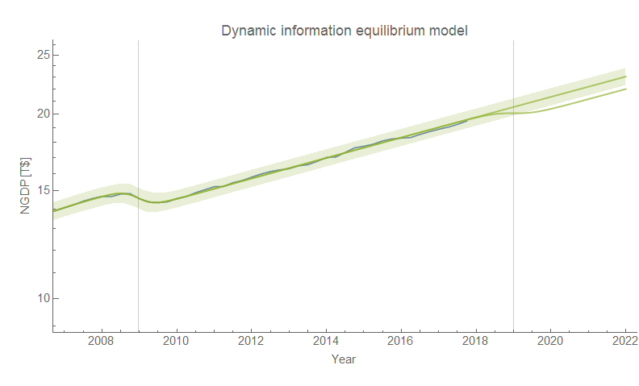
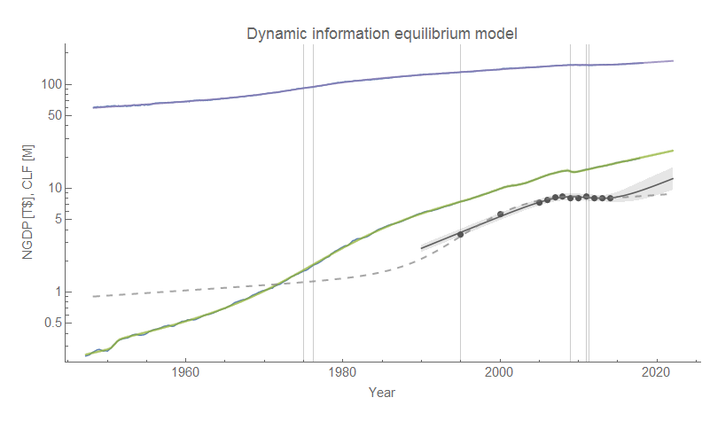
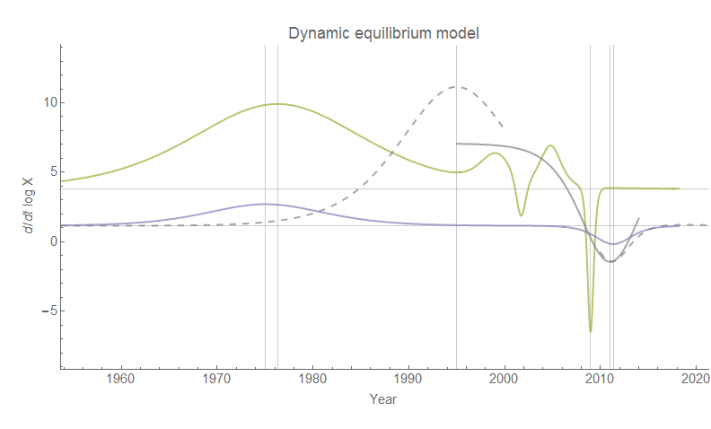

Partially because of the recent news — and most certainly because nearly half this country can be classified as a [racist zero-sum mouth-breather](https://informationtransfereconomics.blogspot.com/2016/12/populism.html) — I wanted to show how dimwitted policies to limit immigration can be. One of the findings of the [dynamic information equilibrium](https://informationtransfereconomics.blogspot.com/2017/01/dynamic-equilibrium-presentation.html) approach (see also [my latest paper](https://papers.ssrn.com/sol3/papers.cfm?abstract_id=3094757)) is that nominal output ("GDP") has essentially the same structure as the size of the labor force:

The major shocks to the path of NGDP roughly correspond to the major shocks to the Civilian Labor Force (CLF). Both are shown as vertical lines. The first is the demographic shock of [women entering the workforce](https://informationtransfereconomics.blogspot.com/2017/09/was-phillips-curve-due-to-women.html). This caused an increase in NGDP (the shock to CLF precedes the shock to NGDP). The second major shock is the Great Recession. In that case a shock to NGDP caused people to exit the labor force driving down [the labor force participation rate](https://informationtransfereconomics.blogspot.com/2017/05/civilian-labor-force-participation-and.html) (the shock to NGDP came first). The growth rates look like this (NGDP is green, CLF is purple):

The gray horizontal lines represent the dynamic equilibrium growth rates of CLF (~ 1%) and NGDP (~ 3.8%). The dashed green line represents the effects of two asset bubbles (dot-com and housing, described [here](https://informationtransfereconomics.blogspot.com/2017/04/macroeconomics-has-no-equilibrium-data.html)). Including them or not does not have any major effects on the results (they're too small to result in statistically significant changes to CLF). You may have noticed that there's an additional shock centered in 2019; I will call that the Asinine Immigration Shock (AIS). 

I estimated the relationship between shocks to CLF and to NGDP. Depending on how you look at it (measuring the relative scale factor, or comparing the integrals relative to the dynamic equilibrium growth rate), you can come up with a factor α between about 4 and 6. That is to say a shock to the labor force results in a shock that is 4 to 6 times larger to NGDP.

Using this [this estimate](http://www.pewhispanic.org/2015/09/28/chapter-2-immigrations-impact-on-past-and-future-u-s-population-change/) of the contribution of immigration to population growth, I estimated that the AIS over the next four years (through 2022) could result in about 2 million fewer people in the labor force (including people deported, people denied entry, and people who decide to move to e.g. Canada instead of the US). The resulting shock to NGDP \[1\] using the low end estimate of a factor of α = 4 would result in NGDP that is 1 trillion dollars lower in 2022 \[2\].  This is what the path of the labor force and nominal output look like:

As you can see, the AIS is going to be a massive self-inflicted wound on this country. What is eerie is that this shock corresponds to the [estimated recession timing](https://informationtransfereconomics.blogspot.com/2017/09/recession-detection-algorithm-update.html) (assuming unemployment "stabilizes") — as well as [the JOLTS leading indicators](https://informationtransfereconomics.blogspot.com/2018/01/happy-jolts-data-day.html) — implying this process may already be underway. With the positive shock of women entering the labor force ending, immigration is a major (and perhaps only) source of growth in the US aside from asset bubbles \[3\].

...

**Footnotes:**

\[1\] Since I am looking at the results sufficiently following the shock in 2022, it doesn't matter whether which shock comes first (so I show them as simultaneous, centered in January 2019). However, I think the most plausible story is that the shock to CLF would come first followed by a sharper shock to NGDP as the country goes into a recession about 1/2 to 1/3 the size of the Great Recession.

\[2\] It's roughly a factor of 500 billion dollars per million people (evaluated in 2022) since both NGDP and CLF are approximately linear over time periods of less than 10 years (i.e. 1 million fewer immigrants due to the AIS results in an NGDP that is 500 billion dollar lower in 2022).

\[3\] I also tried to assess the contribution of unauthorized immigration on nominal output. However the data is limited leaving the effects uncertain. One interesting thing I found however is that the data is consistent with a large unauthorized immigration shock centered in the 1990s that almost perfectly picks up after the demographic shock of women entering the workforce wanes (also in the 1990s). As that shock wanes we get the dot-com bubble, the housing bubble, and the financial crisis. It is possible that the estimate of the NGDP growth dynamic equilibrium may be too high because it is boosted by unauthorized immigration that doesn't show up in the estimates of the Civilian Labor Force.

**Update 23 January 2018**

Here are the graphs of two scenarios: one is dynamic equilibrium estimated from unauthorized immigration data alone, the second is one based on an assumption that the underlying dynamic equilibrium is the same. The latter model shows an interesting "surge" that compensates for the lower growth due to the fading shock of women entering the workforce.

