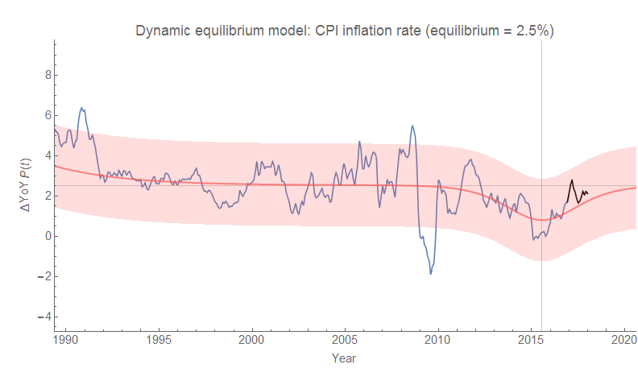
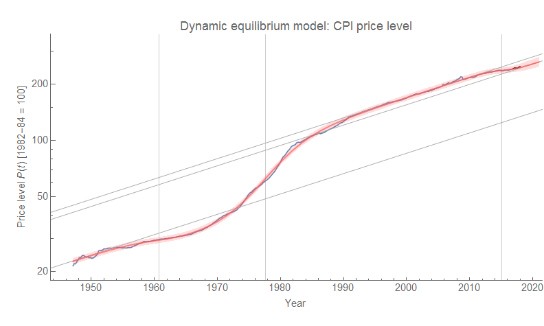
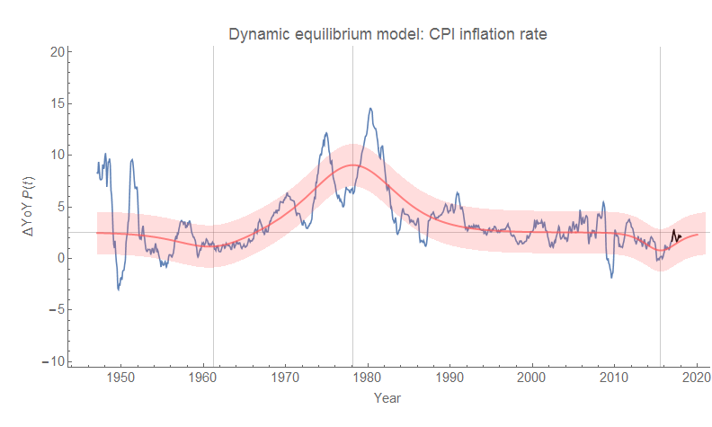
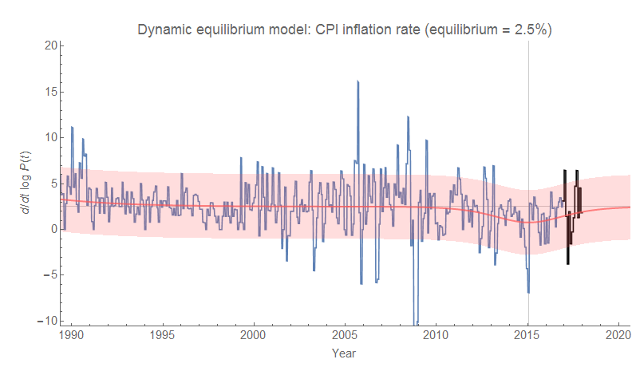
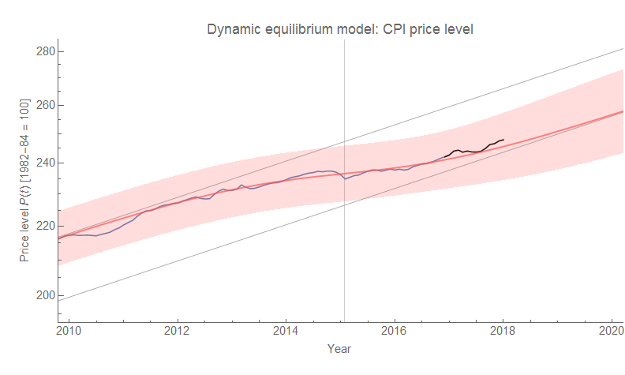

I'm continuing to compare the CPI forecasts to data (new data came out last Friday, shown on the forecast graph for YoY CPI all items \[1\]). I think the data is starting to coalesce around a coherent story of the Great Recession in the US. As you can see in the graph above, the shock centered at 2015.1 (2015.1 + 0.5 = 2015.6 based on how I displayed the YoY data)  is ending. This implies that (absent another shock to CPI), we should see "headline" CPI (i.e. all items) average 2.5% \[2\].

It is associated with the shock to [the civilian labor force](https://informationtransfereconomics.blogspot.com/2018/01/immigration-is-major-source-of-growth.html) (CLF, at 2011.3), nominal [output per worker](http://informationtransfereconomics.blogspot.com/2017/03/the-quantity-theory-of-labor-and.html) (NGDP/L, at 2014.6), and the prime-age [CLF paricipation](http://informationtransfereconomics.blogspot.com/2017/11/a-new-beveridge-curve-or-science-is.html) rate (in 2011) — all occurring _after_ the [Great Recession shock to unemployment](https://informationtransfereconomics.blogspot.com/2017/01/dynamic-equilibrium-presentation.html) (2008.8, see also [my latest paper](https://papers.ssrn.com/sol3/papers.cfm?abstract_id=3094757)). What we have is a large recession shock that pushed people out of the labor force (as well as reduced uptake of people trying to enter the labor force). This shock is what then caused the low inflation \[3\] (in terms of CPI or PCE \[2\]). This process is largely ending and we are finally returning to a "normal" economy \[4\] nearly 10 years later.

...

**Update + 2 hrs**

I thought I'd add the graph of the full model over the post-war period (including the guides mentioned in \[1\]), but also note that two of the three periods [David Andolfatto mentions](http://andolfatto.blogspot.com/2018/01/lowflation-then-and-now.html) as "lowflation" periods line up with the two negative shocks to CPI (~ 1960-1970, and ~ 2008-2018):

The period 1996-2003 does not correspond to low headline CPI inflation in the same way core PCE inflation was below 2%. However 1996-2003 roughly corresponds to the "dynamic equilibrium" period of CPI inflation as well as PCE inflation (~ 1995-2008) — which in the case of PCE inflation is ~ 1.7% (i.e. below 2%). Therefore the 2% metric for lowflation measured with PCE inflation would actually include the dynamic equilibrium, and not just shocks. Another way to say it is that the constant threshold (at 2%) detector gives a false alarm for 1996-2003, whereas a "dynamic equilibrium detector" does not.

**Footnotes:**

\[1\] Here is the log derivative (i.e. continuously compounded annual rate of change) and the level (with new dynamic equilibrium guides as diagonal lines at 2.5% inflation rate):

\[2\] Note that the [dynamic equilibrium for core PCE inflation](http://informationtransfereconomics.blogspot.com/2017/03/the-quantity-theory-of-labor-and.html) that economists like to use is 1.7%, and so the end of the associated shock will not bring inflation all the way back up to the Fed's stated target of 2%.

\[3\] Interestingly, this negative shock to inflation happens at the same time as a negative shock to unemployment: i.e. inflation went down at the same time unemployment went down, giving further evidence [that the Phillips curve has disappeared](https://informationtransfereconomics.blogspot.com/2017/09/was-phillips-curve-due-to-women.html).

\[4\] This is a "normal" economy in the sense of dynamic equilibrium, but it might not seem normal to a large portion of the labor force as there has been only a limited amount of time between the end of the [demographic shock of the 1970s](https://informationtransfereconomics.blogspot.com/2017/09/was-phillips-curve-due-to-women.html) and the Great Recession shock of the 2000s. [As I've said before](https://informationtransfereconomics.blogspot.com/2017/04/macroeconomics-has-no-equilibrium-data.html), there is a limited amount of "equilibrium" data in this sense (the models above would say ca. 1995 to 2008).
