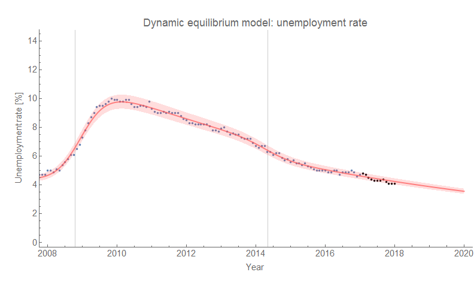
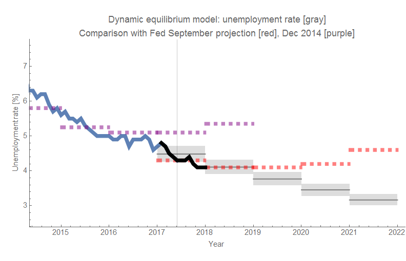
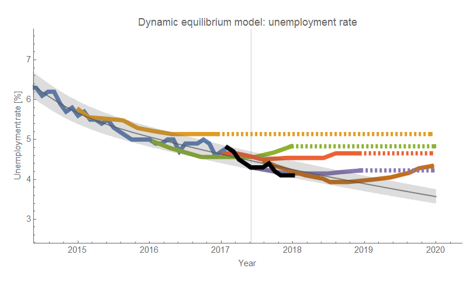
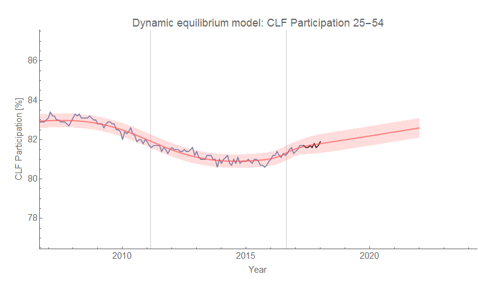
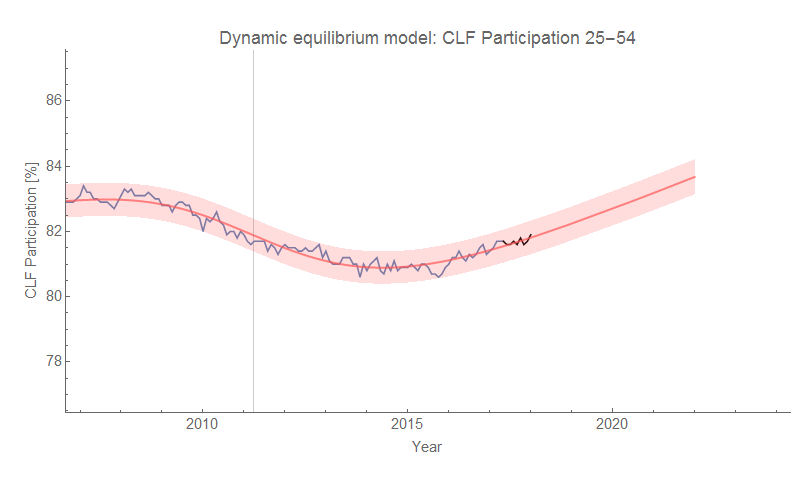
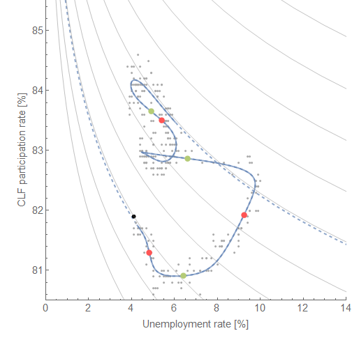

The latest data for the unemployment (U) rate and the (prime age) civilian labor force (CLF) participation rate are available, so I get to test to see if the models have failed or not. [Here's the last unemployment model update](https://informationtransfereconomics.blogspot.com/2017/12/latest-unemployment-numbers-and.html) \[1\] (includes a discussion of a "structural unemployment") and here's the post about the novel [dynamic equilibrium "Beveridge curve" for CLF/U](https://informationtransfereconomics.blogspot.com/2017/11/a-new-beveridge-curve-or-science-is.html) \[2\] shown below. Now let's add the newest data points (shown in black in the figures below).

First, the unemployment rate forecast remains valid:

And it's still looking better than the history of forecasts from FRB SF and FOMC:

As discussed in the second link \[2\] above, here are the two CLF forecasts (with and without a shock in 2016):

The "Beveridge curve" (the theory of these dynamic equilibrium "Beveridge curves" is discussed in [my latest paper](https://papers.ssrn.com/sol3/papers.cfm?abstract_id=3094757)) relating labor force participation to the unemployment rate (a curve you likely would not have seen unless you use the dynamic information equilibrium model) also discussed in \[2\] is also on track with the latest data:

The shocks to CLF are in red-orange and the shocks to U are green. In the absence of recession shocks, the data should continue to follow the dotted blue line upwards from the black point. However, it is likely that we will have a recession in the mean time, and so — like the rest of the curve — we will probably see the data deviate towards another dynamic equilibrium (another gray hyperbola). The only place I have seen so far where these kinds of Beveridge curves are stable enough to be useful is in [the classic Beveridge curve](https://informationtransfereconomics.blogspot.com/2017/10/the-beveridge-curve.html) (data for which will be available next Tuesday). This stability arises from both the size and timing of the shocks being approximately equal. In the case above, the shocks to CLF are not only much smaller, but also much later (even years later) which cause the Beveridge curve above to become a spaghetti-like mess.
