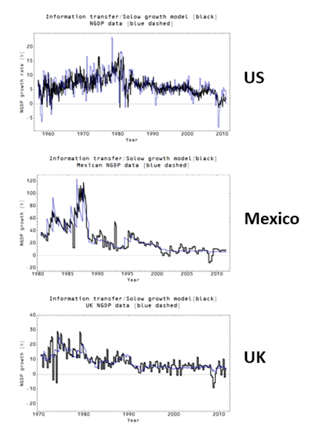

Chris Dillow [has a great post](http://stumblingandmumbling.typepad.com/stumbling_and_mumbling/2018/01/why-economists-should-look-at-horses.html) about "looking at horses" in economics. The metaphor is from Ely Devons:

> _"If economists wished to study the horse, they wouldn’t go and look at horses. They’d sit in their studies and say to themselves, ‘What would I do if I were a horse?’"_

In it, he references [a tweet of mine](https://twitter.com/infotranecon/status/953396005185060864):

> I will defend Cobb-Douglas for a second: it arises from general information theory considerations when matching information entropy one distribution to information entropy of two or more distributions

 And says:

> _Nobody saw fit to point out that if you want to know how useful they are, you should look at how actual firms produce actual stuff: do Cobb-Douglas functions describe the real world or not? Again, nobody’s looking at the horses._

It seems in both cases (the tweet thread and in Dillow's post), I was misunderstood: I was defending the general ansatz

not any specific application of the ansatz that exists in economics — with the exception of matching function in search and matching theory. And I was defending it because **_I was_** looking at horses. I turns out that if you look at _nominal_ output instead of "real" output, the [Cobb-Douglas aggregate production function used in the Solow model](https://informationtransfereconomics.blogspot.com/2016/09/the-kaldor-facts.html) is actually remarkably accurate:

I used this to form the basis of the "quantity theory of labor and capital" that is also [empirically accurate](https://informationtransfereconomics.blogspot.com/2017/03/improved-quantity-theory-of-labor-and.html).

Now it is true that I defended Cobb-Douglas functions from a theoretical standpoint, but the only reason I was comfortable doing so was because I had already shown it was empirically useful. And it's not only as a production function — but as a matching function as I discuss in [my recent paper](https://papers.ssrn.com/sol3/papers.cfm?abstract_id=3094757) (with empirically accurate models of unemployment). This is to say that it is not prima facie a bad starting point whenever you have two things combining to create a new thing (_labor + capital = output_, or _job seeker + vacancy = hire_). I think a lot of people hear Cobb-Douglas and immediately think of the Cambridge Capital Controversy ([which I have solved](https://informationtransfereconomics.blogspot.com/2015/05/resolving-cambridge-capital-controvery.html) — kidding). This is unfortunate because the general ansatz is perfectly sound.
