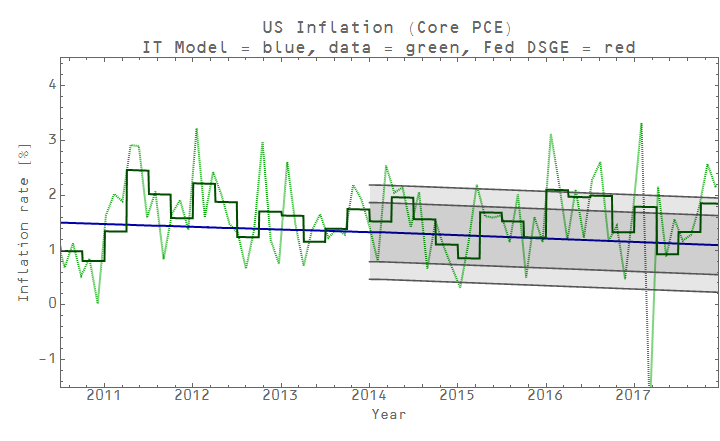
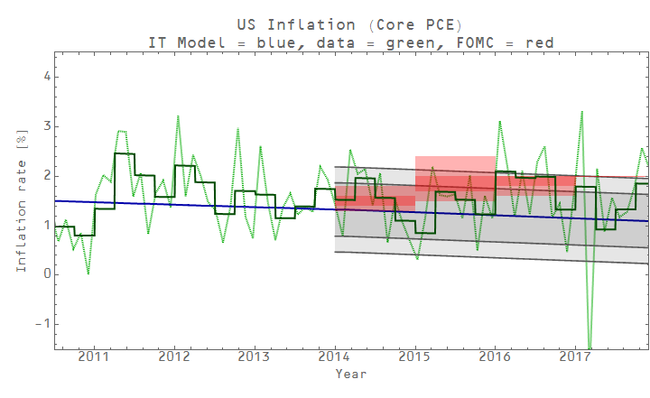
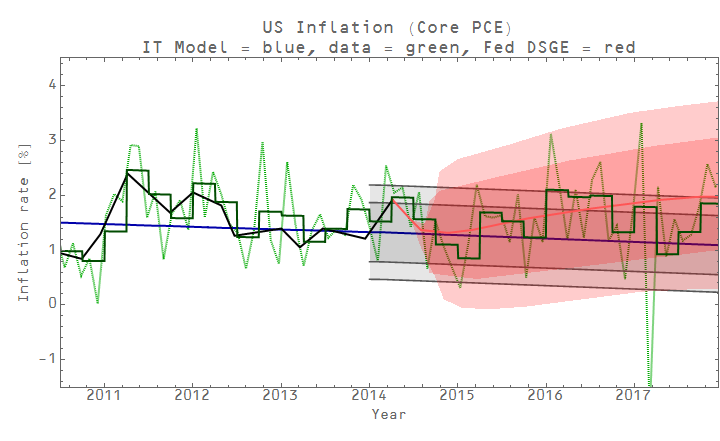
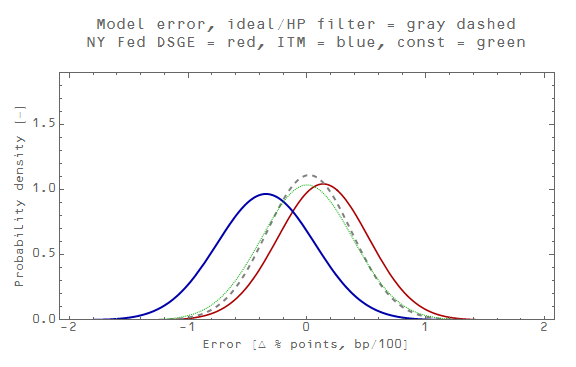
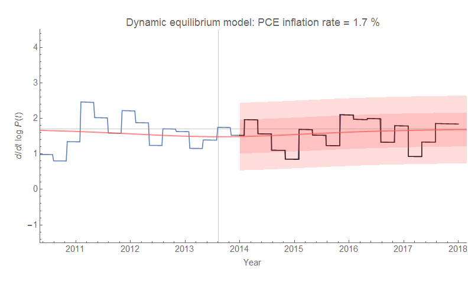
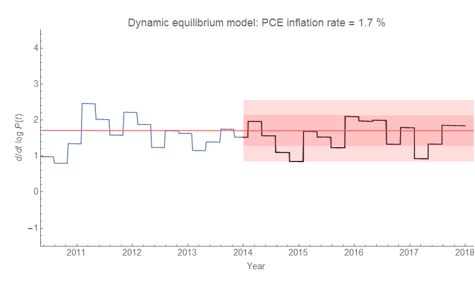

With the latest data on core PCE inflation, I get to close out a forecast of 4 years of inflation data. The monetary information equilibrium model turned out to be biased low to almost the same degree the FRB NY DSGE model was biased high in the last year of the forecast period (-40 basis points versus +46). Nearly all of the error in the DSGE model can be attributed to the assumed return to 2% core PCE inflation. If it had instead predicted a return to 1.7% core PCE inflation, it would have performed almost perfectly.

In fact, the constant 1.7% inflation model did perform almost perfectly, which is excellent news for the [dynamic information equilibrium model that predicts](https://informationtransfereconomics.blogspot.com/2017/03/the-quantity-theory-of-labor-and.html) a constant 1.7% core PCE inflation in the absense of shocks. I'll define "good" performance relative to the constant model; with that metric the information equilibrium and DSGE models performed poorly.

The poor performance of the monetary information equilibrium model is in part behind my recent post on [money as aether](https://informationtransfereconomics.blogspot.com/2018/01/money-is-aether-of-macroeconomics.html). Like a lot of people getting into economic theory, I was susceptible to the "money" view and one of the first models I produced was a "quantity theory of money" where

_P_ _k(t)__M_

with _k(t)_ falling over time. The _M_ in this case is M0 (i.e. notes and coins) since every other measure (M1, M2, MZM, etc) worked terribly even after allowing _k =  k(t)_. It is now apparent that the _k(t)_ in the model (1) above was accounting for the dissipation of the major demographic shock in the 1970s, and instead of continuing to fall the shock faded resulting in an underestimate of inflation.

So I consider this model rejected and it will get a frown-y face [at the prediction aggregation link](https://informationtransfereconomics.blogspot.com/2015/09/prediction-aggregation-redux.html). This allows me to shed the last vestiges of my adherence to the paradigm of money. This model, which would have outperformed the Fed's [so-called P\* model](https://informationtransfereconomics.blogspot.com/2014/07/notes-from-ben-bernanke-and-p-model.html) using data available at the time (mostly because that linear extrapolation of _k(t)_ from 1990 where the demographic shock was still fading was still an accurate approximation) as well as the various (monetary) [models tested by Rochelle Edge and Refet Gurkaynak in 2010](https://informationtransfereconomics.blogspot.com/2016/10/forecasting-it-versus-all-comers.html), will be laid to rest.

I will say in my defense that it only took me 4 years of looking at the data to reject monetary explanations of macro observables like inflation.

**Update 30 January 2018**

Here are the comparable dynamic information equilibrium core PCE inflation model graphs (both with and without the 2014 shock implied from NGDP data):

