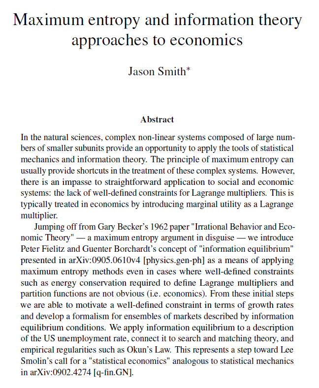
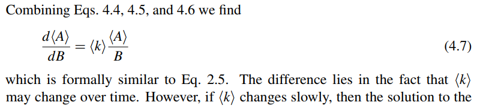

I put a new paper up at SSRN (_Maximum entropy and information theory approaches to economics_) that I believe is accessible despite currently being under review that's been accepted and is no longer under review:

[https://papers.ssrn.com/sol3/papers.cfm?abstract\_id=3094757](https://papers.ssrn.com/sol3/papers.cfm?abstract_id=3094757)

It covers some of the material I've covered in presentations (collected [here](https://informationtransfereconomics.blogspot.com/2017/05/explore-more-about-information.html)), but with a lot more details and explanations. It also contains the derivation of my favorite equation I've come up with here:

That's probably the best shot I'll get at [an equation I could engrave on my tombstone](https://commons.wikimedia.org/wiki/File:Zentralfriedhof_Vienna_-_Boltzmann.JPG).
