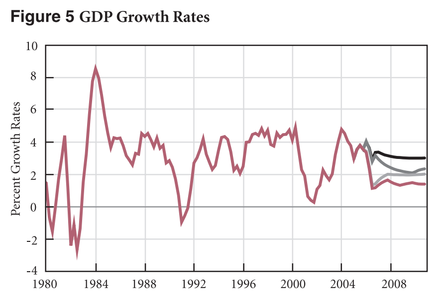

> _Ed. note: This post is late by almost a year. As mentioned below, part of the reason is that I think Wynne Godley's work has been misrepresented by some of his proponents. I added footnote \[1\] and the text referencing it, and toned down footnote \[3\]._

This was originally going to be a continuation in a series of posts ([part 1](http://informationtransfereconomics.blogspot.com/2017/02/qualitative-economics-done-right-part-1.html), [part 2](http://informationtransfereconomics.blogspot.com/2017/02/qualitative-economics-done-right-part-2.html), [part 2a](http://informationtransfereconomics.blogspot.com/2017/02/qualitative-economics-done-right-part-2a.html)) based on an [UnlearningEcon tweet](https://twitter.com/UnlearningEcon/status/828177509837574149):

> _\[Steve\] Keen (and Wynne Godley) used their models to make clear predictions about crisis_

It was part of a debate about what it means to predict things with a qualitative model. I covered Keen in [part 2](http://informationtransfereconomics.blogspot.com/2017/02/qualitative-economics-done-right-part-2.html). This post was going to focus on Wynne Godley. One of Godley's influences on the subject is his "[sectoral balances](https://en.wikipedia.org/wiki/Sectoral_balances)" approach, which is uncontroversial and not exclusively MMT or Post-Keynesian (for example, [here is Brad DeLong](http://www.bradford-delong.com/2011/10/a-note-components-of-autonomous-spending.html) using the approach).

Now UnlearningEcon says "predictions about crisis" (i.e. how it would play out), not "predictions of crisis" (i.e. that it would occur) which leaves in a large gray area of interpretation. However much of the references to Godley by the heterodox economics community say that he predicted the global financial crisis. As a side note, I wonder if [Martin Wolf's FT piece](http://blogs.ft.com/martin-wolf-exchange/2012/07/19/the-balance-sheet-recession-in-the-us/?) saying Godley helps understand the crisis lent credence to others saying he predicted the crisis?

However in my research, I found that Godley himself doesn't say many of the things attributed to him. He doesn't predict a global financial crisis. He doesn't tell us that the bursting of a housing bubble will lead to a global financial crisis. In [the earliest documented source](http://www.levy.org/pubs/pn_4_06.pdf) \[pdf\], Godley says that falling house prices (as already observed in 2006) will lead to lower growth over the next few years (more on this below). This has little to do with "heterodox economics" and in fact is indistinguishable from the story told by mainstream economists like Paul Krugman. For example, Krugman was warning about the effect of a deflating housing bubble on the broader economy [in the summer of 2005](http://www.nytimes.com/2005/08/08/opinion/that-hissing-sound.html):

> _Meanwhile, the U.S. economy has become deeply dependent on the housing bubble. The economic recovery since 2001 has been disappointing in many ways, but it wouldn't have happened at all without soaring spending on residential construction, plus a surge in consumer spending largely based on mortgage refinancing. ... Now we're starting to hear a hissing sound, as the air begins to leak out of the bubble. And everyone ... should be worried._

Unfortunately, Godley's policy note linked above is completely mis-represented in a paper by Dirk Bezemer that I have been directed to on multiple occasions as "documentation" of how the heterodox community predicted the global financial crisis. It was even cited [in the New York Times](http://www.nytimes.com/2013/09/11/business/economy/economists-embracing-ideas-of-wynne-godley-late-colleague-who-predicted-recession.html). The paper is [_“No One Saw This Coming” Understanding Financial Crisis Through Accounting Models_](http://www.heterodoxnews.com/htnf/htn85/No%20one%20saw%20this%20coming.pdf) \[pdf\], and its introduction claims that it's simply a survey of economic models that anticipated the crisis:

> _On March 14, 2008, Robert Rubin spoke at a session at the Brookings Institution in Washington, stating that "few, if any people anticipated the sort of meltdown that we are seeing in the credit markets at present”. ... \[‘no one saw this coming’\] has been a common view from the very beginning of the credit crisis, shared from the upper echelons of the global financial and policy hierarchy and in academia, to the general public. ... The credit crisis and ensuing recession may be viewed as a ‘natural experiment’ in the validity of economic models. Those models that failed to foresee something this momentous may need changing in one way or another. And the change is likely to come from those models (if they exist) which did lead their users to anticipate instability. The plan of this paper, therefore, is to document such anticipations, to identify the underlying models, to compare them to models in use by official forecasters and policy makers, and to draw out the implications_

Godley's paper above is cited and purportedly quoted to provide a basis for using Stock Flow Consistent models because of their supposed validity. Bezemer's purported quotes of Godley are:

> _“The small slowdown in the rate at which US household debt levels are rising resulting form the house price decline, will immediately lead to a …sustained growth recession … before 2010”. (2006). “Unemployment \[will\] start to rise significantly and does not come down again.” (2007)_

These quotes appear in a table at the end of the paper (p. 51) as well as in the text (p. 36), but neither of these quotes appear in the cited references to Godley. The second one doesn't appear in any form in any of the cited papers that could be construed as Godley (2007) — which is great for Godley as unemployment in the US has since fallen to levels unseen in almost two decades \[1\]. \[Update: [the source has been found, but it is not one of the cited ones](https://informationtransfereconomics.blogspot.com/2018/05/letter-to-dirk-bezemer.html).\] The first is cobbled together from a few words in a much longer passage in Godley (2006) linked above:

> _It could easily happen that, if **house price**s stop rising or if the financial-obligations ratio published by the Fed continues to rise, the debt-to-income ratio will slow down during the next few years, much as it did in the late 1980s and early 1990s. ..._

> _The results are a bit surprising, since the apparently quite **small** differences between **debt levels** in the four scenarios generate such huge differences in the lending flows. In particular, Scenario 4, the lowest projection, shows that the debt percentage only has to level off slowly and then fall very slightly for the flow of net lending to fall from 15 percent of income in 2005 to 5 percent in 2010. ..._

> _The average growth rates for 2005–10 come out at 3.3 percent, 2.6 percent, 1.8 percent, and 1.4 percent. The last three projections imply **sustained growth recession**s—very severe ones in the case of the last two. ..._

> _Is it plausible to suppose that the growth of GDP would slow down so much just because of a fall in lending of this size? Figure 7, which shows past (and projected Scenario 4) figures for net lending combined with successive, overlapping three-year growth rates, suggests that it could. Major slowdowns in past periods have often been accompanied by falls in net lending._

Bezemer also says "This recessionary impact of the bursting of asset bubbles is also a shared view." which is to say that the the predictions of Godley and Keen \[2\] about the negative impact of a fall in housing prices are not unique to their models. A good example is the aforementioned Krugman quote; he probably didn't use an SFC model or some non-linear system of differential equations.

But the original discussion with UnlearningEcon was about the usefulness of qualitative economic models (per the title of this post). The thing is that Godley's models were quantitative and do look a bit like real data:

Of course the debt data does look a bit like the the counterfactual path shown (in shape, as usual I have no idea what heterodox economists mean when they say "debt" and therefore what their graphs represent; I plotted several different data sources) However, the GDP growth rates miss the giant negative shock associated with the global financial crisis. This means this model definitely misses something because debt did follow the shape of the path Godley used as the worst case scenario.

I wouldn't call this a prediction about the global financial crisis, but rather just a model of the contribution of housing assets to lower GDP growth. But still, it was a quantitative model (one of Godley's [sectoral balance models](https://en.wikipedia.org/wiki/Sectoral_balances) based on the GDP accounting identity). And this is all Godley says it is \[3\].

Doing the research for this post has given me a newfound respect for Wynne Godley (and Mark Lavoie), but also a real sense of the sloppiness of heterodox economics more broadly including MMT and stock flow consistent approaches. Maybe because it is such a tribal community (see \[3\]) there is little introspection and genuine peer review. I know from my own efforts that I get few critiques of my conclusions from people who agree with those conclusions. This leads me to try and be my own "[reviewer #2](https://amlbrown.com/2015/11/10/how-not-to-be-reviewer-2/)" even to the point where I have built two independent versions of the models I show on this blog on separate computers.

**Footnotes:**

\[1\] People will undoubtedly bring up other measures of unemployment. However these [do not appear to contain additional information](https://informationtransfereconomics.blogspot.com/2017/09/different-unemployment-rates-do-not.html) not captured in the traditional "U3" measure — U6 ~ α U3 for some fixed α.

\[2\] Bezemer also says that Steve Keen predicted the crisis:

> _“Long before we manage to reverse the current rise in debt, the economy will be in a recession. On current data, we may already be in one.” (2006)_

But [in the original source](http://evatt.org.au/news/lily-pond.html), this is in reference to Australia. [Australia hasn't had a recession since 1991](http://www.worldfinance.com/special-reports/recession-proof-australia) (in September of 2016, Australia had managed to rack up 100 quarters without recession and at 25 \[now 26!\] years is second only to \[now tied with\] the Netherlands that went for 26 years from 1982 to 2008).

\[3\] I do want to take a moment to mention that Wynne Godley and Mark Lavoie are far more reasonable than you might be lead to believe by their proponents out in the Post-Keynesian and MMT community. They'd probably be fine with what I pointed out [about SFC models](http://informationtransfereconomics.blogspot.com/2016/03/more-like-stock-flow-in-consistent.html) since the "fix" is just adding a parameter.

[On Twitter](https://twitter.com/infotranecon/status/836654374617165824) (see the whole thread), there was an excellent example of how the supporters of Godley and Lavoie aren't doing them any favors. Simon Wren-Lewis showed how a non-flat Philips curve implied a Non-Accelerating Inflation Rate of Unemployment \[NAIRU\]. It's a pretty basic argument ...

> _If π(t) = E\[π(t+1)\] - a U + b, there exists a U at which inflation is stable (NAIRU) = b/a._

[Post-Keynesian blogger](https://www.concertedaction.com/) and [Godley and Lavoie fan](https://www.concertedaction.com/influences/) Ramanan said that they (G&L) showed there was an exception, therefore Wren-Lewis's argument was not valid.

Wren-Lewis responded "\[t\]hat is obviously not a NAIRU model, because you are saying the \[Phillips curve\] is flat", which is what I also said:

> _But \[Ramanan\]'s purported exception has a flat piece, so it's not a counterexample to \[Simon Wren-Lewis\]'s argument._

I added that

> _Techncally, \[Ramanan\]'s \[Philips Curve\] has two point NAIRUs plus a continuum (between \[two of the\] points on his graph)._

Which turns out is exactly what Mark Lavoie said to Ramanan (and [he quoted it on his blog](https://www.concertedaction.com/2017/02/24/the-non-existence-of-nairu-in-sfc-models/)):

> _Another way to put it is to say that there is an infinite number of NAIRU or a multiplicity of NAIRU (of rates of employment with steady inflation)._
