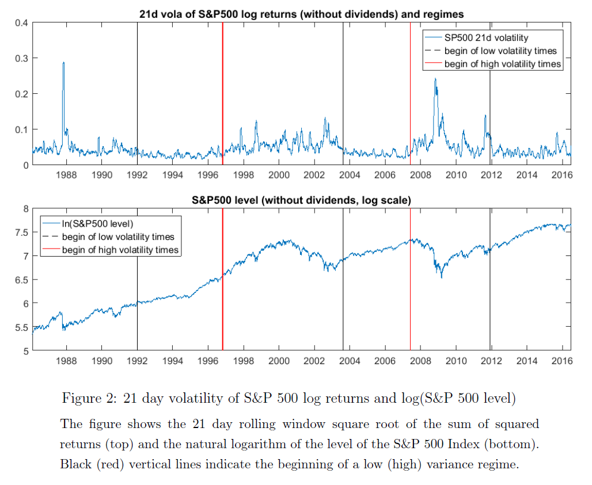
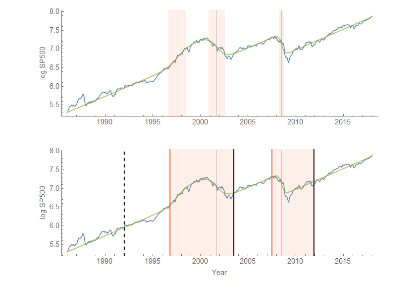

In scanning through the posters, papers, and discussions of the [preliminary schedule of the upcoming ASSA 2018 meeting in Philadelphia](https://www.aeaweb.org/conference/2018/preliminary) I found a lot of interesting sessions (e.g. two machine learning sessions). As a side note, those who think economics ignores alternative approaches should note the (surprising number of) sessions on institutionalist, Marxian, Feminist, and other heterodox approaches.

One poster from the [student poster session](https://www.aeaweb.org/conference/2018/preliminary/2033?q=eNqrVipOLS7OzM8LqSxIVbKqhnGVrAxrawGlCArI) caught my eye — in particular the identification of low volatility and high volatility regimes in the S&P 500:

That's from "Structural Breaks in the Variance Process and the Pricing Kernel Puzzle" by Tobias Sichert \[[pdf](https://www.aeaweb.org/conference/2018/preliminary/paper/5a4D7SGb)\]. It seems these low volatility and high volatility regimes line up with the transition shocks of the [dynamic information equilibrium model](https://informationtransfereconomics.blogspot.com/2017/01/what-about-s-500.html) (green line):

The top picture is the dynamic information equilibrium model with shock widths (full width at half maximum, described [here](https://informationtransfereconomics.blogspot.com/2018/01/canadas-below-target-inflation.html)). The bottom graph is Sichert's paper's structural breaks (black indicating the start of a low volatility regime, red indicating the start of a high volatility one per the figure at the top of this post). However, the analysis started at 1992, so that isn't so much the beginning of a low-volatility regime as the beginning of the data being looked at (therefore I indicated it with a dashed line). I colored in the high volatility regime with light red, and we can see these regions line up with the shock regions in the dynamic equilibrium model. The late 1990s early 2000s is seen as a single high volatility regime in Sichert's analysis and the Great Recession seems to continue for awhile after the initial shock — [possibly due to step response](https://informationtransfereconomics.blogspot.com/2017/11/unemployment-rate-step-response-over.html)? However, overall volatility looks like a good independent metric to identify periods of dynamic equilibrium (low volatility) and shocks (high volatility).
