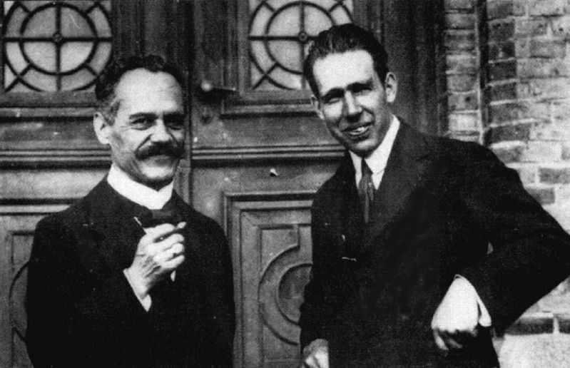

I was part of an epic Twitter thread yesterday, initially drawn in to a conversation about whether the word "mainstream" (vs "heterodox") was used in natural sciences (to which I said: [not really, but the concept exists](https://twitter.com/infotranecon/status/953353826492235776)). There was one sub-thread that asked a question that is really more a history of science question (I am not a historian of science, so this is my own distillation of others' work as well a couple of my undergrad research papers). It began with Robert Waldmann [tweeting to](https://twitter.com/robertwaldmann/status/953337345624956928) Simon Wren-Lewis:

> _... In natural sciences hypotheses don't survive statistically significant rejection as they do in economics._

Simon's response was:

> _They do if there is no alternative theory to explain them. The relevant question is what is an admissible theory._

To which both Robert and I said we couldn't think of any examples where this was the case. Simon Wren-Lewis then [asks an interesting question](https://twitter.com/sjwrenlewis/status/953373721414299649) about what happens when your theory starts meeting the headwind of empirical rejection:

> _How can that logically work\[?\] Do all empirical deviations from the (at the time) believed theory always come along at the same time as the theory that can explain those observations? Or in between do people stop doing anything that depends on the old theory?_

The answer to the second question is generally "no". Some examples followed, but Twitter can't really do them justice. So I thought I'd write a blog post discussing some case studies in physics of what happens when your theory's rejected.

**The Aether**

The one case I thought might be an example where natural science didn't reject a theory (therefore making me qualify that there were no examples in post-war science) was the aether: the substance posited to be the medium in which light waves were oscillating. The truth was that this theory wasn't invented to make sense of any particular observations (Newton thought it explained diffraction), but rather to soothe the intuition of physicists (specifically Fresnel's, who invented the wave theory of light in the early 1800s). If light is a wave, it must be a wave **_in_** something, right? The aether was terribly stubborn for a physical theory in the Newtonian era. Some of the earliest issues arose with [Fizeau's experiments](https://en.wikipedia.org/wiki/Fizeau_experiment) in the 1850s. The "final straw" in the traditional story was the [Michelson and Morely experiment](https://en.wikipedia.org/wiki/Michelson%E2%80%93Morley_experiment), but experiments continued to test for the existence of "aether wind" for some years later (you could even call [this 2009 precision test of Lorentz invariance](https://journals.aps.org/prl/abstract/10.1103/PhysRevLett.103.090401) a test of the aether). 

So here we have a case where a hypothesis was rejected and it was over 50 years between the first rejection and when the new theory "came along". What happened in the interim? [Aether dragging](https://en.wikipedia.org/wiki/Aether_drag_hypothesis). Actually the various experiments were considered **_confirmation_** of particular questions about how aether interacts with matter (even including Michelson and Morely's). 

But Fresnel's wave theory of light didn't really need the aether, and there was nothing that the aether did in Fresnel's theory besides exist as a medium for transverse waves. Funny enough, this is actually a problem because apparently aether didn't support longitudinal waves which makes it very different from any typical elastic medium. Looking back on it, it really doesn't make much sense to posit the aether. To me, that implies its role was solely to soothe the intuition; since we as physicists have long given up that intuition we can't really reconstruct how we would think about it at the time in much the same way we can't really imagine what writing looked like to us before we learned how to read.

So in this case study, we have a theory that was rejected and before the "correct" theory came along and physicists continued to use the "old theory". However, the problem with this as an example of Simon's contention is that the existence of the aether didn't have particular consequences for the descriptions of diffraction and polarization (the "old theory") for which it was invented. It was the connection between aether and matter that had consequences — in a sense, you could say this connection was assumed in order to be able to try and measure it. I can't remember the reference, but someone once wrote that the aether experiments seems to imply that nature was conspiring in such a way as to make the aether undetectable!

**The Precession of Mercury**

This case study brought up by Simon Wren-Lewis better represents what happens in natural sciences when data casts doubt on a theory. Precision analysis of astronomical data in the mid-1800s by Le Verrier led to one of the most high profile empirical errors of Newton's gravitational theory: it got the precession of Mercury wrong by several arc seconds per century. As Simon says: physicists continued to use Newton's "old" theory (and actually do so to this day) for nearly 50 years until the "correct" general theory of relativity came along.

But Newton's old theory was wildly successful (even the observed error was about 40 arc **_seconds_** per **_century_**). In one century, Mercury travels about 54 million seconds of arc meaning this error is on the order of one in one million. No economic theory is that accurate, so we could say that this case study is actually a massive case of false equivalence.

However, I think it is still useful to understand what happened in this case study. In our modern language, we would say that physicists set a scope condition (region of validity) based on a relevant scale in the problem: the radius of the sun (_R_). Basically, when the perihelion of the orbit _r_ is large relative to _R_, other effects potentially enter. And at _r/R_ ~ 2%, this ratio is much larger for Mercury than for any other planet (Mercury is in a 3:2 orbit resonance, tidally locked with the sun). Several _ad hoc_ models of the sun's mass distribution (as well as other effects) were invented to try an account for the difference from Newton's theory (as mentioned by Robert). Eventually general relativity came along (setting a scale — the Schwarzchild radius _2 G M/c²_ — in terms of the strength of the gravitational field based on the sun's mass _M_ and the speed of light, not its radius). Despite the how weird it was to think of the possibility of e.g. black holes or gravitational waves as fluctuations of space-time, the theory was quickly adopted because it fit the data.

The scale _R_ set up a firewall preventing Mercury's precession from burning down the whole of Newtonian mechanics (which was otherwise fairly successful), and _ad hoc_ theories were allowed to flourish on the other side of that firewall. This does not appear to happen in economics. As [Noah Smith says](http://noahpinionblog.blogspot.com/2015/09/a-bit-of-pushback-against-empirical-tide.html):

> _I have not seen economists spend much time thinking about domains of applicability (what physicists usually call "scope conditions"). But it's an important topic to think about._

And as Simon says in his tweet, economists just go on using rejected theory elements and models without limiting its scope or opening the field to _ad hoc_ models. This is also my own experience reading the economics literature.

**Old Quantum Theory**

Probably my favorite case study is so-called [old quantum theory](https://en.wikipedia.org/wiki/Old_quantum_theory): the collection of _ad hoc_ models that briefly flourished between Planck's quantum of light in 1900 to Heisenberg's quantum mechanics in 1925. Previously, lots of problems started to arise with Newtonian physics (though with the caveat that it was mostly wildly successful as mentioned above). There was the ultraviolet catastrophe (a singularity as wavelength goes to zero) which was related to blackbody radiation. Something was happening when the wavelength of light started to get close to the atomic scale. Until Planck posited the quantum of light, several _ad hoc_ models including atomic motion were invented to give different functional forms for blackbody radiation in much the same way different models of the sun allowed for possible explanations of Mercury's precession.

In much the same way the radius of the sun set the scale for the firewall for gravity, Planck set the scale for what would become quantum effects by specifying a fundamental unit of action (energy × time or momentum × distance) now named after him: _h_. Old quantum theory set this up as a general principle by saying phase space integrals could only result integer multiples of _h_ (Bohr-Sommerfeld quantization). Now _h_ \= 6.626 × 10⁻³⁴ J×s is tiny in terms of our human scale which is related to Newtonian physics being so accurate (and still used today); again using this as a case study for economics is another false equivalence as no economic theory is that accurate. But in the case, Newtonian physics was basically considered rejected within the scope of old quantum theory and stopped being used. That rejection was probably a reason why quantum mechanics was so quickly adopted (notwithstanding its issues with intuition that famously flustered Einstein and continue to this day). Quantum mechanics was invented in 1925 \[0\], and by the 1940s physicists were working out renormalization of quantum field theories putting the last touches on a theory that is the most precise ever developed. Again, it didn't really matter how weird the theory seemed (especially at the time) because the only important criterion was fitting the empirical data.

There's another way this case study shows a difference between the natural sciences and economics. Old quantum theory was almost immediately dropped when quantum mechanics was developed, and ceased to be of interest except historically. Its one major success lives on in name only as the Bohr energy levels of Hydrogen. However, Paul Romer wrote about economic models using the Bohr model as an analogy for models like the Solow model [that I've discussed before](https://informationtransfereconomics.blogspot.com/2015/05/frameworks-and-bohr-model-analogy.html). Romer said:

> _Learning about models in physics–e.g. the Bohr model of the atom–exposes you to time-tested models that found a good balance between simplicity and insight about observables._

Where Romer sees a "balance between simplicity and insight" that might well be used if it were an economic model, this physicist sees a rejected model that's part of the history of thought in physics. Physicists do not learn the Bohr model (you learn of its existence, but not the theory). The Bohr energy level formula turned out to be correct, but today's undergraduate physics students derive it from quantum mechanics not "old quantum theory" using Bohr-Sommerfeld quantization.

**A Summary**

There is a general pattern where some empirical detail is at odds with a theory in physics:

-   A scale is set to firewall the empirically accurate pieces of the theory
-   A variety of _ad hoc_ models are developed at that new scale where the only criterion is fitting the empirical data, no matter how weird they may seem

I submit that this is not how things work in economics, especially macroeconomics. Simon says we should keep using theories without a scope condition firewall, which Noah says doesn't seem to be thought about at all. New theories in macro- or micro-economics, [no matter how weird](https://papers.ssrn.com/sol3/papers.cfm?abstract_id=3094757), aren't judged based on their empirical accuracy alone.

But a bigger issue here I think is that there aren't any wildly successful \[1\] economic models. There really aren't any macroeconomic models accurate enough to warrant building a firewall. This should leave the field open to a great deal of _ad hoc_ theorizing \[2\]. [But in macro, you get DSGE models](https://papers.ssrn.com/sol3/papers.cfm?abstract_id=3022009) despite their poor track record. Unless you want to consider DSGE models to be _ad hoc_ models that may go the way of old quantum theory! That's really my view: it's fine if you want to try DSGE model macro and it may well eventually lead to insight. But it really is an _ad hoc_ framework operating in a field that hasn't set any scales because it hasn't had enough empirical success to require them.

...

**Update 19 January 2018**

Both Robert Waldmann and Simon Wren-Lewis responded to the tweet about this blog post (thread [here](https://twitter.com/infotranecon/status/953780615693746176)) saying that physics is not the optimal natural science for comparison with economics. However, I disagree. Physics (and chemistry) are the only fields with a comparable level of mathematical formalism to economics. Other natural sciences use lots of math, too, but there is no over-arching formal mathematical way to solve a problem in e.g. biology (and some of the ones that do exist are based on either dynamical systems, [the same kind of formalism used in economics](https://informationtransfereconomics.blogspot.com/2017/04/good-ideas-do-not-need-lots-of-invalid.html), _[or even **economic** models](https://informationtransfereconomics.blogspot.com/2015/08/obviously-e-coli-is-rational-utility.html)_). There's even less in medicine (Wren-Lewis's example).

Now you may argue that (macro)economics shouldn't have the level of mathematical formalism it does (I would definitely agree that the mathematical macro models used are far to complex to be supported by the limited data and that it's funny to [write stuff like this](https://informationtransfereconomics.blogspot.com/2015/05/im-not-sure-noah-smith-understands.html)). If you want to argue that macroeconomics shouldn't be using DSGE models, or that social science isn't amenable to math, go ahead \[3\]. But that wasn't the argument we were having which was what to do when your mathematical framework (e.g. standard DSGE models with Euler equations and Phillips curves) is rejected. Additionally, the reasons that these models are rejected are due to comparing the mathematical formalism with data — not their non-mathematical aspects. To that end, physics provides a best practice: set a scale and firewall off the empirically accurate parts of your theory.

Aside from the question of how one "uses" a non-mathematical model, one of the issues with the discussion of rejection of non-mathematical models is that there's no firm metric for rejection. When were Aristotle's crystal spheres rejected? Heliocentric models didn't really require rejection of the principle that planets were fixed to spheres made of aether. Kepler even mentions them in the same breath as the elliptical orbits that would reject the Aristotelian/Ptolemaic model completely, so comets and novae didn't reject the concept in Kepler's mind (you could make the case that the aether survives all the way to special relativity above). The "bad air" theory of disease around malaria (since it was associated with swampy areas, hence the name) was moderately successful up until a new theory came along in the sense that staying away from swamps or closing your windows is a good way to avoid mosquitoes.

Actually, it's possible the mathematical formalism is part of the reason macro doesn't just reject the models because of sunk costs ([or 'regulatory capture'](http://noahpinionblog.blogspot.com/2017/11/the-cackling-cartoon-villain-defense-of.html)) involved in learning the formalism. I don't know if non-mathematical models are more easily rejected in this sense (lower sunk costs), but I as I mentioned in my tweet as part of the thread linked above I couldn't even think of any non-mathematical models that were rejected that economics still uses — rendering the entire discussion moot if we're not talking about mathematical models.

PS I also added footnotes \[2\] and \[3\].

**Footnotes:**

\[0\] Added 16 November 2019. You could consider the brief period between Heisenberg's September 1925 paper and Schrodinger's December 1926 paper as a period in which a rejected theory (old quantum theory) continued to be used because people were uncomfortable with (or didn't understand) Heisenberg's matrix mechanics. Fifteen months! Physicists jumped at Schrodinger's work more readily since it was a differential equation — something they were comfortable with. Dirac's _Principles of Quantum Mechanics_ (1930) unified the two approaches. In a later edition of that book, it's made even clearer via [bra-ket notation](https://en.wikipedia.org/wiki/Bra%E2%80%93ket_notation).

\[1\] Noah likes to tell a story about the prediction of the BART ridership using random utility discrete choice models (I mentioned [here](https://informationtransfereconomics.blogspot.com/2015/07/random-utility-discrete-choice-models.html)). One of the authors of that study [has said](https://www.accessmagazine.org/spring-2002/path-discrete-choice-models/) that result was a bit of a fluke ("However, to some extent, we were right for the wrong reasons.").

\[2\] Added in update. This is part of my answer to Chris House's question (that I also address [in my book](https://www.amazon.com/dp/B0754X3PYF/ref=as_li_ss_tl?ie=UTF8&linkCode=ll1&tag=arandomphysic-20&linkId=1bd6c4cea930f74ed2c2c17df1ebe320)): _[Why Are Physicists Drawn to Economics?](https://orderstatistic.wordpress.com/2014/03/21/why-are-physicists-drawn-to-economics/)_ Because it is a field that uses mathematical models and there are no real scope conditions known opening up the possibilities of any _ad hoc_ model by physicists' standards.

\[3\] But you do have to contend with the fact that some of this non-mathematical social science [is pretty empirically accurately described by mathematical models](https://twitter.com/infotranecon/status/953780615693746176).
