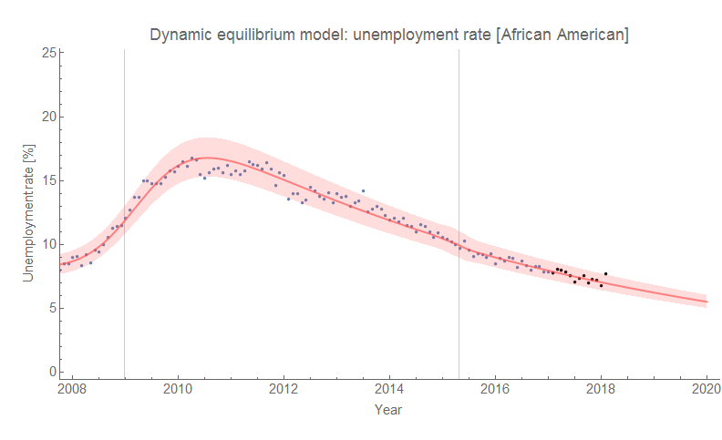

There's almost a sense of dramatic irony that after the State of the Union speech last week where credit was taken for the stock market and African American unemployment, both reversed themselves in the most recent data. While the spike in unemployment is outside the 90% confidence bands for the [dynamic information equilibrium model for black unemployment](https://informationtransfereconomics.blogspot.com/2017/07/racial-disparities-in-unemployment-rate.html), I do think it is just a fluctuation (statistical or measurement error):

We'd expect 90% of the individual measurements to fall inside the bands, so occasionally we should see one fall outside. It's not an actual increase in human suffering, and in fact is consistent with the continued decline in unemployment seen by the model. The unemployment rate is somewhat of a [lagging indicator of recessions as well](https://informationtransfereconomics.blogspot.com/2017/07/jolts-leading-indicators.html), so we should expect to see a decline in one or more JOLTS measures first if this is the leading edge of a recession.

We should always keep our minds open to alternative theories, and along with the spike in hate crimes since the 2016 election it is possible that employers have felt more empowered to discriminate against African Americans. JOLTS data is not broken out by race, and so a racially biased decline in hires could well be hidden in the data (e.g. it could be partially responsible for the potential decline we are [currently seeing in the aggregate measures](https://informationtransfereconomics.blogspot.com/2018/01/happy-jolts-data-day.html) — why would JOLTS hires fall when the "conventional wisdom" is that the economy is doing "great"?). This "leading" indicator wouldn't be as good of a leading indicator for a racially biased recession. In the past two recessions, the shocks to unemployment hit African Americans a couple months later (the centers are at 2002.0 vs 2001.8, and 2009.0 vs 2008.8), so a recession where black unemployment leads would be anomalous.

I don't think that is what is happening (it's just a single data point after all), but it can't be ruled out using available data. And after the experience of the past two years, I wouldn't put money on the better angels of white Americans' nature.
