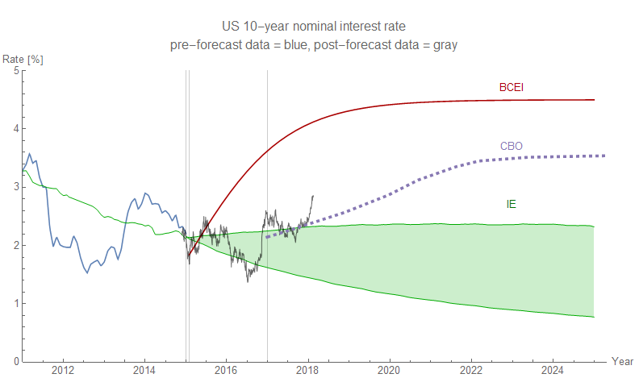
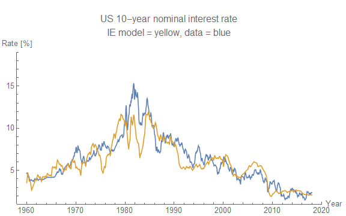
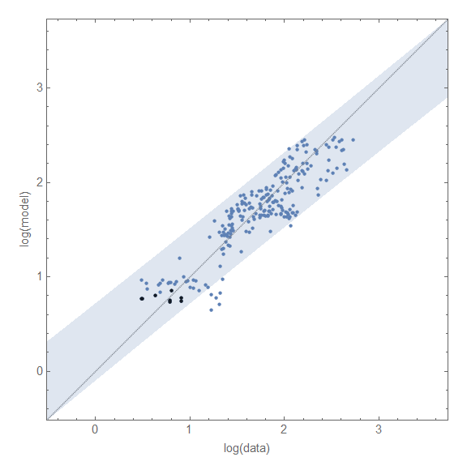
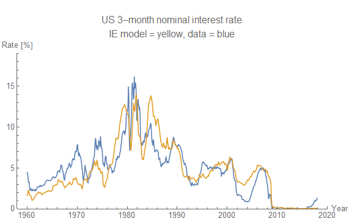
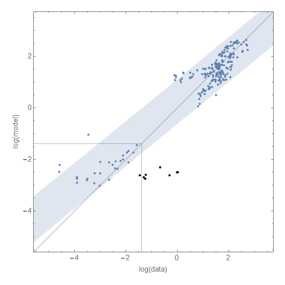

The interest rate model of the long and short term interest rates are predicting average interest rates below the current observed rates. For example in this forecast:

Now the actual forecast is for the **_average trend_** of **_monthly_** rates and I'm showing actual **_daily_** interest rate data, so we can expect to see occasional deviations even if the model is working correctly.

But how can we tell the difference between some expected theoretical error and a deviation? I decided to look at the elevated recent data in the light of the models' typical error. In the case of the long rate above, we're in the normal range:

However these errors basically assume that the model error is roughly constant in percentage (i.e. a 10% error means 100 basis point error on a 10% interest rate while a 10% error means a 10 basis point error on a 1% interest rate). This is definitely not true because the data is reported only to the nearest basis point, but the finite precision effect should only come into play near log(0.01) ~ -4.6. This error is possibly due to the Federal Reserve's implied precision of 25 basis points where log(0.25) ~ -1.4. Since the Fed doesn't make changes of less than a quarter basis point, and the short rate typically sticks close to the Fed funds rate, we'd expect data near or below log(0.25) as shown on the graph to have larger error than points above log(0.25).

I don't see any particular reason to abandon these models without a more significant deviation.
