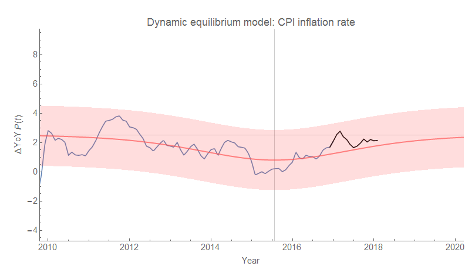
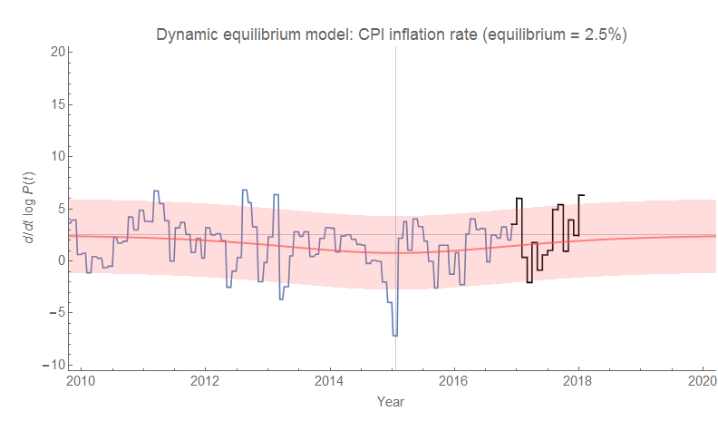

New [CPI data](https://fred.stlouisfed.org/series/CPIAUCSL) is out today, and here is the latest data point as both continuously compounded annual rate of change and year-over-year change. The latest uptick is consistent with the a general upward trend after the post-recession shock to the labor force.

