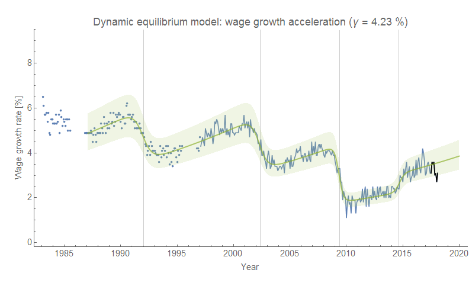
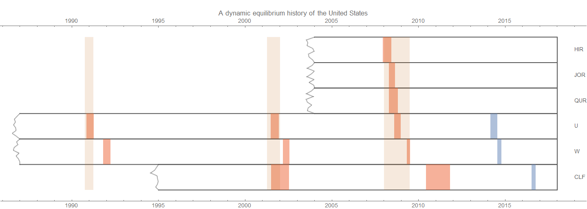

I saw some [data from the Atlanta Fed](https://www.frbatlanta.org/chcs/wage-growth-tracker.aspx?panel=1) \[1\] on wage growth that looked remarkably suitable for a [dynamic information equilibrium model](https://informationtransfereconomics.blogspot.com/2017/01/dynamic-equilibrium-presentation.html) (also described in [my recent paper](https://papers.ssrn.com/sol3/papers.cfm?abstract_id=3094757)). One of the interesting things here is that it is a dynamic equilibrium between wages ($W$) and the rate of change of wages ($dW/dt$) so that we [have the model](https://informationtransfereconomics.blogspot.com/2016/09/basic-definitions-in-information.html) $dW/dt \rightleftarrows W$:

where $\gamma$ is the dynamic equilibrium growth rate and $\sigma_{i} (t)$ represents a series of shocks. This model works remarkably well:

The shock transitions are in 1992.0, 2002.4, 2009.4, and 2014.7 which all **_follow_** the related shock to unemployment. A negative shock to employment drives down wage growth (who knew?), but it also appears that wage growth has a tendency to increase at about 4.2% per year \[2\] unless there is a positive shock to employment (such as in 2014) when it can increase faster. The most recent downturn in the data is possibly consistent with the [JOLTS leading indicators](https://informationtransfereconomics.blogspot.com/2017/07/jolts-leading-indicators.html) showing a deviation, however since the wage growth data seems to **_lag_** recessions it is more likely that this is a measurement/noise fluctuation.

I added the wage growth series to the [labor market "seismogram" collection](https://informationtransfereconomics.blogspot.com/2018/02/economic-seismographs-labor-and.html), and we can see a fall in wage growth typically follows a recession:

**Update 20 March 2021**

It's not groundbreaking, but I should add that since $W \rightleftarrows NGDP$, the model is basically (by the [transitive property of information equilibrium](https://informationtransfereconomics.blogspot.com/2015/03/information-equilibrium-is-equivalence.html)) that increases in NGDP are informationally equivalent to increases in the rate of growth of wages — a growing economy opens the opportunity set for wage growth.

At least until [this happens](https://informationtransfereconomics.blogspot.com/2018/10/limits-to-wage-growth.html).

(I've felt that the $\frac{dW}{dt} \rightleftarrows W$ formulation was a bit abstract, but realized I've never updated the post with how I thought about it in a more concrete way.)

...

**Footnotes:**

\[1\] The time series is broken before 1997, but data goes back to 1983 in the source material. I included data back to 1987. However the data prior the 1991 recession does not have the complete 1980s recession(s), so the fit to that recession shock would be highly uncertain and so I left it out.

\[2\] Wage growth it typically around 3.0% lately, so a 4.2% increase in that rate would mean that after a year wage growth would be about 3.1% and after 2 years about 3.3% **_in the absence of shocks_**.
