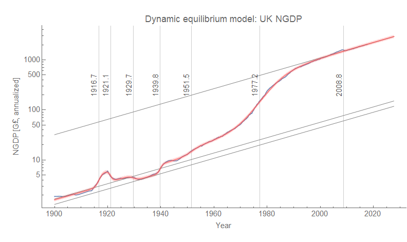
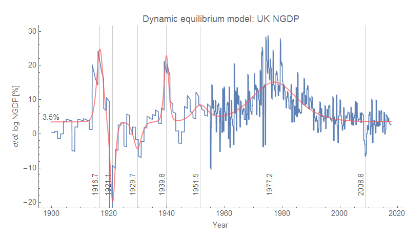
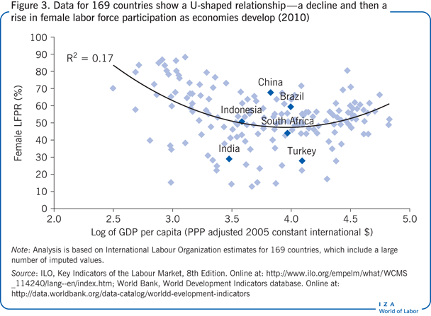

The [Maddison database on economic growth](https://voxeu.org/article/rebasing-maddison) just completed a new revision, and I thought it would be a great opportunity to see how information equilibrium models handle the data. However, the data is entirely in terms of "real" GDP without accompanying price level information. Now I fully understand the motivation behind it: not only are they trying to separate out purely inflationary effects but also compare data across countries. It is hard enough to compare UK pounds sterling in 1918 versus to pounds in 2018 much less US dollars in 2018 in any meaningful way — at least in the traditional view in economic growth. The problem here is that the separation of price level from output _NGDP = P Y_ where we can just "divide by _P_" and then make some adjustments across different countries is model dependent. [I wrote a post](https://informationtransfereconomics.blogspot.com/2017/04/growth-regimes-lowflation-and-dynamic.html) about how this can be seen to generate fluctuations based on nothing but the fact that the widths of shocks are different. These graphs show RGDP per capita as well as NGDP and the deflator which have fundamentally the same general structure:

That these shocks are not in fact identical, cancelling in the RGDP result, makes me think that it is the separation of price level data from nominal output that is the issue here — at least during non-equilibrium shocks — not that something we define as real output is fluctuating with a low growth spell in the 1970s.

I'm not in any way saying the Maddison project and databases like it are wrong-headed or even incorrect, only that it represents a particular view of "real income" that (while shared with the vast majority of economists) is model dependent.

One of the benefits (in my view) of the information equilibrium framework is [its manifest scale invariance](https://informationtransfereconomics.blogspot.com/2017/02/invariance-and-deep-properties.html) that essentially says the basic properties of any relationship (aside from non-equilibrium shocks) are captured by information transfer indices (which are related to [Lyapunov exponents](http://informationtransfereconomics.blogspot.com/2016/05/lyapunov-exponents-and-information.html) \[1\]). This property coupled with the [dynamic information equilibrium](https://informationtransfereconomics.blogspot.com/2017/01/dynamic-equilibrium-presentation.html) approach tells us that levels do not matter to the underlying economic processes as much as growth rates — and growth rates can be separated from levels.

This property also makes it unclear as to whether cross national comparisons can be made meaningful in terms of measures like income. There would be no requirement for any relationship you derive to be stable through non-equilibrium shocks, therefore you end up with a lot of path dependence \[2\]. Add in the fact that you can potentially separate the economic processes from the income levels (that in turn depend on various currencies), and there is a case to be made that cross-national comparisons (like intertemporal ones) are more _sociological_ than economic.

Then again, this might be considered a point against using the information equilibrium framework. But as different nations are structured differently it seems to me to be as difficult to compare living standards the US (with no national healthcare system and people reduced to poverty by medical costs) with living standards the UK (which has one and no medical bankruptcies that I am aware of) as it is to compare Rothschild's level of wealth in an era without antibiotics \[2\] to "equivalent" wealth today.

But what can you say about economic growth then? Since I couldn't use the Maddison database, I had to get my macro data fix somewhere and started working with the UK GDP time series. Here are the series of shocks necessary for a dynamic equilibrium growth rate of about 3.5%/y \[3\]:

I left out the Great Recession boom/bust shock in the model curve for some reason (probably because I was more focused on the data before 1950; see [here for the US version](https://informationtransfereconomics.blogspot.com/2018/01/24-growth-forever.html) as well as a more detailed look at the last 50 years of UK data), but the shocks are: 1916.7 (WWI), 1921.1 (end WWI, Ireland independence), 1929.7 (Great Depression), 1939.8 (WWII), 1951.5 (a post-war economic boom), and 1977.2 (the demographic transition of women entering the workforce [also visible in US data](https://informationtransfereconomics.blogspot.com/2017/09/was-phillips-curve-due-to-women.html) (or see [here](https://informationtransfereconomics.blogspot.com/2018/01/24-growth-forever.html))).

The "story" for the UK is mostly of major geopolitical events as well as the high inflation and growth associated with the demographic shift. Geopolitical events like wars seem (to me at least) mostly unpredictable on the 20-50 year time scale. But what is interesting to me is that we could potentially understand global economic conditions in a different way based on these "shocks". One question I would like to answer is how much of the modern disparities in income per capita can be attributed to where countries are relative to the major demographic shift that occurred in the 60s and 70s in several parts of the world. For example [it appears that as countries develop](https://wol.iza.org/articles/female-labor-force-participation-in-developing-countries/long), there is first a decline in women's labor force participation followed by a rise:

This is just one factor, but it goes back to the question of whether it makes sense to directly compare income/output levels for countries that haven't had the same series of shocks — or whether we should compare the sequence of shocks.

**Footnotes:**

\[1\] Lyapunov exponents measure the separation of paths in phase space in the system. In economic systems, we might say the paths of different agents or firms. Now the IT index _k ~ 1/λ_ which means that a low _k_ system has much faster separation in phase space than a high _k_ system. But since high _k_ is associated with high growth, this means it is low growth systems that have a much faster separation in phase space. An open question here is whether this has any bearing on e.g. inequality where the phase space paths (i.e. income time series trajectories) separate much faster — associating low growth and high inequality.

I'd also like to point out that this is how one might go about this issue scientifically. If I had made a declaration somewhere on this blog that "inequality is critical to understanding economic growth" like [some heterodox economists have](http://informationtransfereconomics.blogspot.com/2017/12/33-theses.html), I would have to make a great effort to show that I was not just finding what I wanted to find.

\[2\] Which may be the only way [to make sense of the price level](https://informationtransfereconomics.blogspot.com/2015/01/how-do-you-measure-price-level.html).

\[3\] This is lower than the estimate [here](https://informationtransfereconomics.blogspot.com/2018/01/24-growth-forever.html) of 3.9%/y due to the addition of data from the early 1900s. The boom preceding the "Great Recession" and the Lawson boom also become more noticeable when you zoom in a bit to the last 50 years.
