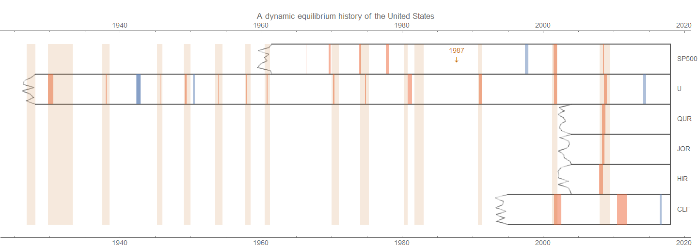
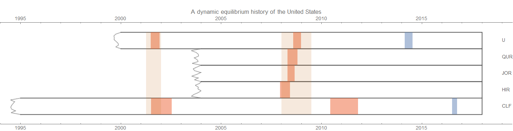

[wrote a tweet](https://twitter.com/interfluidity/status/960667347747979265)[both described here](https://informationtransfereconomics.blogspot.com/2018/01/24-growth-forever.html)[a few months ago](https://informationtransfereconomics.blogspot.com/2017/07/a-dynamic-equilibrium-history-of-united.html)[this 85 foot long infographic](https://fraser.stlouisfed.org/title/162)[here](https://informationtransfereconomics.blogspot.com/2017/01/dynamic-equilibrium-presentation.html)[my paper](https://papers.ssrn.com/sol3/papers.cfm?abstract_id=3094757)
[S&P 500](https://informationtransfereconomics.blogspot.com/2017/01/what-about-s-500.html)[JOLTS](https://informationtransfereconomics.blogspot.com/2017/07/jolts-leading-indicators.html)[prime age Civilian Labor Force participation rate](https://informationtransfereconomics.blogspot.com/2017/11/a-new-beveridge-curve-or-science-is.html)

[leading indicators](https://informationtransfereconomics.blogspot.com/2017/07/jolts-leading-indicators.html)[openings appears to be leading a bit more than hires](https://informationtransfereconomics.blogspot.com/2018/02/jolts-data-and-that-market-crash.html)

PS I thought I'd include these measures that illustrate my contention that the "great inflation" of the 1970s was primarily a demographic phenomenon of women entering the workforce [that I describe here](https://informationtransfereconomics.blogspot.com/2017/07/adding-race-and-gender-to-macroeconomics.html) in order to have a single post to reference for some of my more outside the mainstream conjectures. I present two measures of inflation (CPI and PCE) as well as the civilian labor force (total size) alongside the employment population ratio for men and women.

**Footnotes**

\[1\] You may be asking why there's a positive shock to unemployment, but no (apparent) shock to any of the JOLTS measures. That's an excellent question. The answer probably lies in the fact that shocks to unemployment are made up of a combination of smaller shocks to the other measures [as well as a shock to the matching function itself](https://informationtransfereconomics.blogspot.com/2017/09/search-and-matching-ii-theory.html). Therefore the shock to hires and openings might be too small to see in those (much noisier) measures. One way to think about it is that the unemployment rate is a sensitive detector of changes in both hires, openings, and the matching function.
