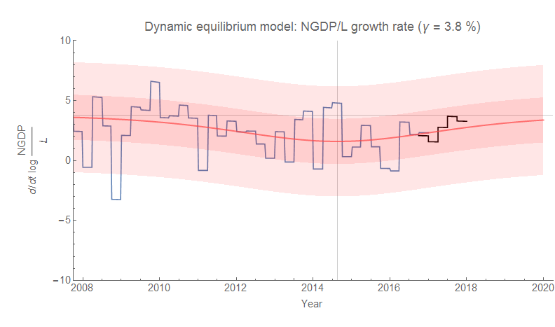
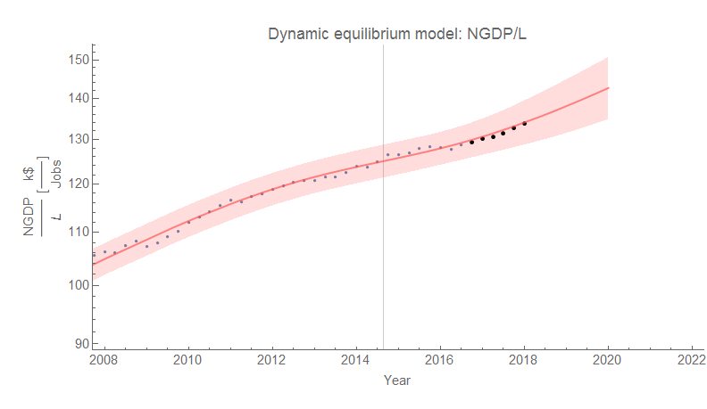
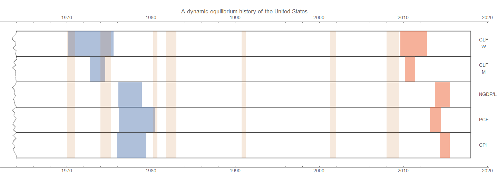
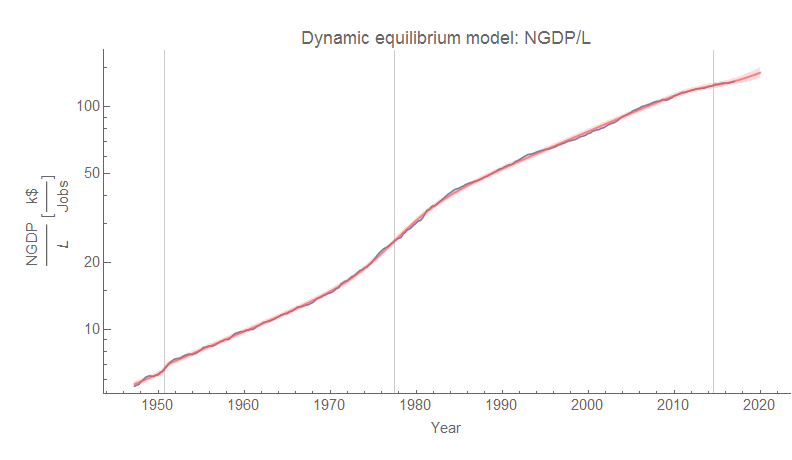

One of the dynamic information equilibrium model forecasts I've been tracking on the order of a year now to measure its performance is what I call the ["N/L" or "NGDP/L" model](https://informationtransfereconomics.blogspot.com/2017/03/the-quantity-theory-of-labor-and.html) \[1\] (specifically [FRED GDP](https://fred.stlouisfed.org/series/gdp), i.e. nominal GDP, divided by [FRED PAYEMS](https://fred.stlouisfed.org/series/payems), i.e. total nonfarm payrolls). Revised GDP data came out today, so I thought it'd be a good time to check back in with the model \[2\]:

One way to think about this is as a measure of nominal productivity. We are coming out of the aftermath of the shock to the labor force following the great recession, so we can see a gradual increase back towards the long-run equilibrium.

If we use this dynamic equilibrium model instead of NGDP alone as the shocks, we can see in [a history "seismograph"](https://informationtransfereconomics.blogspot.com/2018/02/women-in-workforce-and-solow-paradox.html) that this measure basically coincides with the inflation measures.

There's a good reason for this: this is effectively a model of Okun's law (as described [here](https://informationtransfereconomics.blogspot.com/2017/03/the-quantity-theory-of-labor-and.html)) if we identify the "abstract price" with the price level P:

to show changes in employment (and therefore unemployment) are directly related to changes in real GDP.

**Footnotes**

\[1\] Also, the "quantity theory of labor" per the title because the model implies log _NGDP_ ~ _k_ log _L_.

\[2\] Here is the complete model:

