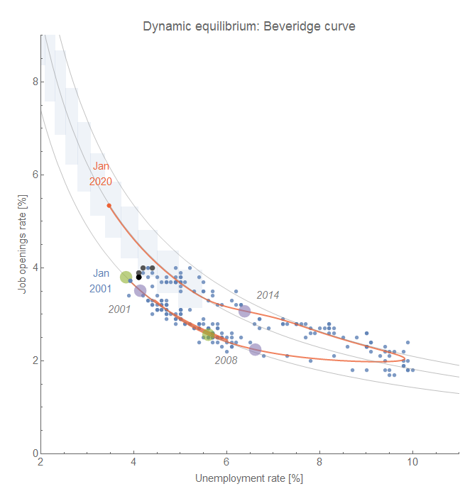
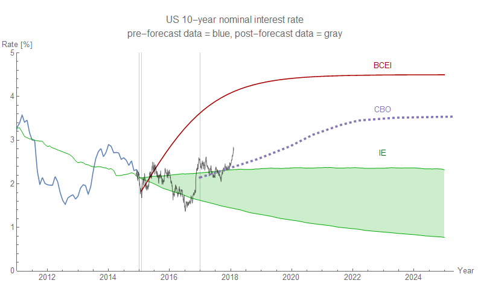

The latest JOLTS data does seem to continue the deviation from the dynamic information equilibrium we might see during the onset of a new shock (shown here with the original forecast and updated counterfactual shock in gray; post-forecast data is in black):

I will admit that the way I decided to implement the counterfactual shock (as a Taylor expansion of the shock function that looks roughly exponential on the leading edge) might have some limitations if we proceed into the shock proper because adding successive terms causes the longer ranges of the forecast to wildly oscillate back and forth [as can be seen here for a sine function](https://math.stackexchange.com/questions/9422/intuition-explanation-of-taylor-expansion). Using the full logistic function isn't necessarily a solution because it produces a  series of under- and over-estimates (see [here](https://informationtransfereconomics.blogspot.com/2017/04/determining-recessions-with-algorithm.html)). Basically, forecasting a function that grows exponentially at first can be hard. One other measure is the joint function of openings and unemployment making up the Beveridge curve which is starting to show a deviation from the expected path as well (moving almost perpendicularly to it):

This brings me to the discussion around the latest market crash which included a lot of "the market is not the economy" and a pretty definitive "[literally zero percent chance we are in a recession now](https://twitter.com/TimDuy/status/960673516956794880)" from Tim Duy. The only thing I would bring up is that [the JOLTS data is a possible leading indicator](http://informationtransfereconomics.blogspot.com/2017/07/jolts-leading-indicators.html) of a recession and that data is not obviously saying "no recession" — and is in fact hinting at one (in the next year or so).

Coincidentally, I just updated [the S&P 500 model I've been tracking](https://informationtransfereconomics.blogspot.com/2018/02/long-term-exercises-in-hubris.html) and the latest drop puts us almost exactly back at the dynamic equilibrium (red, data and ARMA process forecast is blue, post-forecast data is black):

Which is to say that we're right where we'd expect to be — not on some negative deviation from equilibrium (just a correction to a positive deviation). I think it is just coincidental that the market fell to exactly the dynamic equilibrium model center; I wouldn't read too much into that. The fluctuations we see are well within the historical deviations from the dynamic equilibrium (red band is the 90% band).

...

**Update 7 February 2018**

I thought I'd add in the interest rate model forecast that's been going on for over three years as well. Note that the model prediction is for monthly data, therefore the random noise in daily data will have somewhat larger spread, but it is still a bit high (which is one of the [possible precursors of recession](https://informationtransfereconomics.blogspot.com/2014/08/are-interest-rates-good-indicator-of.html), connected to [yield curve inversion](https://informationtransfereconomics.blogspot.com/2014/09/the-emerging-story-of-great-recession.html) in the model, see also [here](http://informationtransfereconomics.blogspot.com/2015/11/are-we-no-longer-safe-from-recession.html) or [here](https://informationtransfereconomics.blogspot.com/2017/06/todays-fed-decision-and-recession.html)):

