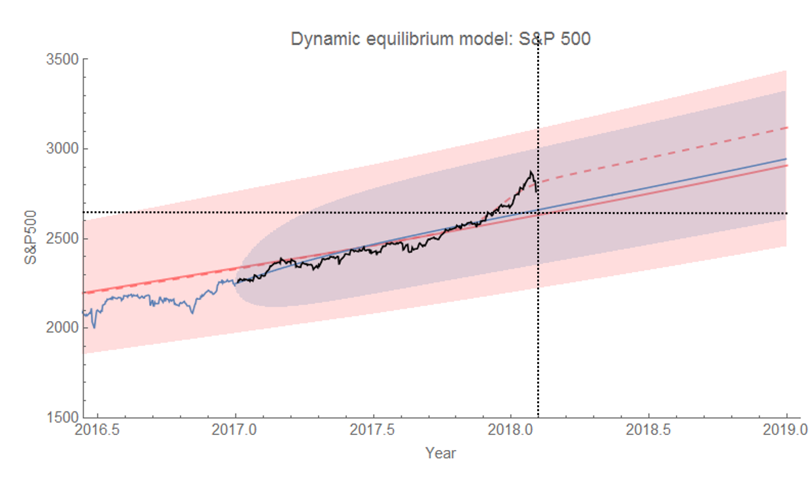
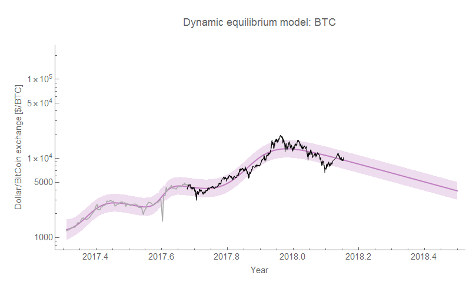

I've been tracking [the S&P 500 forecast](https://informationtransfereconomics.blogspot.com/2017/01/what-about-s-500.html) made with the [dynamic information equilibrium model](https://informationtransfereconomics.blogspot.com/2017/01/dynamic-equilibrium-presentation.html). The latest mini-boom and subsequent fall are still within the normal fluctuations of the market:

However, I wouldn't be surprised if the massive giveaway to corporations in the latest Republican tax cut didn't in fact constitute a "shock" (dashed line in the graph above). Also relevant: [the multi-scale self-similarity of the S&P 500](https://informationtransfereconomics.blogspot.com/2017/07/self-similarity-in-dynamic-equilibrium.html) in terms of dynamic equilibrium.

...

**Update 5 February 2018**

[Ha!](https://www.cnbc.com/2018/02/04/us-stocks-interest-rates-futures.html)

Also, the close today brings us almost exactly back to the dynamic equilibrium:

Also bitcoin continues to fall ([this is not a forecast, but rather a model description](https://informationtransfereconomics.blogspot.com/2017/10/bitcoin-model-fails-usefulness-criterion.html)):

 ...

**Update 26 February 2018**

Continued update of S&P 500 and bitcoin:

