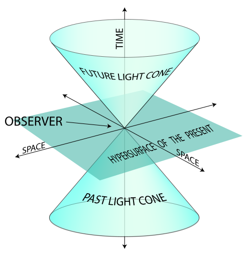
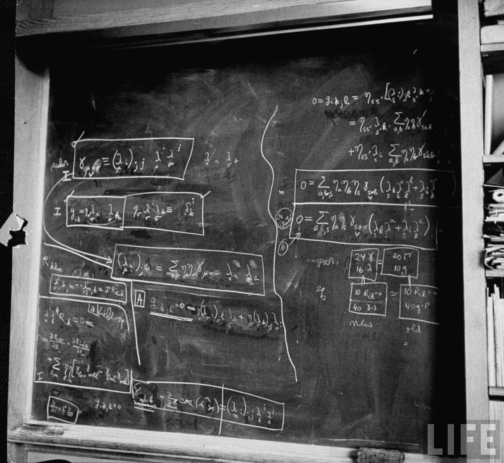
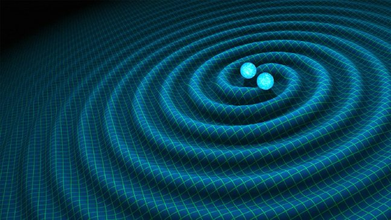

One of the things I've noticed ever since I started doing some "freelance" (or "maverick" or "nutcase") economic research is how many strange accounts of how special relativity came about are out there in the world. It's a story frequently invoked by people from all walks of life from economists to philosophers to general fans of science as an example of an ideal process of science. However the story invoked is often at odds with what actually happened or with how physicists today view the outcome.

The popular re-telling actually has many parallels with the popular but erroneous \[1\] re-telling of how 70s inflation "proved Friedman was right" in macroeconomics — even to the point where some practitioners themselves believe the historical myths. The popular (but false) narrative goes something like this: Michelson and Morely conclusively disproved the idea of the aether and in order to solve the resulting problems, Einstein used intuition and some thought experiments about moving clocks to derive a new theory of physics that refuted the old Newtonian world.

This should immediately raise some questions. 1) What problems with Newtonian physics would be caused by showing the aether (which doesn't exist) doesn't exist? 2) Why do physicists still use Newtonian physics? 3) Isn't Einstein famous for the equation _E = mc²_ — which thought experiment leads to that?

The real story is more like this: Maxwell had produced an aether-based framework that was unifying the physics of light waves, electricity, and magnetism but there were some counterintuitive aspects of this framework that all had to do with moving charges and light sources involving a bunch of _ad hoc_ mathematical modifications like length contraction, models of the aether, and an inconsistency in the interpretation of Maxwell's equations; Einstein came up with a general principle that unified all of these _ad hoc_ modifications, made the aether models unnecessary, and resolved the asymmetry.

This answers my questions 1) through 3) above. 1) The aether was shown to be _unnecessary,_ not _erroneous_. 2) Newtonian physics is a valid approximation when velocity is small compared to the speed of light. 3) _E = mc²_ is a result of Lorentz invariance (i.e. math), not the thought experiments that help us get over the counterintuitive aspects of Lorentz invariance.

Now I am not a historian, so you should take this blog post as you would any amateur's. I did an undergraduate research project on the motivations for special relativity as part of my interdisciplinary science honors program \[2\], presented the result in a seminar, and I'm fairly familiar with the original papers (translated from German and [available in this book](https://www.amazon.com/Principle-Relativity-Dover-Books-Physics-ebook/dp/B00CDGSFQU/ref=as_li_ss_tl?ie=UTF8&linkCode=ll1&tag=arandomphysic-20&linkId=496167924f5c470054e44c33e24031fa)). I also spent a bit of time talking with [Cecile DeWitt](https://en.wikipedia.org/wiki/C%C3%A9cile_DeWitt-Morette) about Einstein, but I'd only really use this to confirm the popular notion that Einstein had a pretty robust sense of humor so direct quotes should be considered with that in mind.

**Myth: Einstein was "bad at math"**

This takes many forms from denial that the theoretical advances Einstein made were extremely advanced math at the time, to that he was actually bad at math leading him to his "thought experiments". This myth likely [arises from a quote](https://www.quora.com/What-was-the-meaning-of-Einsteins-quote-do-not-worry-about-your-difficulties-in-Mathematics-I-can-assure-you-mine-are-still-greater) from a 1943 letter in response to a high school student (Barbara Wilson) who had called Einstein one of her heroes (emphasis mine):

> _Dear Barbara:_ 

> _I was very pleased with your kind letter. Until now I never dreamed to be something like a hero. But since you have given me the nomination, I feel that I am one. It's like a man must feel who has been elected by the people as President of the United States._ 

> _**Do not worry about your difficulties in mathematics; I can assure you that mine are still greater.**_

This probably was just said as encouragement, and Einstein might even have been thinking about his own crash course in differential geometry and comparing himself to mathematicians he knew like his teacher Minkowski. Einstein was something of a mathematical prodigy when he was younger and all of his work on relativity is mathematically challenging even for modern physics students. It would be hard to look at [mathematics like this](https://en.wikipedia.org/wiki/Riemann_curvature_tensor) and say the person who was able to use it to produce an empirically successful theory of gravity was "bad at math". Also, here's the blackboard he left after his death:

_Update 19 January 2019_ (H/T [Beatrice Cherrier](https://twitter.com/Undercoverhist/status/1085994795003195393)). Apparently the math was so obscure at the time that only Einstein and is close mostly German colleagues really understood it and due to English-German animosity in WWI it took some time to leak out to English physicists. [The article that's from](https://physicstoday.scitation.org/doi/full/10.1063/PT.3.3235) also has other things related to the rest of this post.

**Myth: Einstein's thought experiments led to relativity**

There are quite a few versions of this idea, but really it is more the reverse. Math led Einstein to conclusions he used thought experiments to understand (i.e. explain to himself and others) because of how counterintuitive they were. Maxwell's equations and their Lorentz invariance led Einstein to effectively promote a symmetry of electromagnetism to a symmetry of the universe. Einstein later used Minkowski's mathematical representation of a 4-dimensional spacetime as the framework for what would become general relativity.

It's somewhat ironic because Mach — who coined our modern use of "thought experiment" and that Einstein had learned "relativity" from — believed that human intuition was accurate because it was honed by evolution. But why would evolution provide humans with the capacity to intuitively understand the bending of space and time (or the quantum fluctuations at the atomic scale)? Einstein turned that upside-down, and used Mach's thought experiments to instead explain _**counterintuitive**_ concepts like time dilation and length contraction. I think a lot of people confuse Einstein's and Mach's ideas of "thought experiments" which led to this myth \[3\]. You can read more about this [here](https://www.uh.edu/engines/epi576.htm).

I once had a commenter on this blog who decided to argue against even direct quotes from Einstein saying he got the idea of space-time for general relativity from Minkowski's 4-dimensional mathematics. Although some things in physics get named for the wrong person (the Lorentz force wasn't first derived by Lorentz), it's called [Minkowski space-time](https://en.wikipedia.org/wiki/Minkowski_space) for a reason.

This is a powerful narrative for some reason; I suspect it is the math-phobic environment that seems unique to American discourse. It is fine as an American to freely admit you are bad at math and still think of yourself as somehow "cultured" or "intellectual" (or in fact to **_elevate_** your status). The myth that Einstein didn't need math to come up with relativity plays into that.

**Myth: The aether was disproved just before (or by) relativity**

As I talked about [here](https://informationtransfereconomics.blogspot.com/2018/01/what-to-theorize-when-your-theorys.html), there were actually several different theories of the aether (e.g. [aether dragging](https://en.wikipedia.org/wiki/Aether_drag_hypothesis)) and various negative results over _50 years_ from Fizeau's experiment to Michelson and Morely's were often seen as **_confirmation_** of particular versions. Experiments continued for many years after Einstein's 1905 paper \[3\], and despite the modern narrative that Michelson and Morely's experiment led to special relativity it was really more about mathematical theory than experiment \[4\].

I'm not entirely convinced that the aether has been completely "disproved" in the popular imagination or even among physicists anyway. We frequently see general relativity and gravity waves explained through the "rubber sheet" analogy which might as well be called an "aether sheet". If the strong and weak nuclear forces hadn't been discovered in the meantime it is entirely possible that [Kaluza and Klein's 5-dimensional theory](https://en.wikipedia.org/wiki/Kaluza%E2%80%93Klein_theory) that combined general relativity and electromagnetism would have become the dominant "standard model" and the aether could have been re-written in history as what space-time is made of \[5\].

**Myth: Special relativity "falsified" Newtonian physics**

This one can be partially blamed on Karl Popper, but also on various representations and interpretations of Popper. I've frequently found descriptions of Popper's idea of falsification that say something like "Eddington's 1919 experiment falsified Newton's theory of gravity and caused it to be replaced with Einstein's". For example, [here](http://www.iep.utm.edu/pop-sci/):

> _Popper argues, however, that \[General Relativity\] is scientific while psychoanalysis is not. The reason for this has to do with the testability of Einstein’s theory. As a young man, Popper was especially impressed by Arthur Eddington’s 1919 test of GR, which involved observing during a solar eclipse the degree to which the light from distant stars was shifted when passing by the sun. Importantly, the predictions of GR regarding the magnitude shift disagreed with the then-dominant theory of Newtonian mechanics. Eddington’s observation thus served as a crucial experiment for deciding between the theories, since it was impossible for both theories to give accurate predictions. Of necessity, at least one theory would be falsified by the experiment, which would provide strong reason for scientists to accept its unfalsified rival._

As best as I can tell, Popper only thought that Eddington's experiment demonstrated the falsifiability of Einstein's general relativity (e.g. [here \[pdf\]](https://macaulay.cuny.edu/eportfolios/liu10/files/2010/08/KPopper_Falsification.pdf)): Eddington's experiment could have come out differently meaning GR was falsifiable. I have never been able to find any instance of Popper himself saying Newton's theory was falsified (_falsifi**able**_, yes, but not _falsifi**ed**_). Popper was a major fanboy for Einstein which doesn't help — it's hard to read Popper's gushing about Einstein and not believe he though Einstein had "falsified" Newton. Also it's important to note that general relativity isn't required for light to bend (just the equivalence principle), but the relativistic calculation predicts twice the purely "Newtonian" effect. That is to say that light bending alone doesn't "falsify" Newtonian physics, just the particular model of photon-matter gravitational scattering.

In any case, both Newtonian gravity and Newtonian mechanics are used today by physicists unless one is dealing with a velocity close to the speed of light or in the presence of significant gravitational fields (or at sufficient precision to warrant it such as in your GPS which includes some corrections due to general relativity). The modern language we use is that Newtonian physics is an [effective theory](https://en.wikipedia.org/wiki/Effective_theory).

**More myths?**

I will leave this space available for more myths that I encounter in my travels.

**Footnotes**

\[1\] Read [James Forder](http://jamesforder.uk/introduction-to-the-phillips-curve/) on this.

\[2\] [Dean's Scholars](https://en.wikipedia.org/wiki/Dean%27s_Scholars) at the University of Texas at Austin

\[3\] I sometimes jokingly point out that there is a privileged frame of reference that observers would agree on: [the Big Bang rest frame](https://physics.stackexchange.com/questions/25928/is-the-cmb-rest-frame-special-where-does-it-come-from). We only recently discovered our motion with respect to it in the 1990s. This idea also complicates some of the "thought experiments" used to explain special relativity (i.e. an absolute clock could be defined as one ticking in the rest frame of the CMB).

\[4\] I blame Popper for this:

> _Famous examples are the Michelson-Morley experiment which led to the theory of relativity_

[Einstein actually begins](http://hermes.ffn.ub.es/luisnavarro/nuevo_maletin/Einstein_1905_relativity.pdf) \[pdf\] with the "asymmetries" in Maxwell's equations, and relegates the aether experiments to an aside:

> _Examples \[from electrodynamics\], together with the unsuccessful attempts to discover any motion of the earth relatively to the “light medium,” suggest that the phenomena of electrodynamics as well as of mechanics possess no properties corresponding to the idea of absolute rest._

The paper itself is titled _On the electrodynamics of moving bodies_, further emphasizing that Einstein's motivation was more understanding the "asymmetries" of Maxwell's equations and Lorentz's electrodynamics. Einstein's paper basically reformulates Lorentz's "stationary aether" electrodynamics, but does it without recourse to the aether.

Experiments like Michelson and Morely's (such as Fizeau's 50 years prior, and a long list of others) were part of a drumbeat of negative results of measurements of motion with respect aether. In a sense, Einstein is telling us the aether (and therefore any attempt to measure our motion with respect to it) is basically moot — not that some experiment "disproved" it:

> _The introduction of a “luminiferous ether” will prove to be superfluous inasmuch as the view here to be developed will not require an “absolutely stationary space” provided with special properties, nor assign a velocity-vector to a point of the empty space in which electromagnetic processes take place._

\[5\] For example: "In the early 1800s Fresnel came up with the wave theory of light where the electromagnetic vibrations occurred in a medium called the luminiferous aether that we now refer to as space-time after Kaluza and Klein's unification of the two known forces in the universe: gravity and electromagnetism."
