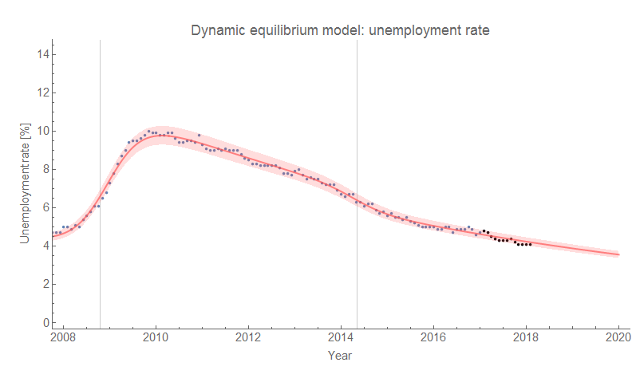
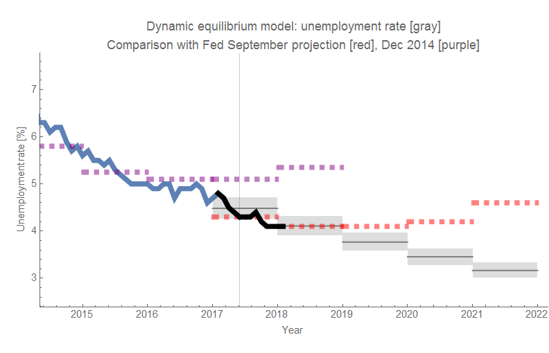
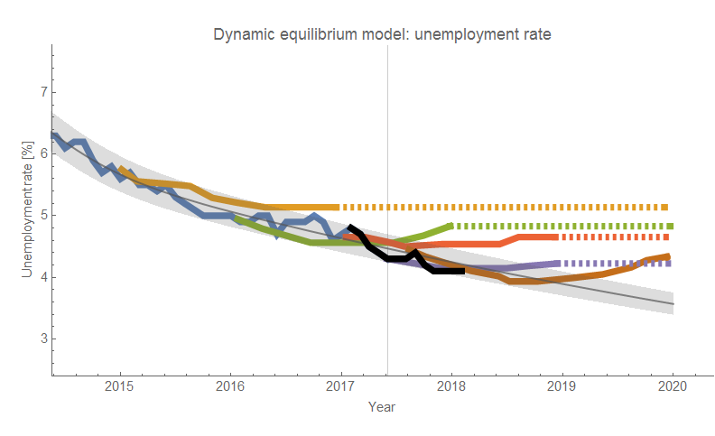
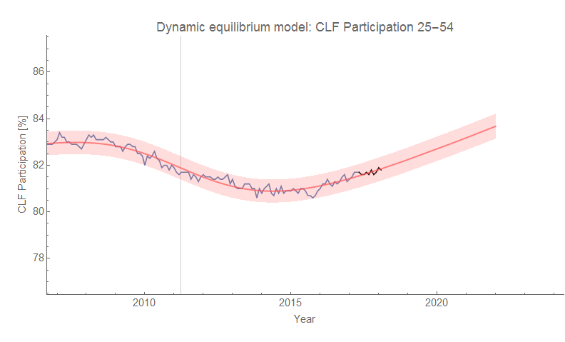
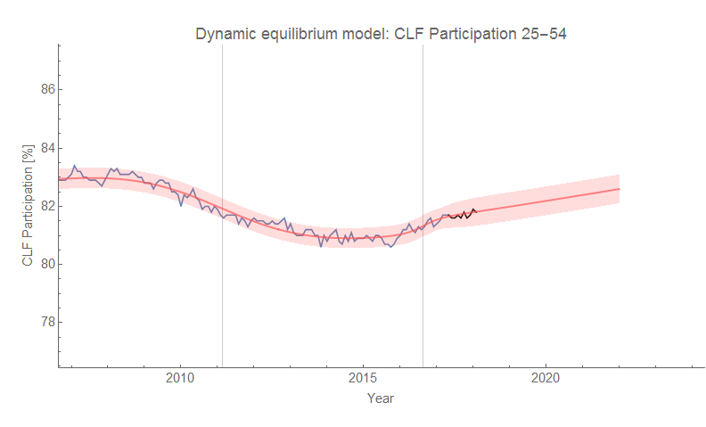
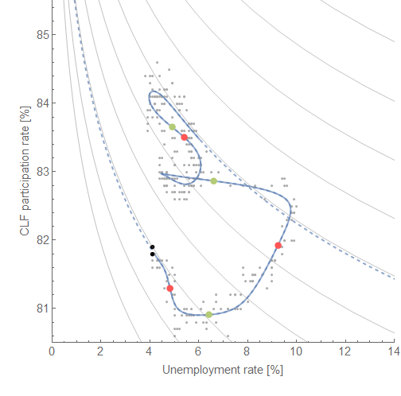
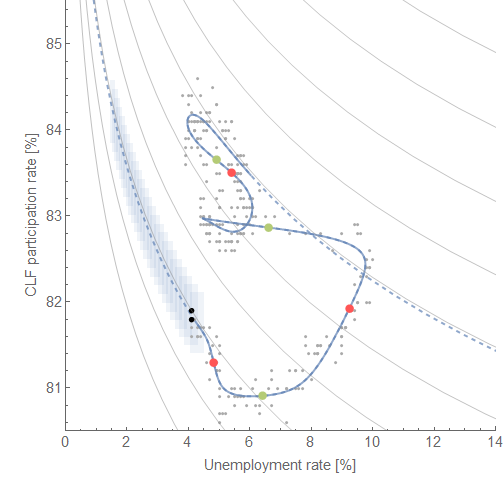

The latest [employment situation data](https://fred.stlouisfed.org/release?rid=50) is out and the unemployment rate holds steady at 4.1%. This is still in line the dynamic information equilibrium model ([here](https://informationtransfereconomics.blogspot.com/2017/01/dynamic-equilibrium-presentation.html) or in [my recent paper](https://papers.ssrn.com/sol3/papers.cfm?abstract_id=3094757)) as we begin the model's second year of accurate forecasting:

The data is also still in line with the some of the latest forecasts from the Fed and FRBSF (but not their earlier ones):

Note that the unemployment rate seems to be a lagging indicator [compared to JOLTS data](https://informationtransfereconomics.blogspot.com/2017/07/jolts-leading-indicators.html) (out next Tuesday 6 February 2018), so while there is some evidence in the JOLTS hires data of a possible turnaround it won't show up in the unemployment rate for several months.

Also out is the latest labor force participation data which doesn't help us distinguish between the two models ([with and without a small positive shock in 2016](https://informationtransfereconomics.blogspot.com/2017/11/a-new-beveridge-curve-or-science-is.html)) as it's consistent with both:

And finally there is the novel "[Beveridge curve](https://informationtransfereconomics.blogspot.com/2017/11/a-new-beveridge-curve-or-science-is.html)" connecting labor force participation and unemployment rate:

**Update:**

In light of [this post by JW Mason](http://jwmason.org/slackwire/posts-in-three-lines-6/), I decided to add the error bands to the "Beveridge" curve above based on the individual errors. It's not exactly looking at the probability of the joint distribution of multiple variables, but it's a step in that direction.

