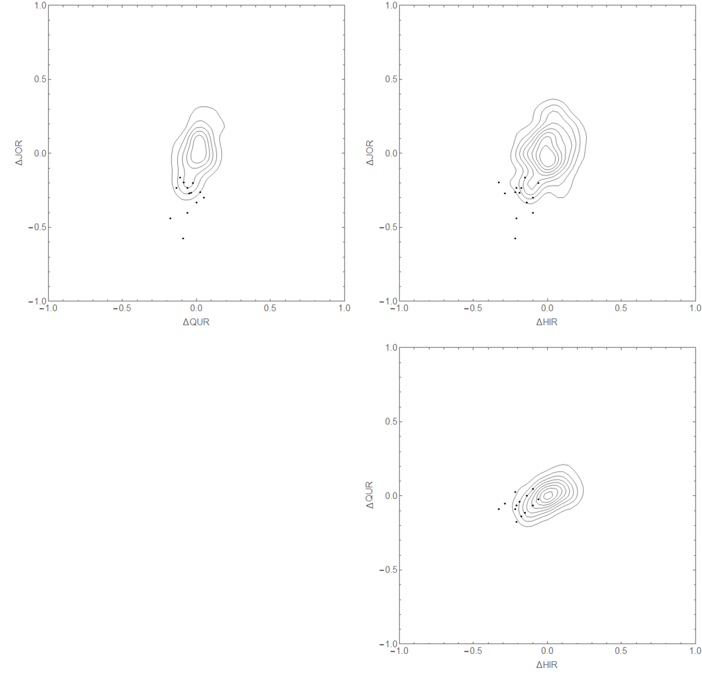
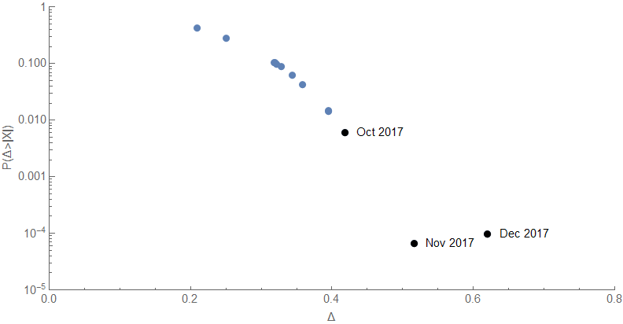
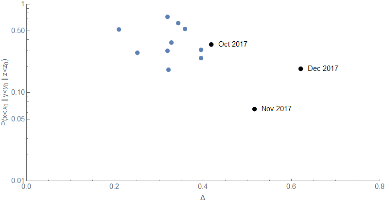

[JW Mason](http://jwmason.org/slackwire/posts-in-three-lines-6/) had a post the other day wherein he said:

> _**The probability approach in economics.** Empirical economics focuses on estimating the parameters of a data-generating process supposed to underlie some observable phenomena; this is then used to make ceteris paribus (all else equal) predictions about what will happen if something changes. Critics object that these kinds of predictions are meaningless, that the goal should be unconditional forecasts instead (“economists failed to call the crisis”). Trygve Haavelmo’s [writings on empirics](http://fitelson.org/woodward/haavelmo.pdf) from the 1940s suggest third possibile goal: unconditional predictions about the joint distribution of several variables within a particular domain._

To that end, I thought I'd look at the joint probabilities of the [JOLTS data time series falling below the model estimates](https://informationtransfereconomics.blogspot.com/2018/02/jolts-data-and-that-market-crash.html). First, let's look at some density plots of the deviation from the model (these are percentage points) for JOLTS hires (HIR), openings (JOR), and quits (QUR) for the data from 2004-2015 and then place the data from January 2017 to the the most recent (Dec 2017) on top of it (points):

Can we quantify this a bit more? I looked at two measures using the full 3-dimensional distribution: the probability of finding a point that is further out from the center as well as the probability that at least one of the data series has a worse negative deviation than the given point and plotted both of those measures versus the distance from zero:

The first measure doesn't account for the correlation between the different series very well, but does give a sense of how far out these points are from the center of the distribution. The second measure gives us a better indication of not only the joint probabilities but the correlation between them — even if one of the three series is far from the center, it can be mitigated by one that is closer especially if they are correlated.

While there is 19% chance that one of the hires, openings, or quits data could've come in worse than it did on Tuesday based on the data from 2004-2015, that's not all that small of a probability leaving open the possibility that the data is simply on a correlated jog away from the model. This is basically capturing the fact that most of the deviation is coming from the openings data while the other two are showing smaller deviations:

