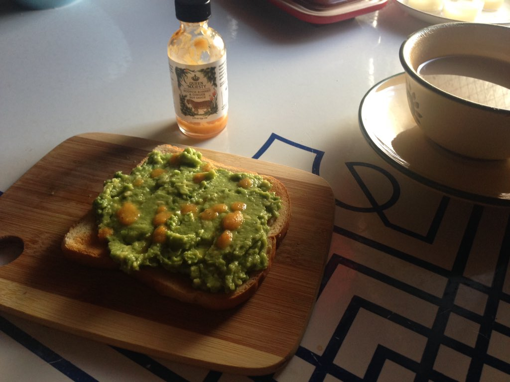
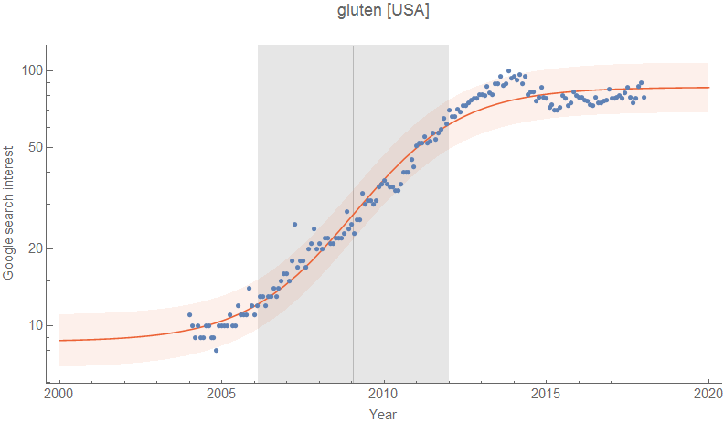
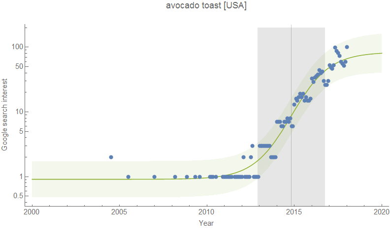
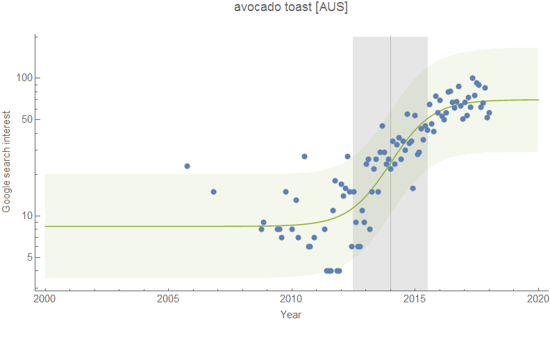
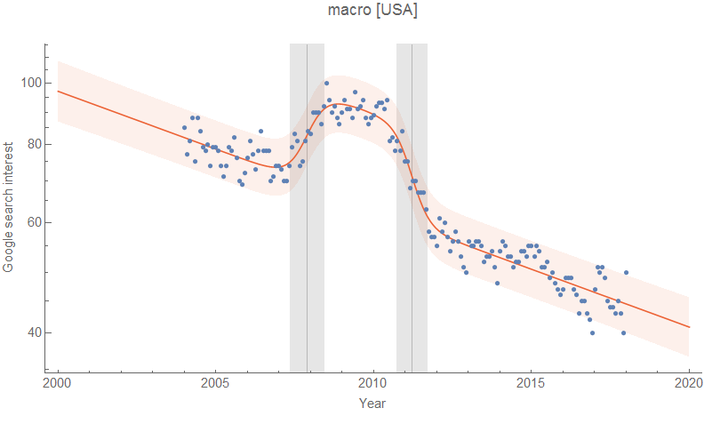

The dynamic information equilibrium approach I talk about [in my recent paper](https://papers.ssrn.com/sol3/papers.cfm?abstract_id=3094757) doesn't just apply to economic data. The idea that the information content of observing one event relative to observing another event has rather general application. As an example, I will look at search term frequency. Now if the English language was unchanging, given that there are a huge number of speakers, we'd expect relative word frequencies to remain constant and the distributions to be relatively stable. Changes to the language would show up as "non-equilibrium shocks" — a change in the relative frequency of use that may or may not reach a new equilibrium. A given word becomes more or less common and therefore has a different information content when a that word is observed (a "word event").

We might be able to see some of these shocks in [Google trends data](https://trends.google.com/trends/) — a collection of "word events" entered as search terms. It's is only available since 2004, so we really can only look at language changes that happen within a few years. Longer changes (e.g. words falling into disuse) won't show up clearly, but this time series is well-suited for looking at fads.

I wanted to try this because I read an offhand comment somewhere (probably on Twitter) that said something like "everyone suddenly became gluten intolerant in 2015" \[1\]. What does the search data say?

The gluten transition in the US is centered near January 2009, but takes place over about 6 years (using the [full width at half maximum for the shock](https://informationtransfereconomics.blogspot.com/2018/01/canadas-below-target-inflation.html)). It "begins" in the mid-2000s and we seem to have achieved a new equilibrium over the past couple years.

However, I did notice on Twitter there were a lot more and earlier references to avocado toast from Australians (in fact I think it was a mention in Australian media that it wasn't just the breakfast I made myself for years after having been given it by a Chilean friend where it's been a common dish for a long time ("palta")). Was this hunch visible in the data? Yes — almost a full year earlier:

So anyway, I just wanted to show a fun application of the information equilibrium framework. It applies to a lot of situations where there is some concept of balance between different things: supply and demand, words and their language, [cars and the flow of traffic](http://informationtransfereconomics.blogspot.com/2016/03/traffic-model-on-wicksellian-roundabout.html), [neurons and the cognitive state](https://informationtransfereconomics.blogspot.com/2016/07/information-equilibrium-in-neuroscience.html), or [electrons and information](https://informationtransfereconomics.blogspot.com/2016/02/information-equilibrium-and-transistors.html).

...

**Update 2 February 2018**

The "macro wars" (Nov 2007–Mar 2011):

...

**Footnotes:**

\[1\] Update: [found it](http://www.lawyersgunsmoneyblog.com/2018/02/hippies-lot-answer-part-infinity).

> _As a casual student of American food faddism, something that is still more than alive and well today (Yes, it’s an amazing coincidence that a sizable percentage of the educated liberal upper middle class all became gluten intolerant over a 3 year period. Must be pollution or something), I always love stories about our ridiculous food history._

It's a 6-year period above, but the definition of the "width" of a transition is somewhat arbitrary (I used the [full width at half maximum](https://en.wikipedia.org/wiki/Full_width_at_half_maximum) above).
