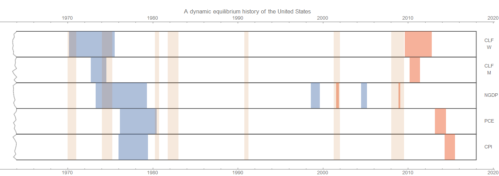
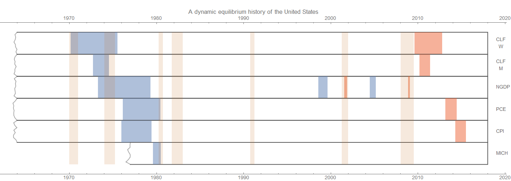
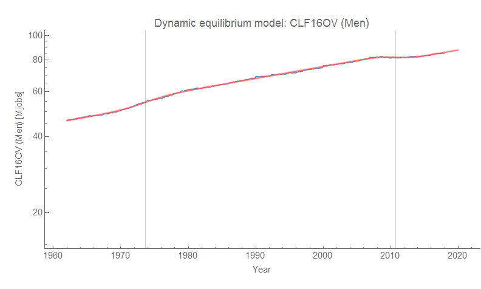
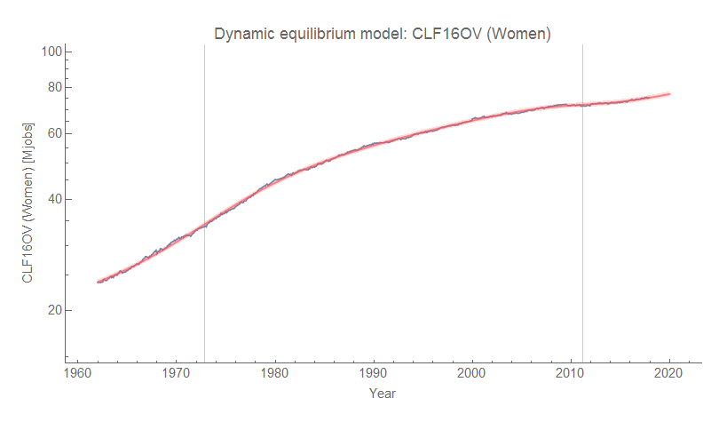
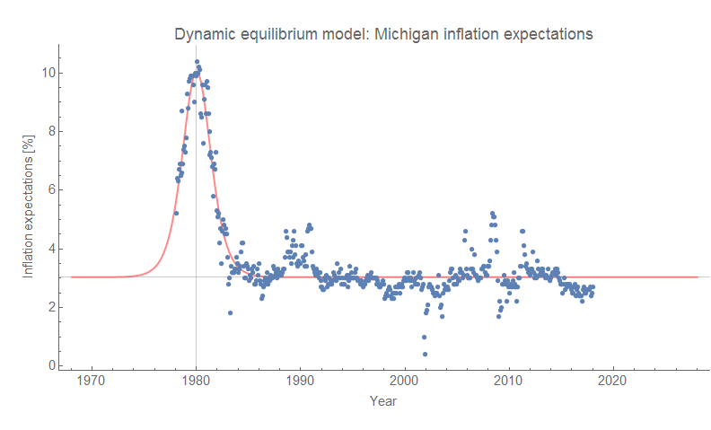

[Paddy Carter](https://twitter.com/CarterPaddy) sent me [a link](https://twitter.com/CarterPaddy/status/966249656110940160) on Twitter to [a study \[pdf\]](http://www1.idc.ac.il/Faculty/Eckstein/pdf/ECTA8803.pdf) using a different model that came to conclusions similar to the view I've been expressing on this blog:

> _The increase in female employment and participation rates is one of the most dramatic changes to have taken place in the economy during the last century._

From their conclusions:

> _Furthermore, the unexplained portion \[of the rise in women's employment\] is quite large and positive; in other words, for cohorts born before 1955, the simulations overpredict female employment and for more recent cohorts, underpredict it. Therefore, there must have been other changes taking place among married women by cohort. We have shown above that it is consistent with the model to claim that technological progress in household production or a change in social norms has brought down the costs of working outside the home._

As part of my continuing series of dynamic information equilibrium "seismograms" (previously [here](https://informationtransfereconomics.blogspot.com/2018/02/dynamic-equilibrium-in-wage-growth.html)), I put together another version of the story of women entering the workforce \[1\] as a driver of dramatic changes in the economy:

A big lesson is about causality. The positive shock to the level of women in the labor force precedes a (smaller relative) shock to the level of men in the labor force, both of which precede shocks to output and finally inflation (both CPI and PCE shown). Women entering the workforce caused a general economic boom — which drew additional men into the workforce and increased output and prices.

In the study linked above, the authors speculate that some of the effect was due to "technological progress in household production" (e.g. household labor-saving devices like washing machines and dishwashers) which made me think of the '[Solow paradox](https://en.wikipedia.org/wiki/Productivity_paradox)' ("You can see the computer age everywhere but in the productivity statistics."). What if the reason that household technology shows up in the economy is because household technology enabled more people **_to enter_** the labor force, while computers were mostly used by people **_already in_** the labor force \[2\]? This idea can be taken a step further to suggest that maybe the high GDP growth and inflation of the 1970s was due to the fact that a significant fraction of work _that isn't counted_ in GDP statistics (household production) was automated allowing people to participate in work _that was counted_ in GDP. That is to say that if household production was counted in GDP, it is possible that there might not have been a "great inflation".

This is of course speculative. However it is a good "thought experiment" to keep in mind to keep you from assuming that GDP is some ideal measure and remind you that the "events" that appear in the GDP data may well be artefacts of the measurement methodology \[3\].

...

**Update**

[Diane Coyle makes the case](https://www.escoe.ac.uk/wp-content/uploads/2017/02/ESCoE-DP-2017-01.pdf) \[pdf\] for the possibility I mention in footnote \[2\]: transition to more "digital production" behind recent low productivity.

**Update 28 February 2018**

Commenter Anti below mentions inflation expectations, so I thought I'd add the dynamic information equilibrium model of the price level implied by the [University of Michigan inflation expectations data](https://fred.stlouisfed.org/series/MICH) \[4\]. I've added the result to the macroeconomic seismogram:

Note that shock to inflation expectations follows the shock to measured inflation (making a simple [backward-looking martingale](https://informationtransfereconomics.blogspot.com/2014/04/inflation-predictions-are-hard.html) a plausible model).

...

**Footnotes**

\[1\] Here are the CLF models for men and women:

The NGDP model is from [here](https://informationtransfereconomics.blogspot.com/2018/01/24-growth-forever.html); the inflation models were used in my [first history seismogram](https://informationtransfereconomics.blogspot.com/2017/07/a-dynamic-equilibrium-history-of-united.html).

\[2\] This brings up the question of whether current home production that isn't counted in GDP — much of which is done on computers — is behind the recent "low growth" of a lot of developed economies.

\[3\] And even the economic system as households (as well as firms) are typically more like miniature centrally planned economies.

\[4\] The model fit is pretty good (dynamic equilibrium is α = 0.03, or basically 3% inflation):

