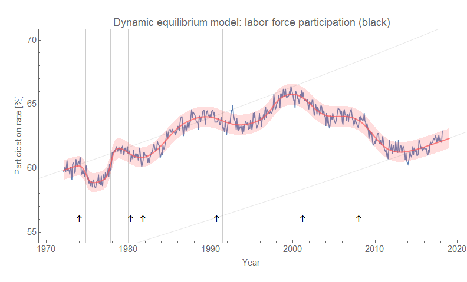
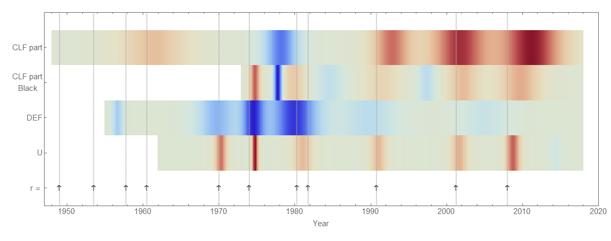
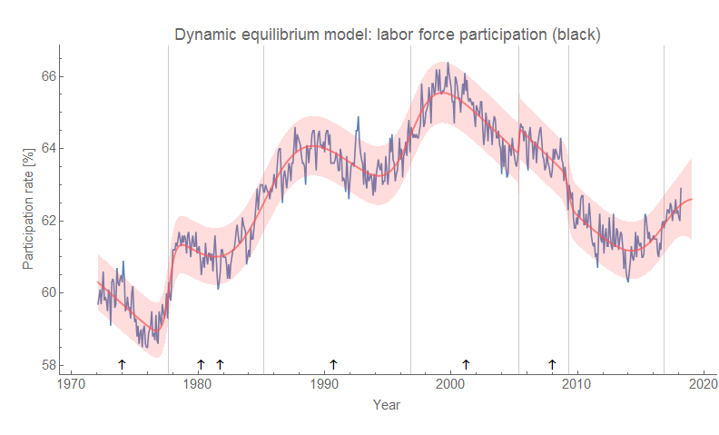

While women entering the work force was the larger effect (almost doubling from 30% in the 1950s to almost 60% at its peak), another social transition was the increase in black labor force participation after the anti-discrimination laws of the 1960s.

Since it was a smaller effect — rising about 10% \[1\] in the same period women's labor force participation rose about 50%, and black women's participation rose 30% \[2\] — the business cycle fluctuations are more readily seen. And from that we can gather a bit more evidence about the effect of labor force participation on inflation. Here's the model result:

Before 2000, between recessions there is a positive shock to black labor force participation (the sum of these shocks is effectively equivalent to the broad shock to women's labor force participation). One way to interpret this is that while the social transition is happening, the booms of the business cycle correspond to people entering the labor force at an increased rate. After 2000, however, black labor force participation shows roughly the same structure as overall participation, men's participation, and women's participation —  participation falls after recessions and no inter-recessionary boom.

The other noticeable effect is the labor force bump comes before bumps in inflation \[3\]:

This provides further evidence that inflation may be a phenomenon of the labor force (i.e. not monetary), and its recent sub-target performance may be due to the end of the demographic transition and its concurrent increase in labor force participation.

Note that I'm not claiming increases in black labor force participation increase inflation, but rather that general increases in labor force participation increase inflation. Looking at black labor force participation helps make the causal structure of the shocks more clear because women's participation is increasing too fast to see the business cycles as clearly.

One of the things I found interesting about modeling this data is that the entropy minimization process was not completely conclusive:

One minimum is lower than the other, but the resulting model — while simpler — makes less sense than the one described above. 

Black labor force declines in this version are endemic, and it's only kept from falling to zero by booms that come between recessions. Recessions effective end these booms and return black labor force participation to its typical state of decline. This would be hard to reconcile with basic intuition (shouldn't labor force participation flag after a recession?), but also impossible to reconcile with the [relative similarity in the structure of black and white unemployment rates](https://informationtransfereconomics.blogspot.com/2017/07/racial-disparities-in-unemployment-rate.html).

That's why I chose the other minimum despite it being only a local minimum, not global.

**Footnotes:**

\[1\] Not 10 percentage points, but 10% from about 60% to about 66%.

\[2\] In fact, black men's labor force participation fell during this time, so the rise overall black labor force participation can mostly be attributed to black women entering the labor force.

\[3\] This would predict a positive shock in labor force participation in the early 70s before the beginning of the available data.
