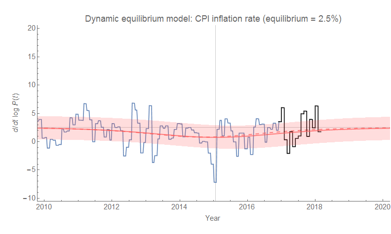
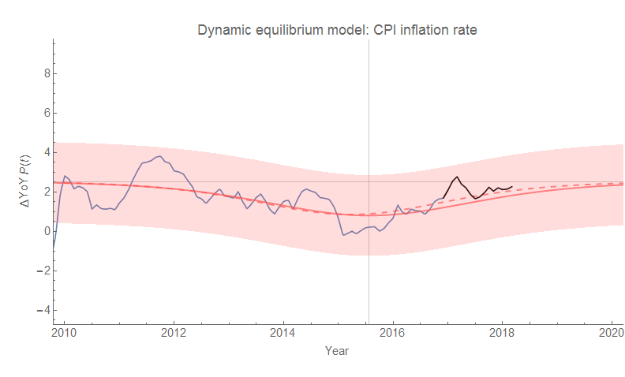
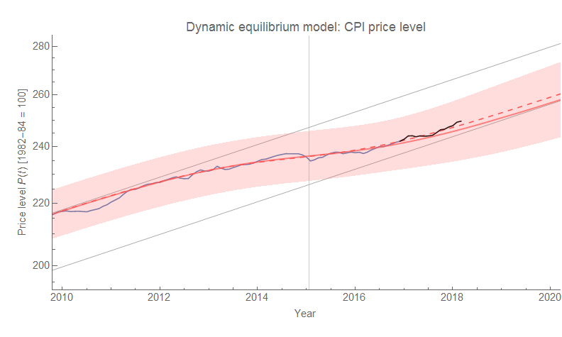

The [latest CPI data](https://fred.stlouisfed.org/series/CPIAUCSL) is out for the US, and I think it's looking like the recent shock (2014-2015) parameters were a bit off (since it was still ongoing at the time). While this has negligible effect on the continuously compounded annual rate of inflation (instantaneous logarithmic derivative), it produces a noticeable effect (within the error) on the level and when measured year-over-year \[1\]. Here's the instantaneous inflation measure:

And here are the year-over-year and level measures:

The original estimates of the shock parameters were

That _b₀_ [corresponds to a duration](https://informationtransfereconomics.blogspot.com/2018/01/canadas-below-target-inflation.html) of 4.4 + 1.4 years, which means the shock was still ongoing when the forecast was made in early 2017. The new estimate (shown as a dashed line in the graphs) has parameters

_a₀_
_y₀_ 
_b₀_

which are all within the error bars on the original estimate (the new errors are all approximately cut in half as well). So we can see this as a true refinement. This new _b₀_ corresponds to a duration of 4.1 + 0.9 years. The shock "began" (inasmuch as you can cite a "beginning") in late 2012 or 2013 and "ended" in late 2016 or 2017. This period of "[lowflation](https://informationtransfereconomics.blogspot.com/2018/01/is-low-inflation-ending.html)" is associated with the negative shock to the labor force after the Great Recession [and appears to be ending](https://informationtransfereconomics.blogspot.com/2018/01/is-low-inflation-ending.html) (or has already ended as of last year per these new parameter estimates).

**Footnotes:**

\[1\] The CPI level accumulates (integrates) the error, while the year-over-year measure amplifies it _(x + δx)/(y + δy)_.
