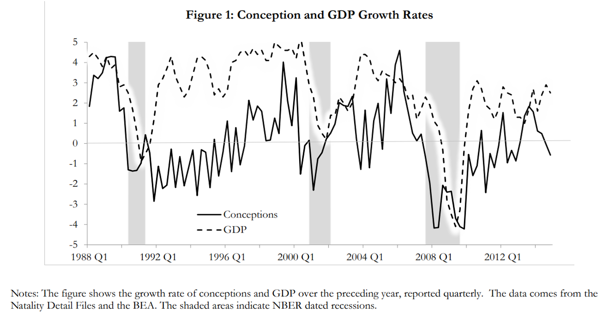
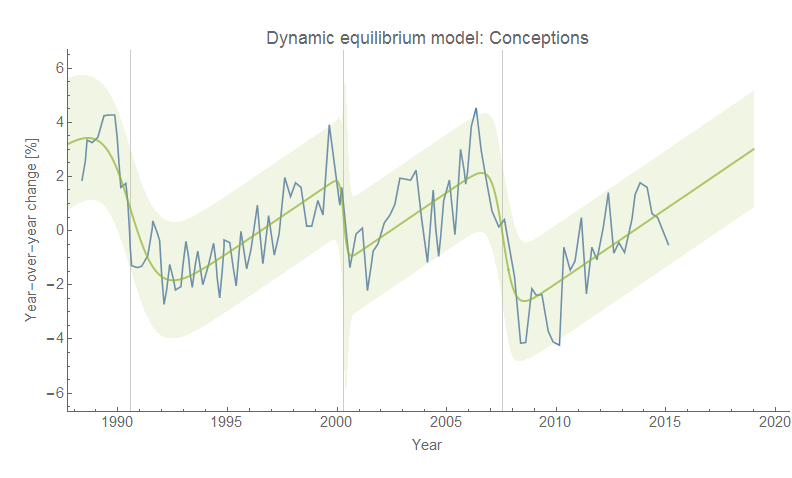
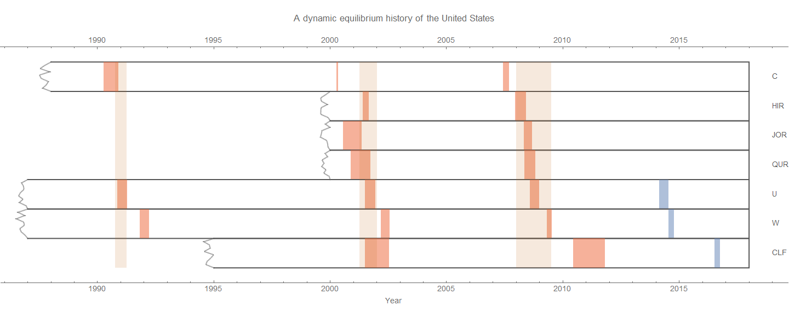
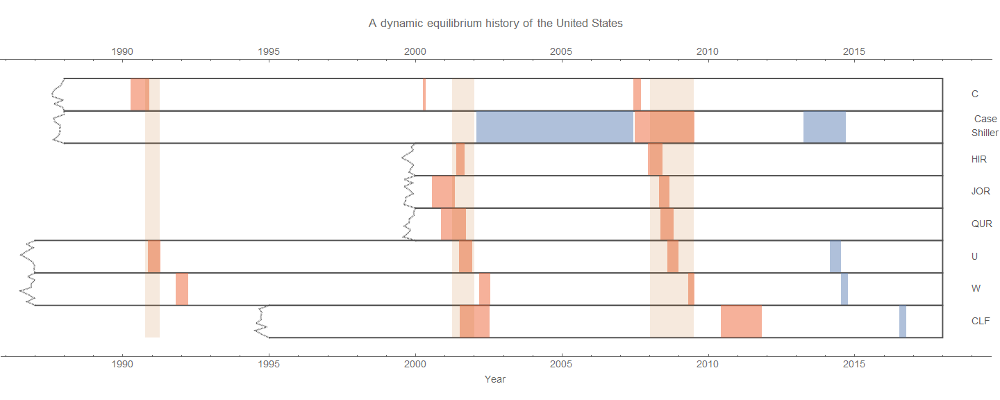

A new [NBER working paper](http://www.nber.org/papers/w24355) titled _Is fertility a leading economic indicator?_ by Kasey Buckles, Daniel Hungerman, and Steven Lugauer looks at birth data to show that conceptions (in the graph at the top of the page) are a leading indicator of recessions. Their abstract:

> _Many papers show that aggregate fertility is pro-cyclical over the business cycle. In this paper we do something else: using data on more than 100 million births and focusing on within-year changes in fertility, we show that for recent recessions in the United States, the growth rate for conceptions begins to fall several quarters prior to economic decline. Our findings suggest that fertility behavior is more forward-looking and sensitive to changes in short-run expectations about the economy than previously thought._

I tried to look at the data using the dynamic information equilibrium model; the details of the model [are in my paper](https://papers.ssrn.com/sol3/papers.cfm?abstract_id=3094757) \[1\] where I also looked at JOLTS data as providing a leading indicator of recessions. The model turns out to be a pretty decent description of the data:

And it is a leading indicator, beating out JOLTS data by several months (an economic "seismograph" per [here](https://informationtransfereconomics.blogspot.com/2018/02/economic-seismographs-labor-and.html)) \[2\]:

Click for the full resolution image. The interesting thing to me is that a human _social_ factor is a leading indicator with a greater lead time than economic factors (like the number of hires or job openings). This points to recession as a predominantly _social_ phenomenon, not economic, being viable hypothesis. There could well be other economic phenomena with longer lead times (I could see e.g. housing coming first in the decision process of having a child \[3\]), and it could therefore be more of a mixture of social and economic factors. But the big takeaway is that a recession is a complex process that involves the interaction of many variables over the course of **_years_** before the thing that gets called an "NBER recession" is said to start.

...

**Update 1 May 2018**

The conceptions indicator appears to lead the shock to the Case-Shiller index (click to expand):

**Footnotes:**

\[1\] The information equilibrium model has a particularly clear interpretation here as "male event" and a "female event" meeting in a "conception event" in physical state space.

\[2\] C = conceptions, HIR = JOLTS hires, JOR = JOLTS job openings, QUR = JOLTS quits, U = unemployment rate, W = [wage growth](https://informationtransfereconomics.blogspot.com/2018/02/dynamic-equilibrium-in-wage-growth.html), CLF = Civilian Labor Force participation rate

\[3\] The actual mix of factors might also depend strongly on the social institutions of the country in question — the US has particularly stingy maternal/paternal leave provisions and therefore a fall in conceptions might not lead recessions in e.g. France which has much more parent-friendly policies.
