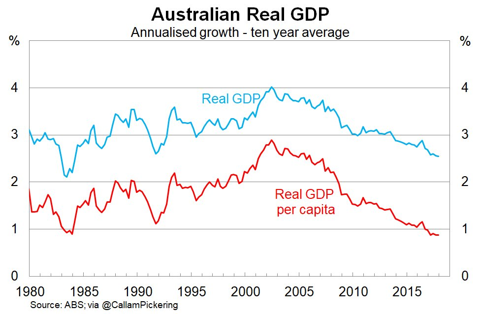
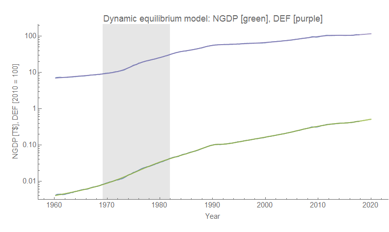
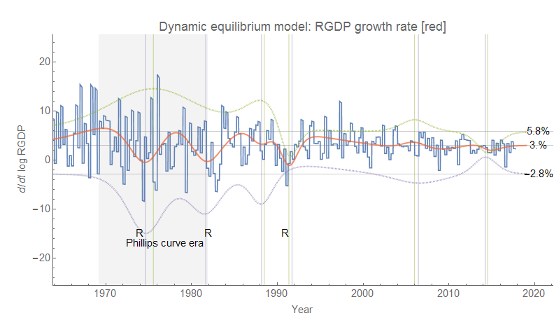
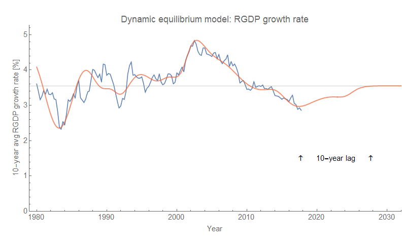

I saw the chart above [on Twitter](https://twitter.com/infotranecon/status/971201180809420800); it made me want to try [this analysis](https://informationtransfereconomics.blogspot.com/2018/01/24-growth-forever.html) using the dynamic information equilibrium model for Australia to see if I could understand the near constant decline in RGDP growth since the early 2000s because it looked very odd from a dynamic equilibrium standpoint. The data I have from FRED for Australia is a bit noisier than the US and UK data so there is the oddity that the model sees the Great Recession as more of a statistical fluctuation than a shock. Here are the models of NGDP and the GDP deflator (click for full resolution):

The dynamic equilibria are 5.8% NGDP growth and 2.8% inflation, resulting in 3%. The demographic shift (discussed below) is highlighted in gray. And here is how they combine as RGDP growth (click for full resolution):

Overall the picture for Australia is approximately the same as for the US and UK: a "Phillips curve era" accompanied by a demographic transition in the mid-to-late 1970s and a more recent era with sparser shocks. I hesitate to give it the same "asset bubble era" label I gave the US and UK because it seems more associated with the "commodity boom" of the 2000s (centered in 2006). There was also a major (nominal) commodities bust centered in 2014, but as it was accompanied by a nearly equal negative shock to inflation it turns out to be a wash in RGDP. In fact both shocks in the post-Phillips curve era effectively combine to create a slow steady decline in RGDP. Here is the dynamic equilibrium model version of the 10-year average RGDP growth graph at the top of this post (click for full resolution):

While the forecast looks a bit strange, it is entirely due to the backward-looking 10 year average (which also makes the 10 year average growth rate higher than the continuously compounded rate about at 3.6%) and in the continuously compounded rate of change we have a simple return to about 3% RGDP growth following the "commodity bust".

Australia is frequenty noted for its long recession-free streak following its early 90s recession (which in fact has almost the exact same structure as the "Lawson boom" — and subsequent bust — in the UK data), with [some attributing it](http://www.themoneyillusion.com/why-australia-hasnt-had-a-recession-in-26-years/) to effective monetary policy. I'd attribute it to the high rate of NGDP and RGDP growth (likely stemming from a high rate of population growth, about double the US) that makes even large negative shocks like the Great Recession insufficient to generate more than a single quarter of negative growth (it's effectively interpreted by the model as the ending of the "commodity boom" than its own "shock"). But also the shocks to nominal growth and inflation are both broader and more correlated for Australia resulting in less jagged RGDP growth (which tends to be associated with recessions). This correlation may well be due to the fact that the nominal growth is associated with commodities rather than financial and/or housing asset bubbles in the UK and US (Minsky!). Although housing prices appear to have been rising in Australia (only to begin to decelerate more recently), there does not appear to be a separate "housing bubble" effect readily visible in the data — maybe housing prices were associated with the commodities boom rather than an independent phenomenon (for US readers, think North Dakota housing prices in the 2010s rather than Florida/Arizona in the 2000s)?

But the broad themes here are similar to the US and UK: a big demographic shift has ended (and with it, high growth), and we've entered an era of booms and busts and more moderate growth.
