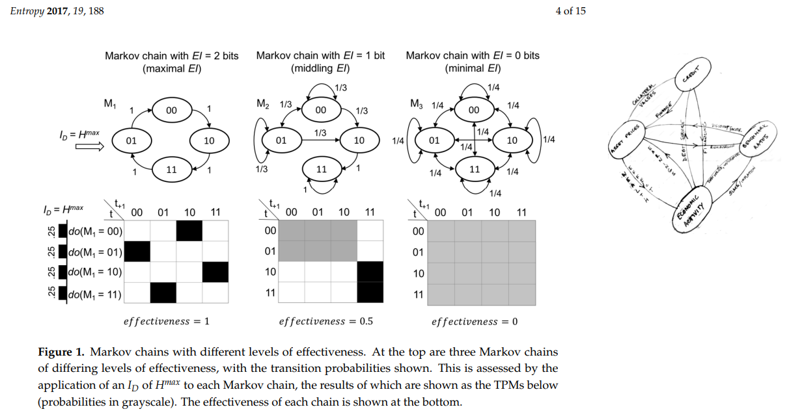
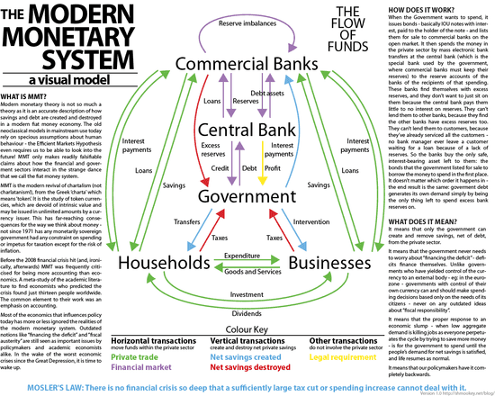
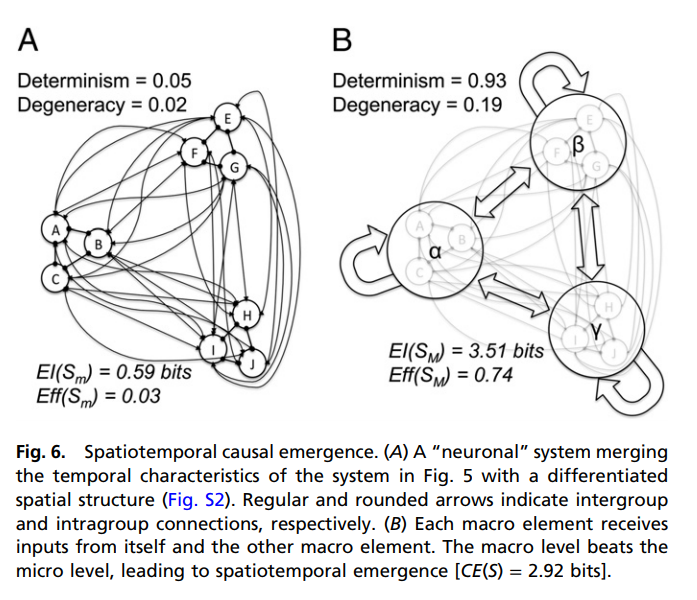

Let me first say [this is a great post](http://teasri.blogspot.com/2018/03/monetary-policy-feedback-loops-and.html) from [Sri Thiruvadanthai](https://twitter.com/teasri)[‏](https://twitter.com/teasri), and I largely agree with its recommendation to aim towards a **_resilient_** economic system rather than a stable one. And I would also agree that the idea that a single interest rate can stabilize the system (partially) pictured above from Sri's blog post is at best idealistic (at worst foolhardy) — if we viewed this system as a blueprint for a mathematical model. A mathematical model this complex is likely intractable as well, above and beyond using a single interest rate to stabilize it.

However, when I saw the diagram [another diagram from Erik Hoel](http://www.mdpi.com/1099-4300/19/5/188) appeared in my head; I've placed Sri's diagram alongside Erik's:

Now it's true that Erik is talking about simple Markov chain models, but that might be interpreted as the limiting case of the information contained in asset prices, credit markets, economic activity, and benchmark rates \[1\]. In the limiting case, the "effective information" in this model for forming a causal explanation is basically zero. Another way to put it is that given enough feedbacks and connections between observables, your model becomes too complex to be useful to explain anything.

Now Erik's paper motivates so-called causal emergence: just as there are local minima of effective information, there are local maxima and we can think of the separation between these local maxima being related to scales in the theory. We understand chemistry at the atomic scale, but we understand biology at the cellular scale. Erik's conjecture is that this is a general property of causal descriptions of the universe from quarks to quantitative easing.

Now I understand this is just my opinion, but this is why I don't think a lot of "this is how the banking system actually works" will help us understand macroeconomics. Effective information and causal emergence is always at the forefront of my mind when I see descriptions like this (click to expand):

Such a model might well capture the details of the system, but might yield no insight as to how it actually works. Knowing what every neuron does could capture the phenomena of a brain system, but it probably won't yield answers to questions about consciousness or even how humans recognize objects in images \[2\].

And since the "emergent" but approximate descriptions with higher effective information at the higher scale don't have a 1-to-1 relationship with the model at the lower scale (they cannot because that 1-to-1 relationship could be used to translate one to the other implying that the effective information of the models at the two scales would be equal), there is no reason to expect the models to behave in ways interpretable in terms of the lower scale sub-units.

And now I come back to Sri's contention that changes to a single interest rate is unlikely to stabilize the system diagrammed above — especially if we think of interest rates in terms of the causal model above where we make some loose associate between raising interest rates and tightening monetary policy and damping economic activity.

I make the rather contrarian assertion in [my blog post about monetary policy in the 80s](https://informationtransfereconomics.blogspot.com/2018/03/its-80s.html) that the increase in interest rates and "decisive action" from the Volcker Fed may well have **_mitigated_** the first 80s recession, but then the same stance **_caused_** the second. This is of course makes no sense on the surface (raising rates are both good and bad for the economy), but the feedbacks and strong coupling in Sri's diagram mean the system is probably so complex as to obliterate an obvious 1-to-1 relationship between the discount rate and economic activity.

However, it might have an effective description thought the causal emergence of politics and "Wall Street opinion". Volcker's "decisive action" in raising interest rates/targeting monetary aggregates was considered "good" because the government (Fed) was "doing something". The recessionary pressure ebbed, and the first recession faded. In the same way, quantitative easing might well have had "symbolic" effect in stopping the panic involved in the 2008 financial crisis. Volcker's and Bernanke's "decisive actions" might well have no sensible interpretation in terms of the underlying complex model at the lower scale. But at the macro scale, they may have helped.

That's also how Volcker doing almost exactly the same thing again about a year later could cause a recession. Instead of being seen as "decisive action", the second surge in the discount rate was seen as the shock to future prices it was intended to be. In the underlying model, firms laid off workers and unemployment rose dramatically.

There's no single interest rate that stabilizes Sri's system, but one interest rate could be used as a focus for business sentiment and a complex signal of information.

Now there is a danger lurking in this kind of analysis because it leaves you vulnerable to "just so" stories at the higher scale, especially if you try an interpret things in terms of the complex underlying model. That's why models at the higher scale need to be constructed and compared to data. While we have physics models of protons, neutrons, and electrons, and use them to model atoms, we don't then say that chemistry involves complex interactions of atoms and use that to produce "just so" stories. We find empirical regularities in chemistry which have their own degrees of freedom like concentration and acidity. In some cases we can make direct connection between atoms and chemical processes, but other chemical processes are so complex that they're intractable in terms of atoms.

This also doesn't mean the lower scale model isn't useful. Sometimes the insight comes from the lower scale model. Sometimes you need to understand parts of it to do some financial engineering (such as Sri's contention to focus on making the system more resilient — solutions might come in terms of specific kinds of transactions or for particular assets). The "shadow banking system" comes to mind here; looking at the details might point out a particular danger. But the macro model might not need to know the details and interpreting the financial crisis in terms of a run on the shadow banking system with a Diamond-Dybvig model will have more effective information for macro policy than the details of collateralized debt obligations.

**Footnotes:**

\[1\] We can think of the nodes in that network themselves made up of more complex models as in [another paper](http://www.pnas.org/content/110/49/19790.short) from Erik:

\[2\] There are similar contentions with machine learning where a system might be able to recognize any picture of a dog, but we won't really understand why at the level of nodes.
